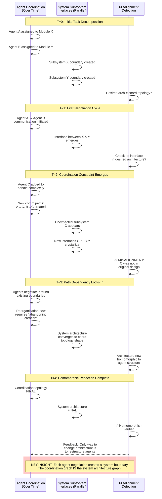

# Homomorphic Reflection: Agent Coordination → System Architecture

```mermaid
sequenceDiagram
    participant AC as Agent Coordination<br/>(Over Time)
    participant SI as System Subsystem<br/>Interfaces (Parallel)
    participant MA as Misalignment<br/>Detection

    Note over AC,MA: T=0: Initial Task Decomposition
    AC->>AC: Agent A assigned to Module X
    AC->>AC: Agent B assigned to Module Y
    SI->>SI: Subsystem X boundary created
    SI->>SI: Subsystem Y boundary created
    MA->>MA: Desired arch ≠ coord topology?

    Note over AC,MA: T=1: First Negotiation Cycle
    AC->>AC: Agent A ↔ Agent B<br/>communication initiated
    SI->>SI: Interface between X & Y<br/>emerges
    MA->>MA: Check: Is interface<br/>in desired architecture?

    Note over AC,MA: T=2: Coordination Constraint Emerges
    AC->>AC: Agent C added to<br/>handle complexity
    AC->>AC: New comm paths:<br/>A↔C, B↔C created
    SI->>SI: Unexpected subsystem<br/>C appears
    SI->>SI: New interfaces C-X, C-Y<br/>crystallize
    MA->>MA: ⚠️ MISALIGNMENT:<br/>C was not in<br/>original design

    Note over AC,MA: T=3: Path Dependency Locks In
    AC->>AC: Agents negotiate around<br/>existing boundaries
    AC->>AC: Reorganization now<br/>requires "abandoning<br/>creation"
    SI->>SI: System architecture<br/>converges to coord<br/>topology shape
    MA->>MA: Architecture now<br/>homomorphic to<br/>agent structure

    Note over AC,MA: T=4: Homomorphic Reflection Complete
    AC->>AC: Coordination topology<br/>FINAL
    SI->>SI: System architecture<br/>FINAL
    MA->>MA: ✓ Homomorphism<br/>verified
    MA-->>AC: Feedback: Only way to<br/>change architecture is<br/>to restructure agents

    rect rgb(255, 200, 200)
        Note over AC,MA: KEY INSIGHT: Each agent negotiation creates a system boundary.<br/>The coordination graph IS the system architecture graph.
    end
```
