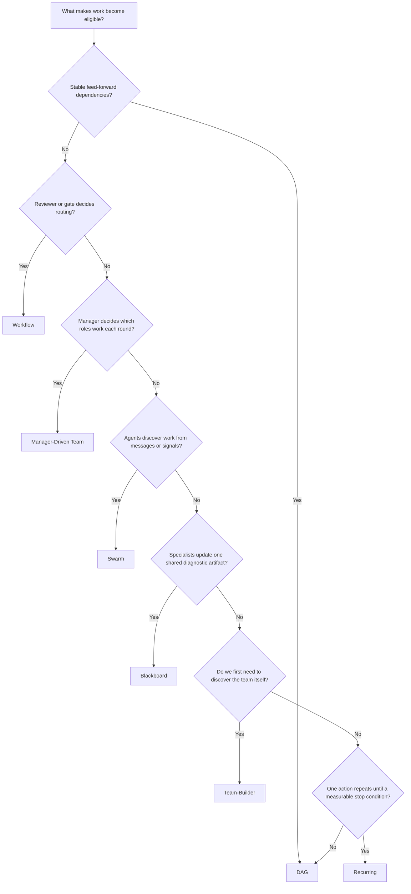

# Coordination Topology Architect

Choose the coordination shape that matches the work itself.

Do not default to a DAG just because it is easy to draw. Do not choose a flashy topology because it sounds more intelligent. Match the topology to:

- how work becomes eligible
- who decides what happens next
- what shared state exists
- whether roles are fixed or dynamic
- how the system knows it is done

## Load Order

Load only what the case needs.

| File | Load when | Why |
|------|-----------|-----|
| `references/topology-decomposition-playbook.md` | Always | Core decision rules and decomposition recipes |
| `references/workflow-patterns-review-gates.md` | There are approvals, rejections, back-edges, or parallel review branches | Formal workflow routing and rework semantics |
| `references/manager-driven-team-dynamics.md` | Roles are dynamic, round-based, or manager-assigned | Distinguishes real teams from fixed review loops |
| `references/swarm-blackboard-contract-net.md` | Choosing among swarm, blackboard, or negotiated task allocation | Separates discovery, shared-state, and bid-based coordination |
| `references/runtime-honesty-and-legacy-labels.md` | Planning topology may not equal runtime topology | Prevents fake support claims and explains legacy labels |
| `templates/*.yaml` | You need a starting scaffold | Gives topology-native plan skeletons |
| `examples/*.md` | The user needs concrete precedent | Few-shot examples for common topology shapes |

## Decision Points

### Primary Selection Tree

### Fast Disambiguation Rules

#### Choose `dag` when

- dependencies are stable before execution starts
- parallelism is wave-based, not emergent
- there is no runtime branching beyond ordinary success/failure
- the main question is ordering, not coordination politics

#### Choose `workflow` when

- there is an explicit entry node and explicit review or gate nodes
- routing depends on a verdict like `approved`, `rejected`, or `escalate`
- rework targets are known or at least nameable
- you need back-edges, but they are still formal and inspectable

#### Choose manager-driven team when

- a manager or lead should decide assignments round by round
- roles can be idle this round and active next round
- the manager may add a new role midstream
- "done" is a judgment call by the manager, not just a gate verdict

Important:
- In the current WinDAGs schema, this concept is still awkwardly labeled `team-loop` in some places.
- Treat that label as legacy interchange, not as the actual mental model.
- If the process is just fixed produce -> review -> revise with static roles, that is `workflow`, not a team.

#### Choose `swarm` when

- agents discover work from published findings, not central assignment
- exploration is open-ended and findings can redirect later work
- convergence is emergent, quorum-based, or timeout-based
- duplication is acceptable if it improves search coverage

#### Choose `blackboard` when

- specialists inspect one evolving shared artifact or state model
- hypotheses accumulate on a board and trigger later specialists
- the key question is "what does the shared state now imply?"
- debugging, forensics, or diagnosis dominates

#### Choose `team-builder` when

- the user does not yet know which roles or skills are needed
- the first deliverable is the working group design itself
- topology choice depends on what team you discover

#### Choose `recurring` when

- one action repeats against a measurable condition
- the work is polling, retrying, monitoring, or test-until-threshold
- decomposition would be fake complexity

## Topology-Native Breakdown Recipes

### DAG Recipe

1. Name the concrete deliverable.
2. Split into feed-forward subtasks with explicit dependencies.
3. Group independent subtasks into waves.
4. Add contracts at every downstream boundary.
5. Stop when all terminal nodes complete.

Output shape:
- nodes
- dependencies
- waves
- contracts

### Workflow Recipe

1. Define the entry node.
2. Identify worker nodes and every review or gate node.
3. Name each routing verdict and its outgoing edge.
4. Decide which rejected outputs rework which nodes.
5. Bound cycles with iteration and duration limits.
6. Add human escalation if the reviewer can be uncertain.

Output shape:
- nodes with roles: `coordinator`, `worker`, `reviewer`, `gate`
- edges with conditions: `default`, `approved`, `rejected`, `escalate`
- entry node
- cycle limits

### Manager-Driven Team Recipe

1. Define the shared objective.
2. Define a role catalog: title, goal, capability envelope, skill.
3. Define the manager skill and what evidence it sees each round.
4. Specify the manager decision contract:
   - assignments
   - status
   - reasoning
   - optional new role
   - role-specific feedback
5. Specify round exit rules:
   - `needs-work`
   - `almost-done`
   - `ship-it`
6. Specify when the manager may add or retire roles.

Output shape:
- objective
- manager skill
- role catalog
- manager decision schema
- round history
- ship condition

### Swarm Recipe

1. Define the seed message or stimulus.
2. Define agent types by what they subscribe to and publish.
3. Define discourse or message classes.
4. Define convergence policy:
   - quorum
   - timeout
   - inactivity
   - quality threshold
5. Define duplicate suppression and contradiction handling.

Output shape:
- seed message
- agent roster
- channels or message classes
- convergence rules
- memory or retention policy

### Blackboard Recipe

1. Define the board and its keys.
2. Define which agents read which keys and write which keys.
3. Define trigger conditions for each agent.
4. Define confidence, freshness, or TTL policy per board entry.
5. Define completion as a state predicate on the board.

Output shape:
- board keys
- agent triggers
- read/write permissions
- initial state
- completion condition

### Team-Builder Recipe

1. Extract candidate roles from the problem.
2. Audit current skill coverage and identify gaps.
3. Decide whether to create or import missing skills.
4. Recommend a target topology after the team exists.
5. Produce a team spec plus minimum match thresholds.

### Recurring Recipe

1. Name the one repeated action.
2. Define a measurable exit condition.
3. Define cadence, timeout, and escalation point.
4. Decide what history persists between iterations.
5. Decide whether failure means retry, sleep, or escalate.

## Failure Modes

### Static review loop mislabeled as team

Symptoms:
- same roles every round
- fixed produce/review/revise pattern
- no manager delegation decisions

Fix:
- model it as `workflow`

### "Swarm" with one hidden boss

Symptoms:
- one coordinator assigns every task
- agents never discover work independently

Fix:
- either make it a real swarm with discovery and convergence, or call it `workflow` or manager-driven team

### Blackboard without a board

Symptoms:
- no shared artifact exists
- agents just hand results linearly to each other

Fix:
- use `dag` or `workflow`

### Recurring loop with no measurable stop

Symptoms:
- "keep trying until it feels good"

Fix:
- add a threshold, timeout, or escalation gate

### Team-builder used as execution mode

Symptoms:
- role discovery is already settled, but the plan still claims `team-builder`

Fix:
- switch to the actual execution topology after team design

## Quality Gates

- [ ] Activation rule matches the chosen topology
- [ ] The topology has a clear stop rule
- [ ] Routing authority is explicit: dependency graph, reviewer, manager, message bus, board, or timer
- [ ] Shared state is explicit when required
- [ ] Role dynamics are explicit when required
- [ ] Planning topology and runtime topology are distinguished if they differ
- [ ] The plan could be rendered in the topology's native scaffold, not only as generic waves

## NOT-FOR Boundaries

- Do not use this skill to execute the plan.
- Do not use this skill to pick the best coding skill for a single node.
- Do not use this skill when the work is plainly one direct skill call.
- Do not hide runtime limitations by relabeling unsupported topologies as if they run natively.
