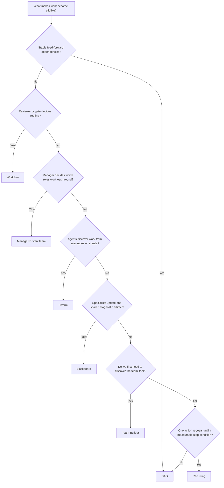

# Diagram 1: flowchart

```mermaid
flowchart TD
  A[What makes work become eligible?] --> B{Stable feed-forward dependencies?}
  B -->|Yes| C[DAG]
  B -->|No| D{Reviewer or gate decides routing?}
  D -->|Yes| E[Workflow]
  D -->|No| F{Manager decides which roles work each round?}
  F -->|Yes| G[Manager-Driven Team]
  F -->|No| H{Agents discover work from messages or signals?}
  H -->|Yes| I[Swarm]
  H -->|No| J{Specialists update one shared diagnostic artifact?}
  J -->|Yes| K[Blackboard]
  J -->|No| L{Do we first need to discover the team itself?}
  L -->|Yes| M[Team-Builder]
  L -->|No| N{One action repeats until a measurable stop condition?}
  N -->|Yes| O[Recurring]
  N -->|No| C
```
