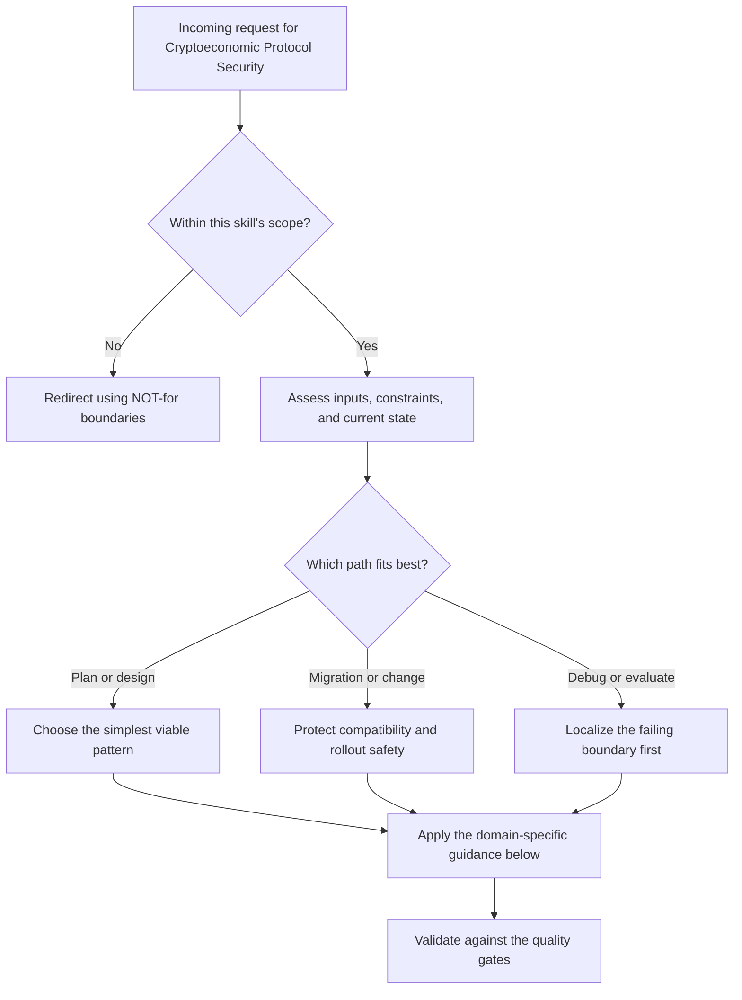

# Cryptoeconomic Protocol Security

Stress-test any system where agents post bonds, escrow funds, or stake
reputation. The goal is to find the cheapest way to profit by breaking
the rules -- then design defenses that make cheating more expensive than
cooperating.

## When to Use

- Stress-testing a bonded or escrowed agent workflow before launch
- Sizing collateral against sabotage, griefing, or abandonment damage
- Reviewing oracle design for acceptance, dispute, or appeal steps
- Checking whether Sybil costs or front-running windows make the scheme exploitable
- Comparing structural, economic, and social defenses for a coordination protocol

## NOT for Boundaries

- Smart contract auditing or exploit review inside EVM/Solidity code paths
- DeFi tokenomics, AMM design, or blockchain consensus security
- Cryptocurrency trading, yield strategy, or portfolio construction
- Pure reputation-system design with no bonded or escrowed enforcement layer

---

## The Five Attack Classes

Every bonded agent system is vulnerable to exactly these five categories
of attack. If your defense does not address all five, you have an
unexamined risk.

### Attack Class 1: Undercollateralization Spirals

**What:** The bond amount is too low relative to the damage a defecting
agent can cause. Rational agents defect whenever `profit_from_defection
> bond_amount + reputation_cost`.

**Detection checklist:**
- What is the maximum damage a bonded agent can inflict?
- What is the current bond-to-damage ratio?
- Can damage scale while the bond stays fixed? (e.g., agent gains
  access to more resources over time)
- Is there a feedback loop where one default triggers others?
  (cascading undercollateralization)
- Can an agent inflate the value of what they control after posting
  bond?

**Decision tree -- choose your defense:**

```
Is bond_amount >= max_possible_damage?
  YES --> Structural defense (full collateralization). Expensive but safe.
  NO  --> Can you cap max_possible_damage?
            YES --> Structural: scope-limit the agent's authority.
            NO  --> Is reputation loss > (profit - bond)?
                      YES --> Social defense (reputation is the real bond).
                      NO  --> VULNERABLE. Raise the bond or accept the risk.
```

**Defenses:**
- Structural: Full collateralization (bond >= max damage)
- Structural: Scope-limiting (cap what a bonded agent can touch)
- Economic: Dynamic bond sizing (bond scales with responsibility)
- Social: Reputation multiplier (repeat players have more to lose)

---

### Attack Class 2: Griefing Attacks

**What:** An attacker posts bond, claims work, then works as slowly as
possible (or not at all), tying up resources and blocking legitimate
agents. The attacker may not even want profit -- the goal is to impose
costs on others.

**Detection checklist:**
- Can a bonded agent hold a task indefinitely without progress?
- Is there a timeout or progress-check mechanism?
- What is the cost to the attacker vs. the cost to the system?
- Can an attacker claim multiple tasks simultaneously?
- Is there a way to measure partial progress?

**Decision tree -- choose your defense:**

```
Does the protocol have mandatory progress checkpoints?
  YES --> Is the checkpoint verified by someone other than the agent?
            YES --> Economic defense (slash bond on missed checkpoint).
            NO  --> VULNERABLE to self-certified fake progress.
  NO  --> Is there a hard timeout with automatic bond forfeiture?
            YES --> Economic defense (time-based). Check: is timeout
                    short enough to limit damage?
            NO  --> VULNERABLE. Add timeouts or checkpoints.

Can one agent claim multiple tasks?
  YES --> Is there a concurrency cap?
            YES --> Acceptable if cap is low enough.
            NO  --> VULNERABLE to resource exhaustion griefing.
  NO  --> Structural defense (single-claim limit).
```

**Defenses:**
- Economic: Timeout-based bond forfeiture
- Economic: Checkpoint slashing (miss a milestone, lose a fraction)
- Structural: Concurrency caps (max N active claims per agent)
- Structural: Progress oracles (external verification of work)
- Social: Priority queuing for agents with completion history

---

### Attack Class 3: Oracle Manipulation

**What:** Someone must decide whether acceptance criteria are met.
Whoever holds that power can be bribed, coerced, or can collude with
one party. "Who watches the watchers?"

**Detection checklist:**
- Who decides that work is "done" or "acceptable"?
- Is the oracle a single entity or a quorum?
- Can the oracle profit by ruling dishonestly?
- Can the requester and oracle collude to steal the worker's bond?
- Can the worker and oracle collude to steal the requester's escrow?
- Is there an appeal mechanism?
- What is the cost to corrupt the oracle vs. the value at stake?

**Decision tree -- choose your defense:**

```
Is acceptance determined by a single party?
  YES --> Can that party profit from a dishonest ruling?
            YES --> VULNERABLE. Add dispute resolution or quorum.
            NO  --> Weak defense (honest-but-curious assumption).
                    Acceptable only for low-value tasks.
  NO  --> Is the quorum selected randomly from a pool?
            YES --> Is the pool large enough that bribing a majority
                    costs more than the stake?
                      YES --> Economic defense (cost-of-corruption).
                      NO  --> VULNERABLE. Increase pool or stake.
            NO  --> Is the quorum self-selected or fixed?
                      --> VULNERABLE to cartel formation.

Is there an appeal/escalation mechanism?
  YES --> Good. Does appeal have a higher bond requirement?
            YES --> Economic defense (costly appeals filter noise).
            NO  --> VULNERABLE to appeal spam.
  NO  --> VULNERABLE. No recourse for honest agents.
```

**Defenses:**
- Structural: Multi-party oracle (quorum of N-of-M)
- Structural: Random oracle selection from large pool
- Economic: Oracle bonding (oracle also stakes, slashed for reversal)
- Economic: Costly appeals with escalation ladder
- Social: Oracle reputation tracking with public history

---

### Attack Class 4: Sybil Economics

**What:** An attacker creates many disposable identities to game the
system. The question is not "can they?" but "what does it cost, and
what do they gain?"

**Detection checklist:**
- What is the cost to create a new identity? (registration fee, bond,
  KYC, proof-of-work, invitation)
- What is the benefit of N identities vs. 1 identity?
- Can Sybils coordinate to manipulate voting/quorum mechanisms?
- Can Sybils claim all available tasks, creating artificial scarcity?
- Does the system offer newcomer bonuses that Sybils can farm?
- Is there a reputation warm-up period?

**Decision tree -- choose your defense:**

```
Cost to create 100 identities:
  > 100x the value extractable per identity?
    YES --> Economic defense (Sybils are unprofitable). Document this.
    NO  --> Is identity creation gated by scarce resource?
              YES --> What resource?
                Bond          --> Economic defense if bond > extractable value.
                Invitation    --> Social defense (web of trust).
                Proof-of-work --> Structural defense (computational cost).
                KYC           --> Structural but has privacy tradeoffs.
              NO  --> VULNERABLE. Add identity cost or cap per-identity value.

Do Sybils gain superlinear advantage?
  (e.g., 10 identities get more than 10x what 1 gets)
  YES --> CRITICAL VULNERABILITY. Redesign incentive curve.
  NO  --> Linear Sybils are manageable with per-identity costs.
```

**Defenses:**
- Economic: Per-identity bond requirement (non-trivial registration cost)
- Economic: Sublinear returns (diminishing value per additional identity)
- Structural: Proof-of-work or proof-of-stake for identity creation
- Social: Web-of-trust / invitation-only with vouching penalties
- Social: Reputation warm-up (new identities start with limited access)

---

### Attack Class 5: Front-Running

**What:** An attacker reads a competitor's public intent (manifest,
bid, plan) and acts on that information before the competitor can
execute. In agent systems, this often means reading a published task
specification and either underbidding, copying the approach, or
blocking resources the competitor needs.

**Detection checklist:**
- Are task manifests/plans publicly visible before execution begins?
- Can a competitor see the bid amount before submitting their own?
- Can someone claim resources mentioned in another agent's plan?
- Is there a commit-reveal scheme or sealed-bid mechanism?
- What is the time window between plan publication and execution?
- Can metadata (timing, size, destination) leak intent even if
  content is encrypted?

**Decision tree -- choose your defense:**

```
Is the plan/manifest visible before execution?
  YES --> Can a competitor profit by reading it?
            YES --> Is there a commit-reveal scheme?
                      YES --> Structural defense. Verify the reveal
                              phase cannot be skipped or delayed.
                      NO  --> VULNERABLE. Add commit-reveal or
                              sealed-bid mechanism.
            NO  --> Low risk. Document why visibility is harmless.
  NO  --> Structural defense (private plans). But verify:
          Can metadata (timing, resource claims) leak intent?
            YES --> Partial vulnerability. Assess metadata leakage.
            NO  --> Strong defense.

Time window between publication and execution:
  Near-zero (atomic commit-and-execute)?
    --> Structural defense (no window to exploit).
  Nonzero?
    --> Window is the attack surface. Minimize it.
```

**Defenses:**
- Structural: Commit-reveal schemes (hash commitment, then reveal)
- Structural: Sealed-bid auctions (bids encrypted until deadline)
- Structural: Atomic commit-and-execute (no window)
- Economic: Front-running penalty (if detected, slash bond)
- Social: Private channels for plan submission

---

## Master Decision Tree: Defense Classification

For any identified attack vector, classify the defense:

```
ATTACK VECTOR IDENTIFIED
  |
  v
Can you make the attack structurally impossible?
  (walls, cryptography, access control, protocol rules)
  YES --> STRUCTURAL DEFENSE
          Examples: scope limits, commit-reveal, concurrency caps,
                    quorum oracles, sealed bids
          Strength: Strongest. Does not depend on rational actors.
  NO  |
      v
Can you make the attack economically unprofitable?
  (bonds, slashing, dynamic pricing, costly identity)
  YES --> ECONOMIC DEFENSE
          Examples: bond > damage, checkpoint slashing, per-identity
                    bond, costly appeals, front-running penalties
          Strength: Strong against rational actors. Fails against
                    irrational griefers or state-level attackers.
  NO  |
      v
Can you make the attack socially costly?
  (reputation, trust networks, public history)
  YES --> SOCIAL DEFENSE
          Examples: reputation multiplier, invitation chains,
                    oracle reputation, priority queuing
          Strength: Weakest standalone. Best as complement to
                    structural or economic defenses.
  NO  |
      v
ACCEPTED RISK
  Document it. Name it. Set a review date.
  Every accepted risk must have:
    - A name
    - An estimated likelihood and impact
    - A trigger condition for re-evaluation
    - An owner
```

---

## Worked Examples

- Load [references/float-plan-escrow-analysis.md](references/float-plan-escrow-analysis.md) for the full Port Daddy Float Plan walkthrough across all five attack classes.
- Minimal case: triage a single escrow workflow by asking whether each attack class is impossible, merely expensive, or currently profitable.
- Failure-recovery case: when a protocol looks safe because it has "a bond," compute the actual bond-to-damage ratio before recommending any rollout.


## Quality Gates

An analysis is complete only when ALL of the following are true:

1. **Every attack class examined.** All five attack classes have been
   evaluated against the target system. No class is skipped.

2. **Every attack vector has a named defense OR is explicitly flagged
   as accepted risk.** There are no unaddressed vectors. "We haven't
   looked at this" is not acceptable. "We looked at this, the cost of
   defense exceeds the expected loss, and we accept the risk with
   review date 2026-Q3" is acceptable.

3. **Every defense is classified.** Each defense is labeled as
   structural, economic, or social. Mixed defenses list all types.

4. **Economic defenses have numbers.** Bond amounts, cost-of-attack
   estimates, and break-even calculations are present. "The bond
   should be higher" without a number is not a defense.

5. **Social defenses have a degradation plan.** What happens when the
   community is small? What happens when reputation data is sparse?
   Social defenses that assume a mature community must document the
   bootstrapping vulnerability.

6. **Accepted risks have four fields.** Name, likelihood/impact
   estimate, trigger for re-evaluation, and owner. Missing any field
   means the gate fails.

7. **The summary table is filled.** Every row has a verdict, defense
   type, and status.

---

## Decision Points



Use this as the first-pass routing model:

- Confirm the request belongs in this skill before doing deeper work.
- Separate planning, migration, and debugging paths before choosing a solution.
- Prefer the simplest correct path that still survives the quality gates.


## Failure Modes

Use the anti-pattern catalog below as the operational failure-mode checklist for this skill. During execution, explicitly look for these failure patterns before you ship a recommendation or implementation.


## Anti-Patterns

### 1. "The Bond Exists, Therefore We Are Safe"

A bond that is too low is worse than no bond. It creates false
confidence. Always compute bond-to-damage ratio.

### 2. "Reputation Will Handle It"

Reputation is the weakest defense layer. It fails when: the community
is small, identities are cheap, or the attacker has a long time
horizon (build reputation, then defect once for big payoff).
Never use reputation as the sole defense for high-value interactions.

### 3. "Nobody Would Do That"

If the protocol allows it and it is profitable, someone will do it.
Design for the attacker who reads your source code.

### 4. "We Will Add Security Later"

Cryptoeconomic security is architectural. Retrofitting bonds and
slashing onto a system designed without them creates inconsistencies
that attackers exploit. Design the incentive structure first.

### 5. "More Bonds = More Security"

Over-collateralization drives away legitimate participants. If the
bond exceeds expected return, only attackers with ulterior motives
participate. Bond sizing is a Goldilocks problem.

### 6. "The Oracle Is Trusted"

No oracle is trusted. The question is not "is the oracle honest?"
but "what is the cost to make the oracle dishonest, and is that cost
higher than the value at stake?"

### 7. "Sealed Bids Prevent All Information Leakage"

Metadata leaks. Timing, payload size, bidder identity, and resource pre-positioning all leak intent even when content is encrypted.
