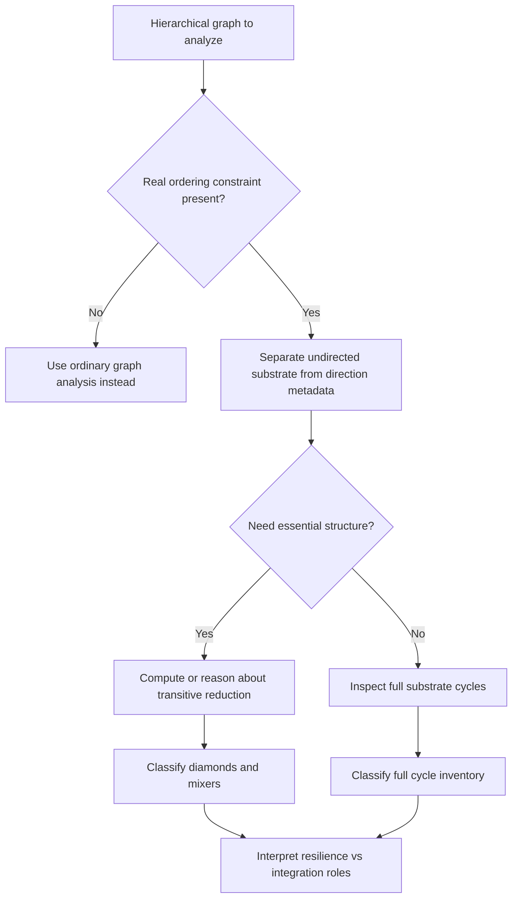

# Hierarchical Cycle Analysis

Use this skill when a system looks acyclic in its directed form, but you need to understand the hidden cycle structure that actually governs resilience, integration, and information flow.

## When to Use

- You are comparing hierarchical systems such as task DAGs, citation networks, genealogies, or workflow graphs and topology alone is not explaining behavior.
- A team says "there are no loops here" because the directed graph is acyclic, and you need the more precise substrate-versus-ordering view.
- You need to distinguish redundancy, robustness, and integration rather than merely count edges or levels.
- You are evaluating whether transitive reduction removes accidental complexity or erases something functionally important.
- You need mesoscopic descriptors of hierarchy that survive beyond one-off local node statistics.

## NOT for Boundaries

This skill is not the primary tool for:
- Ordinary cycle detection in general graphs where the graph is not meaningfully hierarchical.
- Debugging a single broken node, job, or dependency edge in a live pipeline.
- Systems with no explicit ordering constraint such as time, causality, ancestry, or prerequisite structure.
- Treating graph metrics as direct behavioral explanations without any domain interpretation.

## Core Mental Models

### DAG = Substrate + Ordering Metadata

The undirected substrate contains the real topology. The direction labels encode an external ordering constraint. "Acyclic" only means the directions respect the ordering; it does not mean the substrate lacks cycles.

### Four Cycle Classes, Two That Matter Most

After the right contractions, cycles fall into four classes: feedback loops, shortcuts, diamonds, and mixers. In transitively reduced DAGs, the informative survivors are diamonds and mixers.

### Transitive Reduction Reveals Essential Structure

Transitive reduction removes edges that add no new information path. It helps separate real organizational structure from shortcut clutter, but it is an analytical lens, not an automatic design prescription.

### Antichains Give Hierarchical Coordinates

Antichains identify nodes that are incomparable under the ordering. They tell you where information is parallel, where it converges, and why a cycle behaves like a diamond or a mixer.

### Topology Alone Cannot Explain Function

Two systems can have similar raw cycle counts but different information-processing behavior because the cycles sit at different heights, stretches, and source-sink relationships.

## Decision Points

See the expanded visual inventory in [diagrams/INDEX.md](diagrams/INDEX.md).

### 1. Decide Whether the Framework Applies

- Verify that the graph directions come from a meaningful ordering constraint.
- If the system is not hierarchical in that sense, this framework is the wrong abstraction.

### 2. Decide Whether to Use Transitive Reduction

- Use it when you need the minimal informational backbone.
- Avoid treating it as automatically "better" if shortcut edges also serve latency or operational convenience.

### 3. Decide What You Are Comparing

- Compare both topological descriptors and metadata-localized descriptors.
- If two systems look alike globally but behave differently, inspect cycle position, not just cycle count.

## Failure Modes

### 1. Topology-Only Comparison

You compare hierarchies using degree, clustering, or raw cycle counts and miss the fact that cycle position in the ordering is what changes function.

### 2. Acyclic-Means-No-Cycles Confusion

You assume DAGs cannot contain meaningful cyclic organization. That collapses ordering constraints into topology and hides the very structure you are trying to study.

### 3. Shortcut/Diamond Conflation

You treat every alternative path as resilience. Some are eliminable shortcuts; others are genuinely informative parallel routes.

### 4. Ignoring Antichains

You describe hierarchy in terms of "layers" without checking incomparability structure. That loses the distinction between integration across levels and parallelism within a level.

### 5. Over-Reading the Model

You let the graph representation stand in for the full system, forgetting temporal dynamics, stochasticity, incentives, or external interventions that are outside the graph.

## Worked Examples

### Example 1: Workflow DAG with Apparent Redundancy

A multi-agent workflow graph looks over-connected. Using the substrate-plus-metadata lens shows that some extra edges are transitively reducible shortcuts, while a smaller set forms diamonds that preserve alternative recovery routes when one branch stalls. The redesign should prune shortcuts without destroying resilience.

### Example 2: Citation Network vs. Genealogy

Two hierarchical networks have similar size and edge density. Raw graph metrics say they are close; cycle analysis shows one concentrates mixer structures high in the hierarchy while the other mostly has local diamonds. The first is integration-heavy, the second is redundancy-heavy, which explains different diffusion behavior.

## Quality Gates

- The ordering constraint has been named explicitly.
- The analysis separates substrate topology from directional metadata.
- Cycle classes are interpreted, not merely counted.
- Transitive reduction is used as an analytical move, not assumed to be a design goal.
- Conclusions combine structural metrics with domain meaning.

## Reference Documentation

| File | Load when... |
| --- | --- |
| `references/when-does-dag-analysis-apply.md` | You need to check the boundary conditions before using this framework. |
| `references/dag-decomposition-for-hierarchical-reasoning.md` | You want the formal decomposition between substrate and ordering metadata. |
| `references/four-cycle-classes-information-processing.md` | You need the complete taxonomy and information-role interpretation of each cycle class. |
| `references/transitive-reduction-information-minimization.md` | You are deciding whether transitive reduction clarifies or oversimplifies the hierarchy. |
| `references/antichains-and-hierarchical-coordinates.md` | You need the antichain view for positioning cycles inside the hierarchy. |
| `references/metadata-localizes-topology.md` | Similar topologies behave differently and you need the metadata story. |

## Anti-Patterns

- Saying "DAG" when you really mean "therefore no meaningful cyclic organization."
- Using only topology and then claiming to explain function.
- Counting cycles without classifying their informational role.
- Assuming transitive reduction is always an improvement rather than a lens.
- Forgetting that graphs abstract away many system dynamics.

## Shibboleths

You have internalized this skill if you naturally ask:
- "What is the ordering constraint here?"
- "Is this a shortcut, a diamond, or a mixer?"
- "What survives transitive reduction, and what was only clutter?"
- "Where in the hierarchy do these cycles sit, not just how many are there?"
