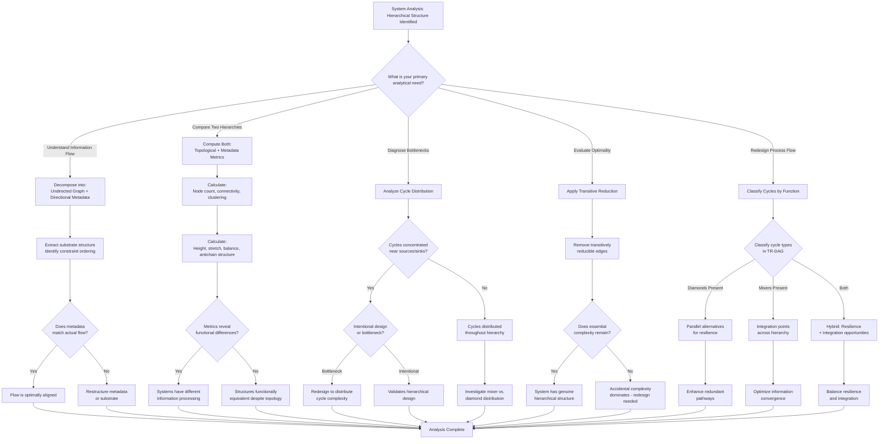

# Hierarchical Cycle Analysis Decision Tree

```mermaid
flowchart TD
    A["System Analysis: Hierarchical Structure Identified"] --> B{What is your primary analytical need?}
    
    B -->|Understand Information Flow| C["Decompose into:<br/>Undirected Graph + Directional Metadata"]
    B -->|Compare Two Hierarchies| D["Compute Both:<br/>Topological + Metadata Metrics"]
    B -->|Diagnose Bottlenecks| E["Analyze Cycle Distribution"]
    B -->|Evaluate Optimality| F["Apply Transitive Reduction"]
    B -->|Redesign Process Flow| G["Classify Cycles by Function"]
    
    C --> C1["Extract substrate structure<br/>Identify constraint ordering"]
    C1 --> C2{Does metadata<br/>match actual flow?}
    C2 -->|Yes| C3["Flow is optimally aligned"]
    C2 -->|No| C4["Restructure metadata<br/>or substrate"]
    
    D --> D1["Calculate:<br/>Node count, connectivity, clustering"]
    D1 --> D2["Calculate:<br/>Height, stretch, balance, antichain structure"]
    D2 --> D3{Metrics reveal<br/>functional differences?}
    D3 -->|Yes| D4["Systems have different<br/>information processing"]
    D3 -->|No| D5["Structures functionally<br/>equivalent despite topology"]
    
    E --> E1{Cycles concentrated<br/>near sources/sinks?}
    E1 -->|Yes| E2{Intentional design<br/>or bottleneck?}
    E2 -->|Bottleneck| E3["Redesign to distribute<br/>cycle complexity"]
    E2 -->|Intentional| E4["Validates hierarchical design"]
    E1 -->|No| E5["Cycles distributed<br/>throughout hierarchy"]
    E5 --> E6["Investigate mixer vs.<br/>diamond distribution"]
    
    F --> F1["Remove transitively<br/>reducible edges"]
    F1 --> F2{Does essential<br/>complexity remain?}
    F2 -->|Yes| F3["System has genuine<br/>hierarchical structure"]
    F2 -->|No| F4["Accidental complexity<br/>dominates - redesign needed"]
    
    G --> G1{Classify cycle types<br/>in TR-DAG}
    G1 -->|Diamonds Present| G2["Parallel alternatives<br/>for resilience"]
    G1 -->|Mixers Present| G3["Integration points<br/>across hierarchy"]
    G1 -->|Both| G4["Hybrid: Resilience<br/>+ Integration opportunities"]
    
    G2 --> G5["Enhance redundant<br/>pathways"]
    G3 --> G6["Optimize information<br/>convergence"]
    G4 --> G7["Balance resilience<br/>and integration"]
    
    C3 --> H["Analysis Complete"]
    C4 --> H
    D4 --> H
    D5 --> H
    E3 --> H
    E4 --> H
    E6 --> H
    F3 --> H
    F4 --> H
    G5 --> H
    G6 --> H
    G7 --> H
```
