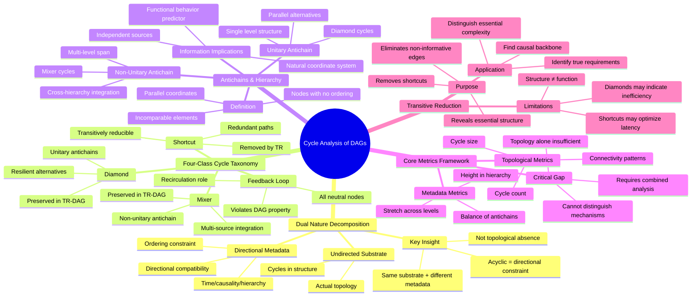

# Cycle Taxonomy & Information Architecture

```mermaid
mindmap
  root((Cycle Analysis of DAGs))
    Dual Nature Decomposition
      Undirected Substrate
        Actual topology
        Cycles in structure
      Directional Metadata
        Ordering constraint
        Time/causality/hierarchy
        Directional compatibility
      Key Insight
        Acyclic = directional constraint
        Not topological absence
        Same substrate + different metadata
    Four-Class Cycle Taxonomy
      Feedback Loop
        All neutral nodes
        Recirculation role
        Violates DAG property
      Shortcut
        Transitively reducible
        Redundant paths
        Removed by TR
      Diamond
        Unitary antichains
        Resilient alternatives
        Preserved in TR-DAG
      Mixer
        Non-unitary antichain
        Multi-source integration
        Preserved in TR-DAG
    Antichains & Hierarchy
      Definition
        Nodes with no ordering
        Incomparable elements
        Parallel coordinates
      Unitary Antichain
        Single level structure
        Diamond cycles
        Parallel alternatives
      Non-Unitary Antichain
        Multi-level span
        Mixer cycles
        Cross-hierarchy integration
      Information Implications
        Natural coordinate system
        Independent sources
        Functional behavior predictor
    Core Metrics Framework
      Topological Metrics
        Cycle count
        Cycle size
        Connectivity patterns
      Metadata Metrics
        Height in hierarchy
        Stretch across levels
        Balance of antichains
      Critical Gap
        Topology alone insufficient
        Cannot distinguish mechanisms
        Requires combined analysis
    Transitive Reduction
      Purpose
        Eliminates non-informative edges
        Removes shortcuts
        Reveals essential structure
      Application
        Distinguish essential complexity
        Find causal backbone
        Identify true requirements
      Limitations
        Shortcuts may optimize latency
        Diamonds may indicate inefficiency
        Structure ≠ function

```
