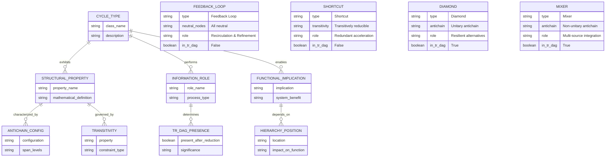

# Four-Class Cycle Taxonomy with Functional Attributes

```mermaid
erDiagram
    CYCLE_TYPE ||--o{ STRUCTURAL_PROPERTY : exhibits
    CYCLE_TYPE ||--o{ INFORMATION_ROLE : performs
    CYCLE_TYPE ||--o{ FUNCTIONAL_IMPLICATION : enables
    STRUCTURAL_PROPERTY ||--o{ ANTICHAIN_CONFIG : characterized_by
    STRUCTURAL_PROPERTY ||--o{ TRANSITIVITY : governed_by
    INFORMATION_ROLE ||--o{ TR_DAG_PRESENCE : determines
    FUNCTIONAL_IMPLICATION ||--o{ HIERARCHY_POSITION : depends_on

    CYCLE_TYPE {
        string class_name
        string description
    }

    FEEDBACK_LOOP {
        string type "Feedback Loop"
        string neutral_nodes "All neutral"
        string role "Recirculation & Refinement"
        boolean in_tr_dag "False"
    }

    SHORTCUT {
        string type "Shortcut"
        string transitivity "Transitively reducible"
        string role "Redundant acceleration"
        boolean in_tr_dag "False"
    }

    DIAMOND {
        string type "Diamond"
        string antichain "Unitary antichain"
        string role "Resilient alternatives"
        boolean in_tr_dag "True"
    }

    MIXER {
        string type "Mixer"
        string antichain "Non-unitary antichain"
        string role "Multi-source integration"
        boolean in_tr_dag "True"
    }

    STRUCTURAL_PROPERTY {
        string property_name
        string mathematical_definition
    }

    ANTICHAIN_CONFIG {
        string configuration
        string span_levels
    }

    TRANSITIVITY {
        string property
        string constraint_type
    }

    INFORMATION_ROLE {
        string role_name
        string process_type
    }

    FUNCTIONAL_IMPLICATION {
        string implication
        string system_benefit
    }

    TR_DAG_PRESENCE {
        boolean present_after_reduction
        string significance
    }

    HIERARCHY_POSITION {
        string location
        string impact_on_function
    }
```
