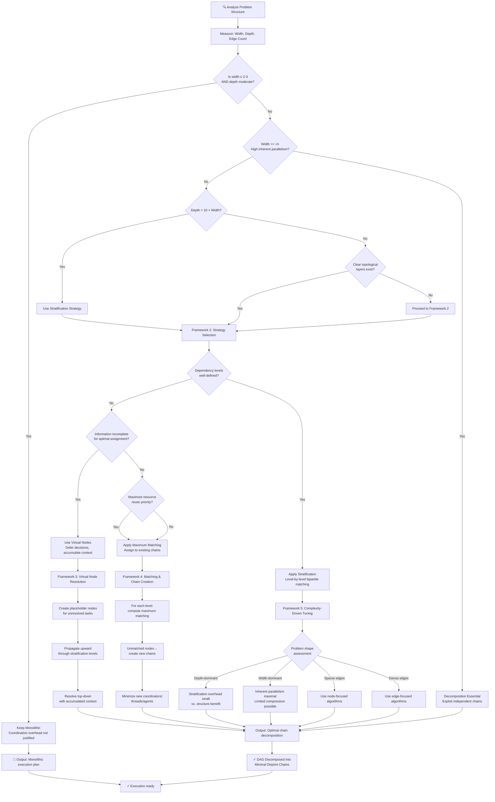

# DAG Decomposition Decision Tree

```mermaid
flowchart TD
    A["🔍 Analyze Problem Structure"] --> B["Measure: Width, Depth, Edge Count"]
    B --> C{"Is width ≤ 2-3<br/>AND depth moderate?"}
    C -->|Yes| D["Keep Monolithic<br/>Coordination overhead not justified"]
    C -->|No| E{"Width >> √n<br/>High inherent parallelism?"}
    E -->|Yes| F["Decomposition Essential<br/>Exploit independent chains"]
    E -->|No| G{"Depth > 10 × Width?"}
    G -->|Yes| H["Use Stratification Strategy"]
    G -->|No| I{"Clear topological<br/>layers exist?"}
    
    H --> J["Framework 2: Strategy Selection"]
    I -->|Yes| J
    I -->|No| K["Proceed to Framework 2"]
    K --> J
    
    J --> L{"Dependency levels<br/>well-defined?"}
    L -->|Yes| M["Apply Stratification<br/>Level-by-level bipartite matching"]
    L -->|No| N{"Information incomplete<br/>for optimal assignment?"}
    
    N -->|Yes| O["Use Virtual Nodes<br/>Defer decisions, accumulate context"]
    N -->|No| P{"Maximize resource<br/>reuse priority?"}
    
    O --> Q["Framework 3: Virtual Node Resolution"]
    P -->|Yes| R["Apply Maximum Matching<br/>Assign to existing chains"]
    P -->|No| R
    
    Q --> S["Create placeholder nodes<br/>for unresolved tasks"]
    S --> T["Propagate upward<br/>through stratification levels"]
    T --> U["Resolve top-down<br/>with accumulated context"]
    U --> V["Output: Optimal chain decomposition"]
    
    R --> W["Framework 4: Matching & Chain Creation"]
    W --> X["For each level:<br/>compute maximum matching"]
    X --> Y["Unmatched nodes→<br/>create new chains"]
    Y --> Z["Minimize new coordinators/<br/>threads/agents"]
    Z --> V
    
    M --> AA["Framework 5: Complexity-Driven Tuning"]
    AA --> AB{"Problem shape<br/>assessment"}
    AB -->|Depth-dominant| AC["Stratification overhead small<br/>vs. structure benefit"]
    AB -->|Width-dominant| AD["Inherent parallelism maximal<br/>Limited compression possible"]
    AB -->|Sparse edges| AE["Use node-focused algorithms"]
    AB -->|Dense edges| AF["Use edge-focused algorithms"]
    
    AC --> V
    AD --> V
    AE --> V
    AF --> V
    D --> AG["🎯 Output: Monolithic execution plan"]
    F --> V
    
    V --> AH["✓ DAG Decomposed into<br/>Minimal Disjoint Chains"]
    AG --> AI["✓ Execution ready"]
    AH --> AI
```
