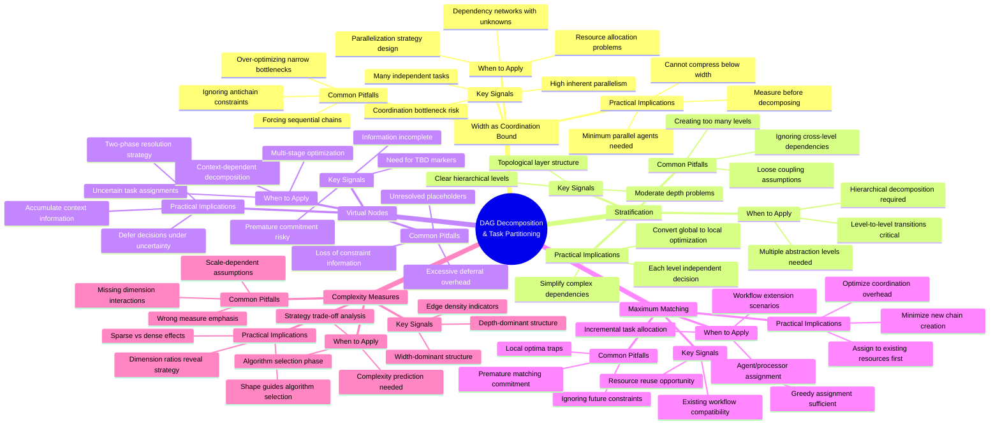

# Mental Models & Activation Triggers

```mermaid
mindmap
  root((DAG Decomposition<br/>& Task Partitioning))
    Width as Coordination Bound
      Practical Implications
        Minimum parallel agents needed
        Cannot compress below width
        Measure before decomposing
      Key Signals
        High inherent parallelism
        Many independent tasks
        Coordination bottleneck risk
      When to Apply
        Dependency networks with unknowns
        Resource allocation problems
        Parallelization strategy design
      Common Pitfalls
        Forcing sequential chains
        Ignoring antichain constraints
        Over-optimizing narrow bottlenecks
    Stratification
      Practical Implications
        Convert global to local optimization
        Each level independent decision
        Simplify complex dependencies
      Key Signals
        Clear hierarchical levels
        Topological layer structure
        Moderate depth problems
      When to Apply
        Multiple abstraction levels needed
        Level-to-level transitions critical
        Hierarchical decomposition required
      Common Pitfalls
        Creating too many levels
        Loose coupling assumptions
        Ignoring cross-level dependencies
    Virtual Nodes
      Practical Implications
        Defer decisions under uncertainty
        Accumulate context information
        Two-phase resolution strategy
      Key Signals
        Information incomplete
        Premature commitment risky
        Need for TBD markers
      When to Apply
        Uncertain task assignments
        Context-dependent decomposition
        Multi-stage optimization
      Common Pitfalls
        Excessive deferral overhead
        Unresolved placeholders
        Loss of constraint information
    Maximum Matching
      Practical Implications
        Minimize new chain creation
        Assign to existing resources first
        Optimize coordination overhead
      Key Signals
        Resource reuse opportunity
        Existing workflow compatibility
        Greedy assignment sufficient
      When to Apply
        Incremental task allocation
        Agent/processor assignment
        Workflow extension scenarios
      Common Pitfalls
        Local optima traps
        Ignoring future constraints
        Premature matching commitment
    Complexity Measures
      Practical Implications
        Shape guides algorithm selection
        Dimension ratios reveal strategy
        Sparse vs dense effects
      Key Signals
        Depth-dominant structure
        Width-dominant structure
        Edge density indicators
      When to Apply
        Algorithm selection phase
        Strategy trade-off analysis
        Complexity prediction needed
      Common Pitfalls
        Wrong measure emphasis
        Missing dimension interactions
        Scale-dependent assumptions
```
