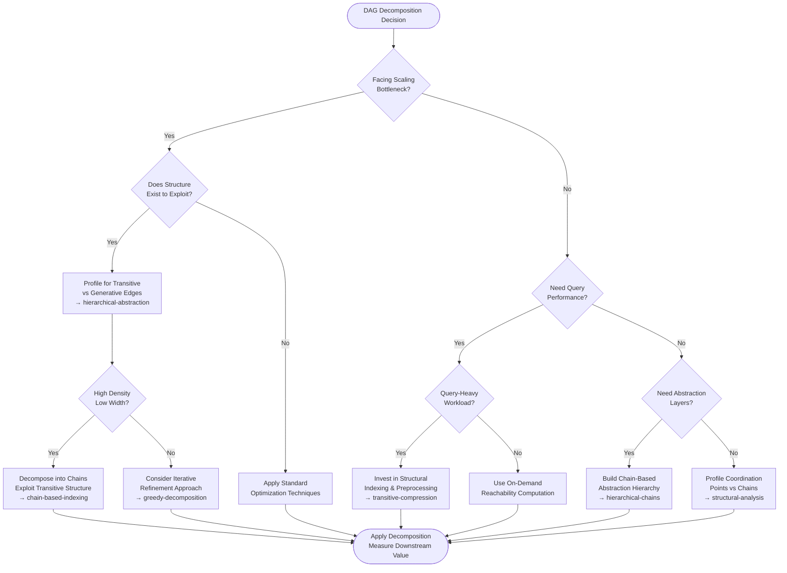

# DAG Decomposition Decision Framework

```mermaid
flowchart TD
    Start([DAG Decomposition Decision]) --> Q1{Facing Scaling<br/>Bottleneck?}
    
    Q1 -->|Yes| Q2{Does Structure<br/>Exist to Exploit?}
    Q1 -->|No| Q5{Need Query<br/>Performance?}
    
    Q2 -->|Yes| A1["Profile for Transitive<br/>vs Generative Edges<br/>→ hierarchical-abstraction"]
    Q2 -->|No| A2["Apply Standard<br/>Optimization Techniques"]
    
    A1 --> Q3{High Density<br/>Low Width?}
    Q3 -->|Yes| A3["Decompose into Chains<br/>Exploit Transitive Structure<br/>→ chain-based-indexing"]
    Q3 -->|No| A4["Consider Iterative<br/>Refinement Approach<br/>→ greedy-decomposition"]
    
    Q5 -->|Yes| Q6{Query-Heavy<br/>Workload?}
    Q5 -->|No| Q7{Need Abstraction<br/>Layers?}
    
    Q6 -->|Yes| A5["Invest in Structural<br/>Indexing & Preprocessing<br/>→ transitive-compression"]
    Q6 -->|No| A6["Use On-Demand<br/>Reachability Computation"]
    
    Q7 -->|Yes| A7["Build Chain-Based<br/>Abstraction Hierarchy<br/>→ hierarchical-chains"]
    Q7 -->|No| A8["Profile Coordination<br/>Points vs Chains<br/>→ structural-analysis"]
    
    A3 --> End([Apply Decomposition<br/>Measure Downstream Value])
    A4 --> End
    A5 --> End
    A6 --> End
    A7 --> End
    A8 --> End
    A2 --> End
```
