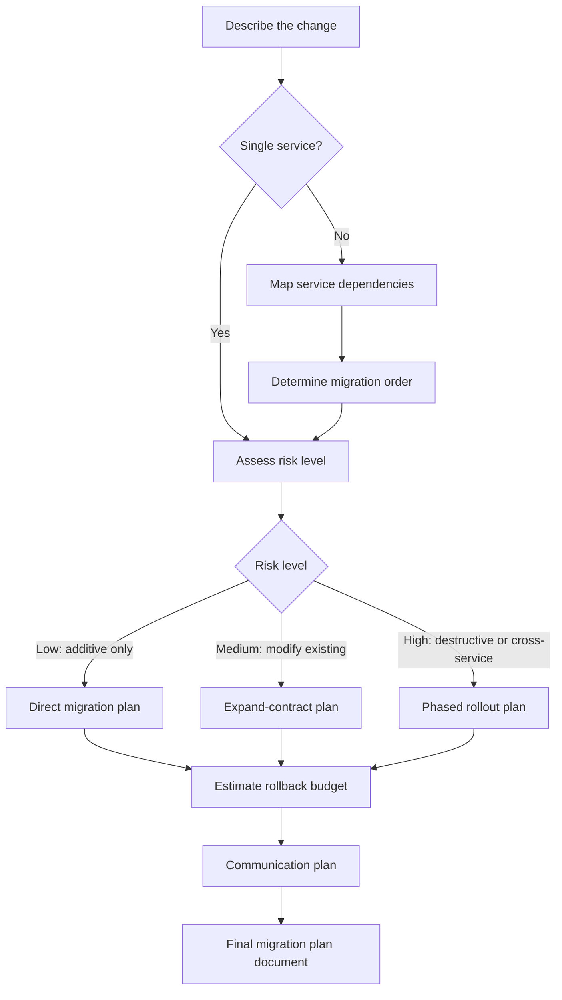
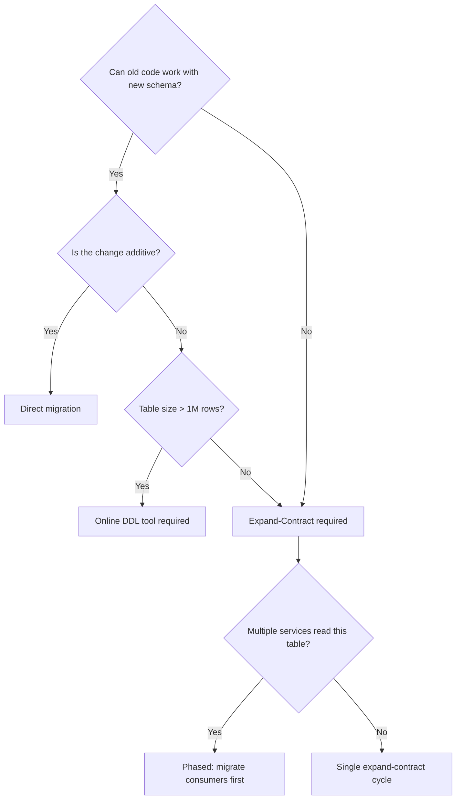
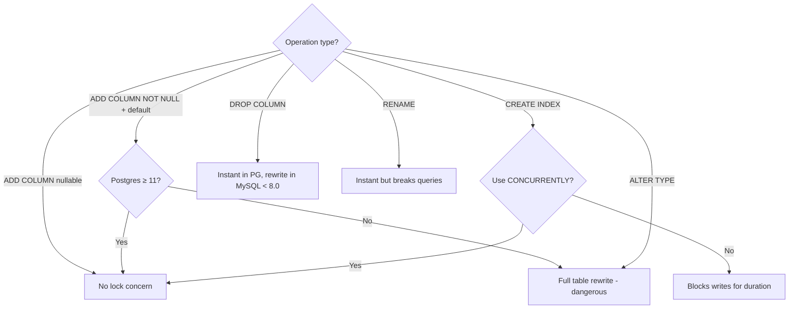
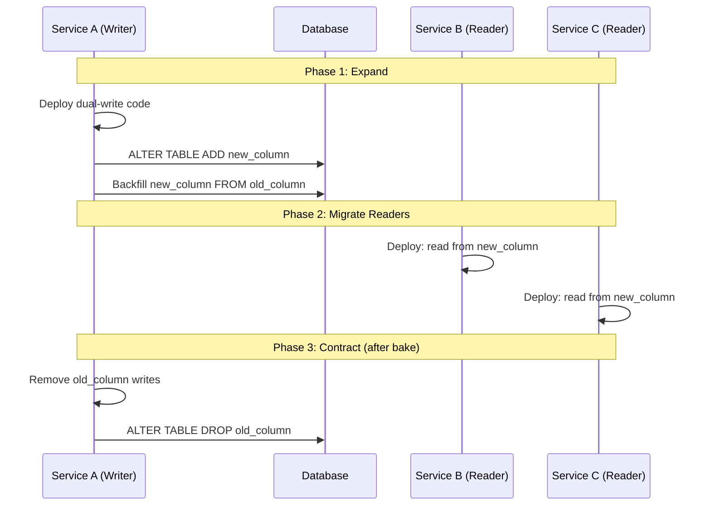

# Database Migration Planner

Plans safe, sequenced database migrations before any SQL is written. Produces migration plans with risk scores, dependency graphs, rollback budgets, and communication timelines.

## When to Use

✅ **Use for**: Deciding migration strategy, risk-scoring schema changes, sequencing migrations across multiple services, estimating rollback windows, planning communication to dependent teams, assessing lock contention risk, choosing between expand-contract vs. blue-green vs. big-bang.

❌ **NOT for**: Writing DDL/migration files (→ `database-migration-manager`), executing data pipelines (→ `data-migration-specialist`), query performance (→ `postgresql-optimization`), ORM config (→ `drizzle-migrations`).

## Core Process



## Risk Classification

| Risk Level | Characteristics | Strategy | Rollback Budget |
|-----------|----------------|----------|-----------------|
| **Low** | Additive only (new table, new nullable column, new index on small table) | Direct apply | Minutes |
| **Medium** | Modifies existing (column type change, NOT NULL addition, index on large table) | Expand-contract | Hours |
| **High** | Destructive (drop column/table, rename across services, data type narrowing) | Phased rollout with feature flags | Days |
| **Critical** | Cross-database, multi-region, or involves PII restructuring | Blue-green database with traffic replay | Weeks |

## Decision Trees

### Strategy Selection



### Lock Contention Assessment



## Anti-Patterns

### Planning by DDL Complexity

**Novice**: "It's just one ALTER TABLE, ship it directly."
**Expert**: Risk comes from *service coupling* and *table size*, not DDL line count. A single `ALTER TABLE ADD COLUMN NOT NULL` on a 500M-row table with 12 consuming services is Critical-risk regardless of its syntactic simplicity.
**Detection**: Plan mentions "simple change" without noting row count or consumer count.

### Rollback as Afterthought

**Novice**: "We'll figure out rollback if something goes wrong."
**Expert**: Rollback is designed first. Every migration plan starts with: "How do I undo this in under X minutes?" If the answer is "you can't," the migration needs a different strategy (expand-contract, blue-green).
**Timeline**: Pre-2020: rollback was optional for many teams. Post-incident-culture (2020+): rollback budget is a hard requirement.

### Ignoring Read Replicas and Caches

**Novice**: Plans migration for primary only.
**Expert**: Read replicas lag. Caches have stale schemas. A migration plan must account for: replica lag window, cache TTL expiry, connection pool recycling, and ORM schema cache invalidation. Miss any one and you get 500s from readers even though the primary migrated cleanly.

## Migration Plan Template

When producing a plan, output this structure:

```markdown
# Migration Plan: [Name]

## Summary
- **Change**: [What's changing]
- **Risk Level**: Low / Medium / High / Critical
- **Estimated Duration**: [Time from start to verified-complete]
- **Rollback Budget**: [Max time to fully reverse]
- **Affected Services**: [List]

## Dependencies
- [ ] Service A must deploy read-compatibility code first
- [ ] Cache TTL must expire (12h) before dropping old column
- [ ] Feature flag `new_schema_v2` must be enabled in staging first

## Sequence
| Step | Action | Duration | Rollback |
|------|--------|----------|----------|
| 1 | Deploy app code that reads both old+new | 30m | Revert deploy |
| 2 | Run forward migration | 5m | Run rollback SQL |
| 3 | Backfill new column from old | 2h | Truncate new column |
| 4 | Verify data integrity | 30m | N/A |
| 5 | Switch reads to new column | 15m | Feature flag off |
| 6 | Remove old column (after bake period) | 1 week | N/A (point of no return) |

## Rollback Plan
- **Trigger**: Error rate > 1% OR p99 latency > 2x baseline
- **Procedure**: [Specific steps]
- **Point of no return**: Step 6 (old column dropped)

## Communication
- [ ] Notify dependent teams 1 week before
- [ ] Post in #migrations channel day-of
- [ ] Update API docs if schema is exposed
```

## Multi-Service Sequencing

When a migration spans multiple services:

1. **Map the dependency graph** — Which services read/write the affected tables?
2. **Identify the critical path** — Which service must migrate first (usually the writer)?
3. **Design compatibility windows** — Period where both old and new schemas are valid
4. **Plan the rollout order**:
   - Writers deploy dual-write code
   - Run schema migration (expand phase)
   - Readers deploy new-schema code
   - Verify all services healthy
   - Remove old-schema code (contract phase)
   - Drop old columns (after bake period)



## Estimation Heuristics

| Factor | Impact on Duration |
|--------|-------------------|
| Table rows > 10M | +1h per 100M rows for backfill |
| Consuming services > 3 | +1 week bake time per additional service |
| PII/compliance columns | +1 week for legal review |
| Multi-region database | 2x total duration (replica sync) |
| No staging environment | 3x risk score (can't rehearse) |
| Active on-call incident | STOP. Do not plan migrations during incidents. |

## References

- `references/risk-matrix.md` — Detailed risk scoring with weighted factors for table size, consumer count, data sensitivity, and region topology
- `references/communication-templates.md` — Pre-written Slack/email templates for migration announcements, go/no-go decisions, and incident escalation
- `references/platform-quirks.md` — Database-specific gotchas: Postgres online DDL limitations, MySQL metadata locks, CockroachDB schema change jobs, PlanetScale branching model
