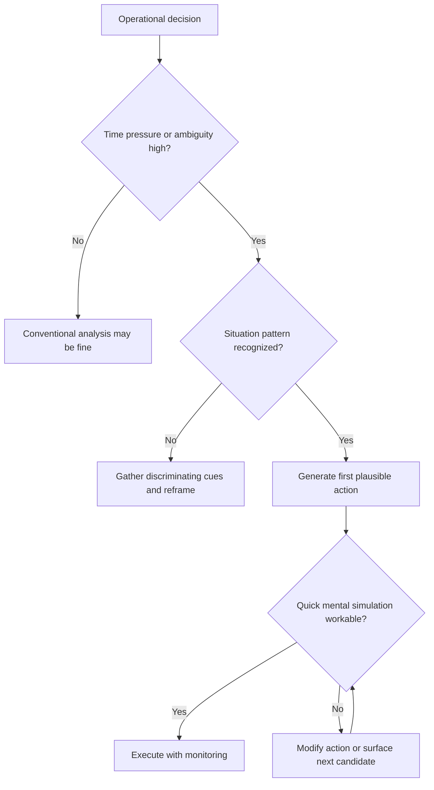

# Decision Models from the Field

Use this skill when the key question is how an agent should decide under operational pressure, not how to optimize a fully specified problem on paper.

## When to Use

- Agents become slow or indecisive because they keep enumerating and comparing options.
- A system performs worse in the field than in clean benchmark or lab-style settings.
- You need to design decision support without interrupting expert pattern recognition.
- Coordination failures suggest different actors are operating from different situation models.
- You want to decide whether satisficing is the correct standard instead of global optimality.

## NOT for Boundaries

This skill is not the primary tool for:
- Batch optimization problems where exhaustive search is affordable and delay has little cost.
- Static planning with complete information and no operational time pressure.
- Formal utility modeling tasks whose main difficulty is numeric optimization rather than situation assessment.
- Generic action-selection tuning when the real problem is upstream perception or framing.

## Core Mental Models

### Situation Assessment Is the Main Cognitive Work

The hard problem is usually understanding what is happening, not ranking options. Once the situation is diagnosed correctly, the first workable action is often obvious.

### Recognition-Primed Decision Is Serial, Not Comparative

Experts recognize a situation, generate one plausible action, mentally simulate it, and execute or modify it. They do not usually compare a menu of options in parallel.

### Satisficing Is Often Rational

In time-pressured environments, the first workable action can dominate the best late action. Seeking optimality when delay is costly creates its own failure mode.

### Rules Hide the Real Expertise

The expertise is not mainly in knowing the consequent of a rule. It is in recognizing that the antecedent actually applies in the live situation.

### Decision Support Should Amplify Recognition

Good support improves cues, anomaly detection, and expectancy tracking. Bad support forces experts into slower analytical rituals that strip context and degrade performance.

## Decision Points

### 1. Diagnose the Situation Before Comparing Actions

- Ask whether the actors share the same situation model.
- If they do not, fix the framing problem before tuning the action policy.

### 2. Decide Whether Comparison Is Necessary

- If a workable action is obvious and time pressure is real, comparison is often waste.
- If the situation type is unclear, spend effort on cue gathering rather than option ranking.

### 3. Set the Correct Success Criterion

- Use workability when delay costs are meaningful.
- Reserve optimization for conditions where search is cheap and the environment is stable enough to justify it.

## Failure Modes

### 1. Option-Enumeration Paralysis

The architecture demands alternative generation and ranking before movement. Valuable time is spent on comparison instead of action or better diagnosis.

### 2. Situation-Model Failure Disguised as Action Failure

The team tunes action selection after a bad outcome, but the real problem was a wrong or incomplete reading of the situation.

### 3. Decision-Support Interference

The support tool asks experts to fill in rankings, probabilities, or exhaustive option sets when their natural advantage was rapid recognition plus simulation.

### 4. Premature Optimization

The system spends scarce time searching for the best action when the real requirement was a good-enough action now.

### 5. Rule-Consequent Worship

Teams keep refining action catalogs while leaving antecedent recognition weak. The system then fails in exactly the live contexts where expertise was supposed to help.

## Worked Examples

### Example 1: Incident Response Commander Agent

A responder agent sees a service outage, partial telemetry, and a rising customer impact signal. Instead of generating five recovery options and scoring each one, it classifies the event as a likely cascading dependency failure, simulates an isolation action, sees no obvious contradiction, and executes with a short checkpoint window. Speed comes from situation recognition, not from skipping thought.

### Example 2: Shared Situation Model in Multi-Agent Coordination

A planner agent wants rollback while an infra agent wants scale-out. The right diagnostic is not "which action is better?" but "why are they reading different situations?" Once both agents align on the causal frame, the action disagreement collapses into a single workable next step.

## Quality Gates

- The live situation model is explicit enough to inspect.
- Option comparison is only required when it actually changes the decision.
- The decision loop includes quick simulation or contradiction checks before action.
- Performance is judged by workability under the operating conditions, not benchmark-style optimality.
- Decision support surfaces better cues rather than forcing analytical ceremony.

## Reference Documents

| File | Load when... |
| --- | --- |
| `references/rpd-recognition-primed-decisions-for-agents.md` | You need the full recognition → simulation → modification loop for agent design. |
| `references/situation-assessment-primacy.md` | A failure analysis suggests the situation model, not the action policy, was wrong. |
| `references/when-analytical-decision-tools-fail.md` | You need to explain why formal analysis degrades performance in operational settings. |
| `references/expertise-as-pattern-recognition-not-rules.md` | You are deciding whether to improve rule catalogs or recognition mechanisms. |
| `references/satisficing-over-optimizing-in-complex-domains.md` | You need to defend workability over optimality as the correct decision standard. |
| `references/decision-support-for-recognition-not-analysis.md` | You are designing or critiquing decision-support tooling. |

## Anti-Patterns

- Mandatory option comparison before action in time-pressured contexts.
- Post-mortems that tune action policy without checking the underlying frame.
- Support systems that ask "which option?" when the real problem is "what is happening?"
- Treating richer rules as a substitute for stronger situation recognition.
- Confusing more deliberation with better judgment.

## Shibboleths

You have internalized this skill if you naturally ask:
- "What situation does the agent think it is in?"
- "Would the first workable action be enough here?"
- "Is analysis helping, or interrupting recognition?"
- "Are we fixing the frame problem or just polishing the action list?"
