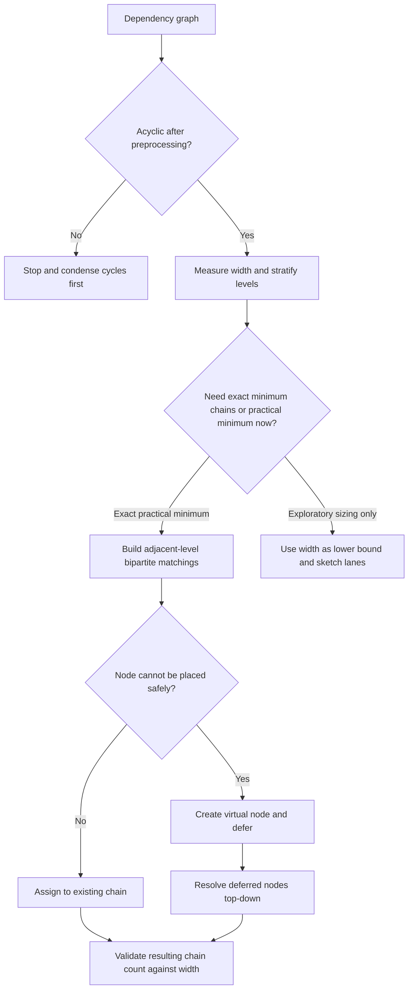

# Decomposing DAGs into Disjoint Chains

Use this skill when the important question is not merely whether a dependency graph is valid, but how many independent chains it truly requires and how to assign nodes without inventing fake coordination.

## When to Use

- A task or build graph is acyclic and you need the smallest practical number of execution lanes.
- You need to translate global dependency structure into level-by-level local decisions.
- A multi-agent workflow is creating too many parallel lanes because independent and merely transitive relationships are being conflated.
- You need to defer assignment safely until more context is available instead of committing too early.
- You are reasoning about inherent coordination cost and need a width-based lower bound.

## NOT for Boundaries

This skill is not the primary tool for:
- Cyclic graphs or feedback systems where SCC condensation has not happened yet.
- Generic scheduling problems with resource calendars, durations, or stochastic execution but no meaningful DAG structure.
- One-off reachability questions where the setup cost of chain decomposition is higher than the query value.
- Problems where the true need is weighted optimization over costs, deadlines, or utilities rather than chain minimization under partial order constraints.

## Core Mental Models

### Width Is the Real Coordination Lower Bound

The width of the DAG, not the raw edge count, tells you the minimum number of chains you must sustain. If the width is six, every "five-lane" design is pretending away real independence.

### Stratification Converts Global Search into Local Assignment

Layering the DAG creates adjacent-level interfaces where matching can be solved locally. That is what makes the global chain decomposition tractable rather than mystical.

### Virtual Nodes Preserve Optionality

If a node cannot yet be placed without making a brittle decision, keep a virtual placeholder and resolve it later from a better-informed level. Deferred commitment is a design move, not a failure.

### Maximum Matching Minimizes New Lanes

At each level transition, use matching to reuse existing chains before opening new ones. Every unmatched node is a justified new lane; every unnecessary lane is coordination tax.

## Decision Points

See the deeper visual set in [diagrams/INDEX.md](diagrams/INDEX.md).

### 1. Decide Whether the Graph Is Ready

- If cycles remain, this method is premature.
- If the graph is acyclic but noisy, simplify labels and verify dependency direction before stratifying.

### 2. Decide Whether Width Alone Answers the Question

- If the stakeholder only needs the lower bound on coordination, width may be enough.
- If actual execution lanes must be assigned, proceed to stratification and matching.

### 3. Decide When to Defer Placement

- If placing a node now would block later valid reuse, keep it virtual.
- If remaining depth is shallow and the ambiguity is low-value, open a fresh chain rather than over-engineering deferral.

## Failure Modes

### Width-Depth Confusion

**Symptoms:** the team talks about the longest path when the real pain is too many simultaneous lanes.  
**Recovery:** compute the maximum antichain explicitly and treat that as the coordination floor.

### Premature Lane Commitment

**Symptoms:** early assignments force unnecessary new chains later.  
**Recovery:** allow virtual nodes and resolve them after more context accumulates.

### Post-Hoc Stratification

**Symptoms:** local assignments are made before levels exist, then "explained" as if they were optimal.  
**Recovery:** stratify first, then solve adjacent-level matching problems.

### False Compression

**Symptoms:** the proposed decomposition uses fewer chains than the width permits.  
**Recovery:** reject the design immediately; it is violating the partial order, not being clever.

### Using Chain Count as a Proxy for All Cost

**Symptoms:** the decomposition is minimal in chains but awful for latency, ownership, or resource balancing.  
**Recovery:** treat chain count as one objective and hand off to a richer scheduler once the structural bound is understood.

## Worked Examples

### Example 1: CI Pipeline Ownership Lanes

A large build graph looks chaotic, but its width is only four. Stratification plus matching shows most work can stay inside four review lanes, with virtual nodes handling late-bound packaging steps. The insight is that the pipeline was noisy, not intrinsically eight-team work.

### Example 2: Multi-Agent Evidence Review

An orchestrator wants parallel document-analysis agents. The graph of prerequisites reveals width three even though there are dozens of edges. The system creates three stable execution chains and only opens a fourth lane for one unmatched synthesis node that truly cannot share an existing chain.

## Quality Gates

- [ ] The graph has been confirmed acyclic before decomposition.
- [ ] Width has been measured or at least bounded before proposing lane count.
- [ ] Stratification happens before local assignment decisions.
- [ ] Virtual nodes are used deliberately, not as a hiding place for confusion.
- [ ] Final chain count is compared against width and justified when larger.

## Reference Files

| File | Load when |
| --- | --- |
| `references/width-as-coordination-bound.md` | You need the formal lower-bound logic behind lane count. |
| `references/stratification-for-local-reasoning.md` | You are implementing or reviewing level construction. |
| `references/matching-as-resource-allocation.md` | You need the matching formulation for chain reuse. |
| `references/virtual-nodes-deferred-decisions.md` | Deferred assignment and two-phase resolution are the core difficulty. |
| `references/correctness-through-induction.md` | You need the proof intuition that local steps compose globally. |
| `references/compression-through-decomposition.md` | The main goal is reachability compression rather than workflow design. |

## Anti-Patterns

- Treating edge density as the main complexity signal without checking width.
- Forcing every unresolved node into a new chain instead of using deferred structure.
- Calling a decomposition "optimal" without validating it against the width bound.
- Applying chain minimization to problems that are really cyclic control systems or weighted scheduling problems.
