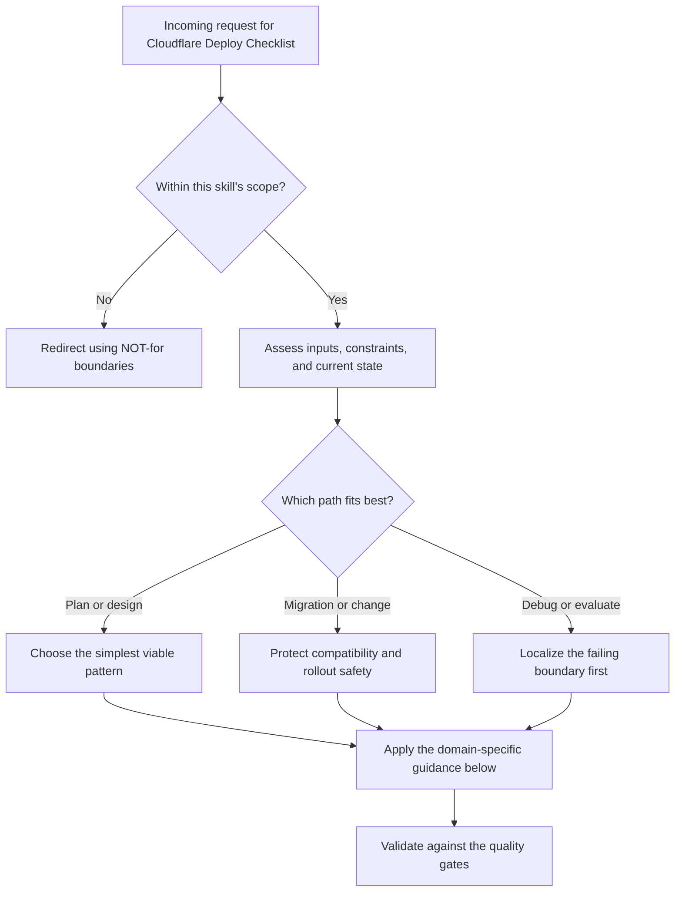

# Cloudflare Deploy Checklist

Run this checklist before every deployment. Each step catches a specific class of failure that has burned us before.

## When to Use

- Shipping a Cloudflare Pages or Workers change to a live environment
- Verifying that secrets, D1 migrations, and Worker-compatible libraries are production-ready
- Checking browser-authenticated flows that cannot be validated with raw HTTP alone
- Doing a preflight review after infrastructure or environment-variable changes

## NOT for

- Designing a full CI/CD pipeline from scratch
- Deploying to Vercel, AWS, Fly.io, or non-Cloudflare targets
- Replacing browser-based QA for layout, copy, or interaction polish after release
- Debugging unrelated runtime bugs that are not deployment-gating failures

## The Checklist

1. **Type-check**: `npx tsc --noEmit` — fix ALL type errors before proceeding
2. **Build locally**: `npm run build` — confirm clean build with zero warnings
3. **Check env vars**: Verify all required env vars/secrets are set in the Cloudflare dashboard (not just .env.local)
4. **D1 migrations**: If using D1, run `wrangler d1 migrations apply <DB> --remote` — local-only migrations don't exist in production
5. **SDK check**: If using Stripe, use raw `fetch()`, NOT the Stripe SDK (it hangs on Workers due to Node.js dependencies)
6. **Deploy**: `npx wrangler pages deploy` or `npm run pages:deploy`
7. **Verify**: Hit the live URL, confirm 200 response
8. **Auth test**: Test authenticated flows in a **browser**, not curl — curl doesn't carry session cookies

## Common Failures

| Failure | Symptom | Fix |
|---------|---------|-----|
| Missing secret | `ReferenceError: X is not defined` in production | Set in Cloudflare dashboard > Settings > Variables |
| Local-only D1 | Queries fail with "table not found" | `wrangler d1 migrations apply DB --remote` |
| Stripe SDK hang | Worker times out on checkout | Replace `new Stripe()` with raw `fetch('https://api.stripe.com/...')` |
| Stale build | Old code deployed | Clear `dist/` and rebuild: `rm -rf dist && npm run build` |
| CORS error | Browser blocked by CORS | Check `Access-Control-Allow-Origin` header in Worker response |

## Decision Points

Use this as the first-pass routing model:

- Confirm the request belongs in this skill before doing deeper work.
- Separate planning, migration, and debugging paths before choosing a solution.
- Prefer the simplest correct path that still survives the quality gates.

## Failure Modes

- Treating an out-of-scope request as if this skill owns it.
- Choosing a pattern before checking the actual constraints and current state.
- Returning an answer without validating it against the acceptance criteria for this skill.

## Anti-Patterns

- Assuming `.env.local` coverage means production secrets are configured in Cloudflare
- Declaring a deploy safe without applying remote D1 migrations where relevant
- Treating `curl` success as sufficient proof that browser-authenticated flows still work

## Worked Examples

- Minimal case: apply the simplest in-scope path to a small, low-risk request.
- Migration case: preserve compatibility while changing one constraint at a time.
- Failure-recovery case: show how to detect the wrong path and recover before final output.

## Quality Gates

- The recommendation stays inside the skill's stated boundaries.
- The chosen path matches the user's actual constraints and current state.
- The output is specific enough to act on, not just descriptive.
- Any major trade-offs or failure conditions are called out explicitly.
