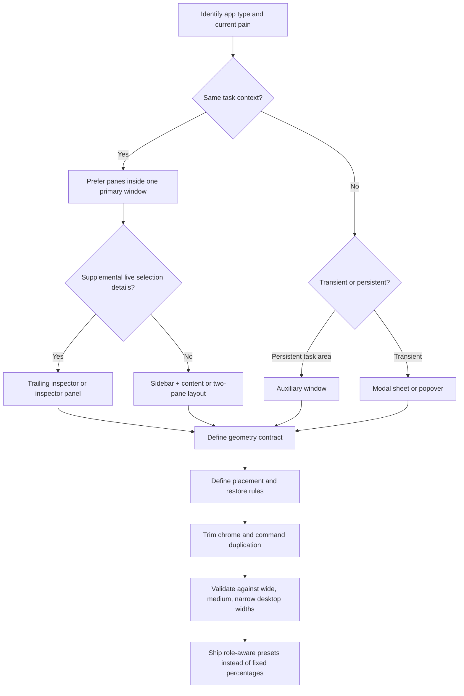

# Desktop Window Layout Architect

Make desktop applications feel like they belong on a real operating system, not like web cards trapped in draggable divs.

## When to Use

✅ **Use for**:
- Tauri, Electron, WinUI, SwiftUI, or hybrid desktop shells that feel spatially wrong.
- Multi-surface apps with a main canvas plus navigation, inspectors, logs, results, or task artifacts.
- Overlapping windows, ugly default placement, brittle tiling, or restore/maximize behavior that feels fake.
- Decisions about split view vs auxiliary window vs floating panel vs modal sheet.
- Fixing title bar density, command placement, and “too much chrome, not enough field.”

❌ **NOT for**:
- Mobile navigation patterns, tab bars, or handset-only adaptive layouts.
- Landing pages, dashboards in the browser, or ordinary responsive marketing surfaces.
- Pure component styling where the problem is typography/color/spacing, not window or pane behavior.
- Backend orchestration, IPC wiring, or packaging/signing issues that do not affect desktop interaction design.

## Fast Signals

Use these to pull the relevant geometry and shell clues into context before deciding anything.

### Window Management Files
```bash
!`rg -n "openWindow|snapWindow|tileWindows|cascadeWindows|arrangeReviewWorkspace|WindowFrame|Titlebar|Taskbar|SplitView|TwoPane|NavigationView" "${ARGUMENTS:-.}" 2>/dev/null | head -n 120`
```

### Geometry and Restore Signals
```bash
!`rg -n "innerHeight|innerWidth|defaultSize|minSize|restoreBounds|window-state|isMaximized|position|size" "${ARGUMENTS:-.}" 2>/dev/null | head -n 120`
```

## Support Files

Load only the files that match the current blocking question.

| File | Load when | Purpose |
|---|---|---|
| `references/INDEX.md` | First | Decide which deep-dive file to read instead of loading everything |
| `references/platform-principles.md` | When grounding decisions in OS conventions | Apple HIG, Windows Fluent, and Tauri state-restoration synthesis |
| `references/surface-selection.md` | When deciding split pane vs panel vs auxiliary window | Surface taxonomy and role-based routing |
| `references/geometry-and-placement.md` | When defining default sizes, mins, snap safety, or restore rules | Geometry contract and placement heuristics |
| `references/chrome-density-and-commanding.md` | When the UI feels crowded or command-heavy | Title bars, gutters, bottom bars, action placement |
| `references/workspace-presets.md` | When designing review, compare, authoring, or inspect modes | Role-aware workspace recipes |
| `references/implementation-patterns.md` | When translating guidance into code | Tauri/Electron/WinUI/SwiftUI implementation notes |
| `scripts/preflight.sh` | Before any repo-specific audit | Read-only inspection of likely shell/layout files |
| `scripts/audit_window_layout.py` | When you want a fast static audit | Emits findings plus JSON, Markdown, or HTML reports about geometry, tiling, snap safety, and restore behavior |
| `templates/layout-audit-template.md` | When returning a structured review | Reusable final answer skeleton |
| `templates/window-registry-template.ts` | When designing a new window registry or refactor | Role- and mode-aware config template |
| `templates/workspace-preset-template.json` | When defining breakpoints and workspace presets | Serializable layout contract |
| `examples/windags-review-workspace.md` | When auditing a graph + inspector + artifact app | Concrete before/after reasoning |
| `examples/surface-selection-scenarios.md` | When the right surface is unclear | Trigger examples that provoke different surface choices |
| `agents/desktop-window-layout-architect-worker.md` | When a clean-room critique or parallel audit helps | Narrow worker for isolated layout review |

## Output Contract

Unless the user explicitly asks for something narrower, structure the answer like this:

1. **Surface Map** — what surfaces should exist and their roles
2. **Geometry Contract** — default size, min size, collapse rules, snap safety
3. **Placement Contract** — first-open placement, restore behavior, parent-relative rules
4. **Chrome and Commanding** — what belongs in title bars, panes, bottom bars, and menus
5. **Workspace Presets** — how the layout should adapt across wide / medium / narrow desktop widths
6. **Implementation Moves** — the smallest code changes that produce the biggest improvement

Use `templates/layout-audit-template.md` when emitting this structure verbatim.

## Core Process



### Step 1: Classify the Surface Model

Decide whether the problem belongs to:

- a **primary window** with multiple panes,
- an **auxiliary window** dedicated to one task,
- a **floating panel** like an inspector,
- or a **modal/sheet** for short blocking work.

Rules:

- If users need to read two or three related regions together, default to a **single primary window with panes**, not multiple floating windows.
- If a surface tracks the current selection and updates live, prefer a **trailing inspector** or **inspector panel**.
- If a surface represents a separate durable task with its own lifecycle, use an **auxiliary window**.
- If the interaction is short and blocking, use a **sheet/popover/modal**, not a whole extra window.

### Step 2: Map Roles Before Coordinates

Assign each surface a role:

- `navigation`
- `canvas`
- `detail`
- `inspector`
- `artifact`
- `console`
- `utility`

Then rank them:

- **Field-first**: canvas/detail/artifact that benefits from visual area
- **Supportive**: navigation/inspector/console
- **Transient**: utility/panel/modal

Never choose percentages before roles. Percentages are outputs of role priority, not the other way around.

### Step 3: Write a Geometry Contract

Define, per surface:

- default size,
- minimum content size,
- minimum snap-safe width,
- collapse priority,
- and whether it can hide.

Hard rules:

- On Windows, keep the minimum width of a snappable primary window at **500 epx or less**, and preferably around **330 epx** when possible.
- If panes are resizable, set mins and maxes that keep dividers usable.
- If the sum of pane minimums does not fit, **change layout mode**. Do not enforce mins after a percentage split and let panes overlap.
- Keep the primary content area dominant. Tooling should compress or hide before the main canvas does.

### Step 4: Write a Placement Contract

Define:

- first-open placement,
- reopen / restore behavior,
- parent-relative placement for auxiliary surfaces,
- clamp behavior when viewport/display changes,
- and maximize/snap restore semantics.

Rules:

- **First launch** can center a window. **After that, restore prior normal bounds**.
- Auxiliary windows should open near the invoking parent without obscuring the point of origin.
- Floating panels should not masquerade as normal documents.
- Keep at least a draggable title region visible when clamping a moved window back onscreen.
- Model explicit window modes such as `normal`, `maximized`, `snapped-left`, `snapped-right`, `tiled`, with `restoreBounds`.

### Step 5: Reduce Chrome Before Rearranging Content

Check whether the app is losing field to shell chrome:

- title bars too tall,
- duplicate headings inside panes,
- oversized caption buttons,
- permanent bottom bars,
- or navigation plus commanding stacked redundantly.

Prefer:

- a single meaningful window title,
- thin dividers,
- toolbar/title integration,
- and command placement near the relevant pane.

Avoid putting critical actions in bottom bars on macOS-style desktop apps.

### Step 6: Design Workspace Presets

Instead of one fixed arrangement, define at least three desktop-width regimes:

- **Wide**: persistent sidebar + canvas + inspector/artifact
- **Medium**: sidebar or inspector becomes collapsible/overlay
- **Narrow desktop**: single primary pane plus toggleable support pane or tabs

The goal is not generic “responsiveness.” The goal is **preserving task comprehension** as width changes.

### Step 7: Validate Like a Desktop Product

Validate at minimum:

- 1280×720
- 1440×900
- 1728×1117 or similar high-density laptop
- ultrawide / dual-monitor assumptions if relevant

Check:

- no overlap after minimum sizes apply,
- snap works,
- restore works,
- no content-critical bottom bar is hidden,
- and auxiliary surfaces do not steal focus unnecessarily.

## Anti-Patterns

### Anti-Pattern: Every Problem Gets Another Window

**Novice**: "If the screen feels crowded, split it into more floating windows."
**Expert**: Related work should usually stay inside one primary window with panes. New windows are for distinct task areas, not for every supportive region.
**Timeline**: Apple’s current HIG explicitly pushes supplementary information toward split views and inspectors before new windows; Windows pushes adaptive panes and navigation surfaces before ad hoc floaters.

### Anti-Pattern: Chrome Is Free

**Novice**: "A 40px child title bar, thick borders, giant controls, and an always-on bottom action bar are fine."
**Expert**: Desktop users will trade ornamental chrome for field. Keep title bars draggable, legible, and system-like, but aggressively protect the content area.
**Timeline**: Windows 11 title bars remain concise and system-integrated; Apple guidance emphasizes content-first windows and warns against hiding critical actions in bottom bars.

### Anti-Pattern: Percentages First, Minimums Later

**Novice**: "Split the screen 66/34 and 58/42, then clamp each pane to its minimum."
**Expert**: That causes overlap. Start from minimum viable pane sizes and role priority. If the floor sum does not fit, switch to a different preset.
**Timeline**: Mature desktop shells moved toward breakpoint- and mode-based arrangements because static percentages fail under resize and snap.

### Anti-Pattern: Static Cascade Equals Window Management

**Novice**: "New windows can open at `x + 24, y + 24`; that’s enough."
**Expert**: Window managers need restore bounds, snap modes, clamp-on-move, viewport recovery, and parent-relative placement. Cascade is an escape hatch, not the whole policy.
**Timeline**: Users now expect snap layouts, restore semantics, and remembered bounds out of the box on both Windows and modern desktop frameworks like Tauri.

### Anti-Pattern: Inspector as a Mini Document Window

**Novice**: "The inspector can minimize, live forever in the task list, and behave like a peer document."
**Expert**: Inspectors are supplemental. They either live in a trailing pane or behave like panels with lighter lifecycle semantics.
**Timeline**: Apple’s panel guidance is explicit: panels are not documents, generally should not minimize, and should appear/disappear with app relevance.

## Worked Examples

### Example 1: Review Workspace for a Graph App

Load `examples/windags-review-workspace.md`.

Use it when the app has:

- a graph/canvas,
- a details inspector,
- an exported artifact or log,
- and currently opens them as overlapping windows.

### Example 2: Choosing the Right Supplemental Surface

Load `examples/surface-selection-scenarios.md`.

Use it when the team is arguing about:

- pane vs panel,
- panel vs auxiliary window,
- or modal vs persistent surface.

## Quality Gates

- The app has a named **surface map** before anyone debates percentages.
- Every primary or auxiliary window has a **default size**, **minimum content size**, and **restore policy**.
- Snap-safe surfaces support a minimum width of **500 epx or less** on Windows; target **330 epx** where practical.
- No fixed workspace preset can overlap once minimum sizes are applied.
- Title bars remain draggable and system legible; the app does not fake caption behavior badly.
- The primary canvas/content region retains visual priority over inspectors and utilities.
- Related content is unified into split panes before additional windows are introduced.
- Bottom bars never contain mission-critical primary actions unless there is a strong, explicit reason.
- The layout has explicit wide / medium / narrow desktop behavior.
- Restored windows reappear onscreen even after display or viewport changes.

## NOT-FOR Boundaries

Do not use this skill when:

- the problem is just CSS polish inside a single page,
- the product has no multi-surface behavior,
- or the user needs mobile-first interaction patterns instead of desktop workspace ergonomics.

If the request is mostly about color, typography, or visual taste, pair this with a design skill after the surface model is fixed.
