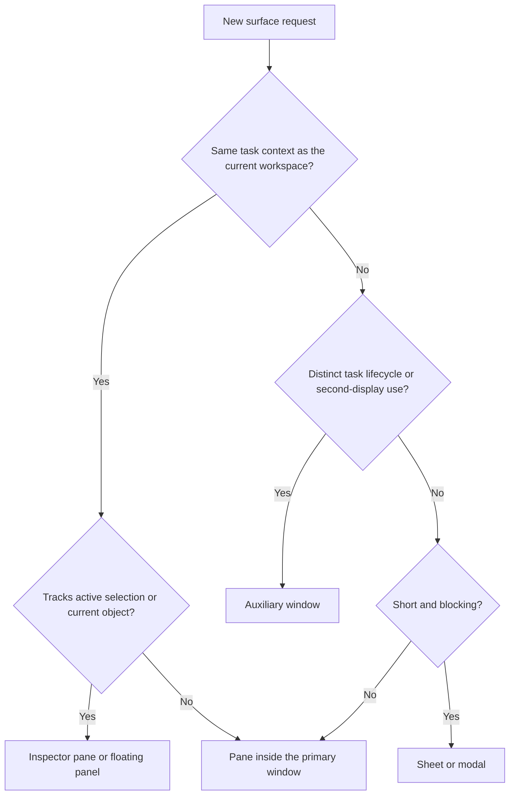

# Surface Routing

```mermaid
flowchart TD
  A[New surface request] --> B{Same task context as the current workspace?}
  B -->|Yes| C{Tracks active selection or current object?}
  B -->|No| D{Distinct task lifecycle or second-display use?}
  C -->|Yes| E[Inspector pane or floating panel]
  C -->|No| F[Pane inside the primary window]
  D -->|Yes| G[Auxiliary window]
  D -->|No| H{Short and blocking?}
  H -->|Yes| I[Sheet or modal]
  H -->|No| F
```

Use this when teams are arguing about coordinates before deciding whether the surface even deserves its own window.
