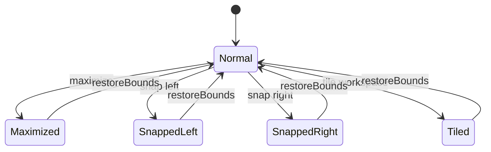

# Window Mode State

```mermaid
stateDiagram-v2
  [*] --> Normal
  Normal --> Maximized: maximize
  Normal --> SnappedLeft: snap left
  Normal --> SnappedRight: snap right
  Normal --> Tiled: tile workspace
  Maximized --> Normal: restoreBounds
  SnappedLeft --> Normal: restoreBounds
  SnappedRight --> Normal: restoreBounds
  Tiled --> Normal: restoreBounds
```

The point of this diagram is simple: `isMaximized` cannot represent all of these states without losing information.
