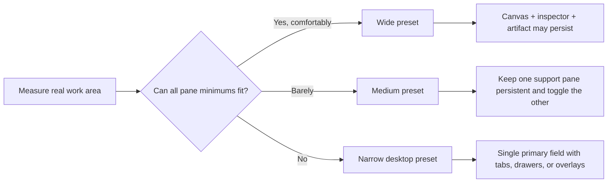

# Workspace Preset Adaptation

```mermaid
flowchart LR
  A[Measure real work area] --> B{Can all pane minimums fit?}
  B -->|Yes, comfortably| C[Wide preset]
  B -->|Barely| D[Medium preset]
  B -->|No| E[Narrow desktop preset]
  C --> F[Canvas + inspector + artifact may persist]
  D --> G[Keep one support pane persistent and toggle the other]
  E --> H[Single primary field with tabs, drawers, or overlays]
```

This is the core anti-overlap rule for the skill: when minimums do not fit, switch presets instead of squeezing forever.
