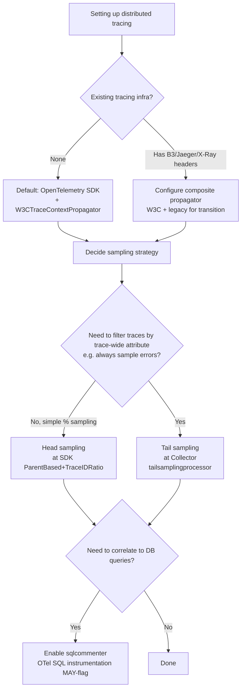

# Distributed Tracing with W3C Trace Context

> **TL;DR**: `traceparent` is a 55-byte header with a fixed format (`version-trace_id-parent_id-flags`, lowercase hex). It's the modern default for cross-service trace propagation, replacing per-vendor `X-B3-*`, `X-Datadog-*`, etc. OpenTelemetry's `W3CTraceContextPropagator` is the canonical implementation. Decide head vs tail sampling early — they're not interchangeable. For HTTP→SQL correlation, append the trace context as a SQL comment via sqlcommenter format.

---

## Jump to your fire

| Symptom | Section |
|---|---|
| "Traces break across our Node→Go service boundary" | [The traceparent format](#1-the-traceparent-header-byte-precise) |
| "Should I use B3 / X-Ray / Datadog headers?" | [Why W3C wins](#2-why-w3c-replaces-vendor-headers) |
| "Sampling 10% but error traces still missing" | [Head vs tail sampling](#3-sampling-decisions) |
| "Need to correlate slow SQL to HTTP request" | [SQL commenter](#4-htmlsql-trace-propagation-via-sqlcommenter) |
| "Custom headers with vendor data?" | [tracestate](#5-tracestate-vendor-extensions) |

---

## Decision diagram



---

## 1. The `traceparent` header (byte-precise)

From the [W3C Trace Context Recommendation §3.2.2](https://www.w3.org/TR/trace-context/), the ABNF:

```
HEXDIGLC        = DIGIT / "a" / "b" / "c" / "d" / "e" / "f"  ; lowercase hex only
value           = version "-" version-format
version         = 2HEXDIGLC   ; version 00; "ff" forbidden
version-format  = trace-id "-" parent-id "-" trace-flags
trace-id        = 32HEXDIGLC  ; 16 bytes; all-zeros forbidden
parent-id       = 16HEXDIGLC  ; 8 bytes; all-zeros forbidden
trace-flags     = 2HEXDIGLC   ; 8-bit flags
```

**Total length for version `00`: exactly 55 ASCII bytes.**

Canonical example (W3C §3.1):

```
traceparent: 00-0af7651916cd43dd8448eb211c80319c-b7ad6b7169203331-01
              ↑               ↑                            ↑          ↑
              version         trace-id (16 bytes hex)      parent-id  flags
```

### MUST requirements (W3C, verbatim)

- "Vendors **MUST** expect the header name in any case (upper, lower, mixed), and **SHOULD** send the header name in lowercase." (§3.2.1)
- "If the `trace-id` value is invalid (for example if it contains non-allowed characters or all zeros), vendors **MUST** ignore the `traceparent`." (§3.2.2.3)
- "Vendors **MUST** ignore the `traceparent` when the `parent-id` is invalid (for example, if it contains non-lowercase hex characters)." All-zeros parent-id is also invalid. (§3.2.2.4)
- "A vendor receiving a `traceparent` request header **MUST** send it to outgoing requests." "The `parent-id` field **MUST** be set to a new value with the `sampled` flag update." (§3.4)
- "Vendors **MUST NOT** parse or assume anything about unknown fields for this version." (§3.2.4)

### Sampled flag (§3.2.2.5.1)

The current spec (`version 00`) defines one flag bit:

```
static final byte FLAG_SAMPLED = 1; // 00000001
boolean sampled = (traceFlags & FLAG_SAMPLED) == FLAG_SAMPLED;
```

`01` = sampled (record + export); `00` = not sampled. The flag **may flip when parent-id is updated** but should reflect the upstream sampling decision unless the local sampler overrides explicitly.

---

## 2. Why W3C replaces vendor headers

Pre-2020, every vendor shipped its own headers:

| Vendor | Headers |
|---|---|
| Zipkin / B3 | `X-B3-TraceId`, `X-B3-SpanId`, `X-B3-Sampled` (or single-header `b3`) |
| Datadog | `x-datadog-trace-id`, `x-datadog-parent-id`, `x-datadog-sampling-priority` |
| AWS X-Ray | `X-Amzn-Trace-Id` |
| Jaeger | `uber-trace-id` |

A polyglot stack with one of each was a graveyard of broken trace continuity. From the [OpenTelemetry context propagation docs](https://opentelemetry.io/docs/concepts/context-propagation/):

> If pre-configured, `Propagator`s **SHOULD** default to a composite `Propagator` containing the W3C Trace Context Propagator and the Baggage `Propagator` specified in the Baggage API.

OpenTelemetry deprecated Jaeger and OT Trace propagators in favor of W3C ("use the W3C TraceContext instead"). B3 is still maintained as a backward-compat option.

### Migration: composite propagator

When transitioning a fleet from B3 to W3C:

```js
// JS / Node OTel example
import { CompositePropagator } from '@opentelemetry/core'
import { W3CTraceContextPropagator } from '@opentelemetry/core'
import { B3Propagator } from '@opentelemetry/propagator-b3'

const propagator = new CompositePropagator({
  propagators: [
    new W3CTraceContextPropagator(),  // primary
    new B3Propagator(),                // fallback for legacy upstreams
  ],
})
```

Inject sends both header sets; extract reads whichever arrives. Run the composite propagator until the last legacy upstream is migrated, then drop the B3 entry.

---

## 3. Sampling decisions

### Definitions (from [OpenTelemetry sampling docs](https://opentelemetry.io/docs/concepts/sampling/))

> **Sampled**: A trace or span is processed and exported. … **Not sampled**: A trace or span is not processed or exported.

### Head sampling

> Head sampling is a sampling technique used to make a sampling decision as early as possible. A decision to sample or drop a span or trace is not made by inspecting the trace as a whole.

> The most common form of head sampling is Consistent Probability Sampling. This is also referred to as Deterministic Sampling. In this case, a sampling decision is made based on the trace ID and the desired percentage of traces to sample.

**Pros**: cheap, deterministic across services (same trace-id everywhere → same decision), runs in the SDK.

**Con (verbatim)**: "It is not possible to make a sampling decision based on data in the entire trace. For example, you cannot ensure that all traces with an error within them are sampled with head sampling alone."

### Tail sampling

> Tail sampling is where the decision to sample a trace takes place by considering all or most of the spans within the trace.

Use cases: always-sample-on-error, latency-based sampling, attribute-based sampling, differential rates per service.

**Cons**: stateful (the collector must hold all spans for a trace until it decides), vendor-specific tooling, expensive.

### The pragmatic recipe

| Need | Strategy |
|---|---|
| Bulk volume reduction | Head sampling (e.g., `ParentBased(TraceIDRatio(0.1))`) — 10% baseline |
| Always sample errors | Tail sampling at the OTel Collector with `tailsamplingprocessor` |
| Always sample slow requests (p99+) | Tail sampling on `latency` policy |
| Always sample for a specific tenant | Both: head sampling 100% via `ParentBased`, ratio low elsewhere |

The OTel Collector ships [`probabilisticsamplerprocessor`](https://github.com/open-telemetry/opentelemetry-collector-contrib/tree/main/processor/probabilisticsamplerprocessor) and [`tailsamplingprocessor`](https://github.com/open-telemetry/opentelemetry-collector-contrib/tree/main/processor/tailsamplingprocessor) for this.

**The sampled flag is the wire-level signal**: when a head sampler in service A decides "sample this trace," service B inherits the bit via `traceparent` flags and respects it (per W3C §3.4). This is what makes head sampling consistent across services.

---

## 4. HTTP→SQL trace propagation via sqlcommenter

A common debugging gap: the trace shows a slow service span, but you can't tell which SQL query was slow because the DB log doesn't know about traces. Sqlcommenter solves this by appending the trace context as a SQL comment.

From [OpenTelemetry semantic conventions for database spans](https://opentelemetry.io/docs/specs/semconv/database/database-spans/#sql-commenter):

> Instrumentations **MAY** propagate context using SQL commenter by injecting comments into SQL queries before execution. SQL commenter-based context propagation **SHOULD NOT** be enabled by default, but instrumentation **MAY** allow users to opt into it.

> The instrumentation implementation **SHOULD** **append** the comment to the end of the query.

### Wire format (canonical example from OTel spec)

```sql
SELECT * FROM songs /*traceparent='00-4bf92f3577b34da6a3ce929d0e0e4736-00f067aa0ba902b7-01',tracestate='congo%3Dt61rcWkgMzE%2Crojo%3D00f067aa0ba902b7'*/
```

- Comment appended **after** the SQL.
- Format: `/* key='url-encoded-value',key='url-encoded-value' */`
- `tracestate`'s `=` and `,` get URL-encoded (`%3D`, `%2C`).
- `traceparent` value is the raw 55-byte form (no URL encoding needed since hex+dashes are URL-safe).

Postgres logs and `pg_stat_statements` preserve comments, so the comment becomes the bridge from a slow query log line to the originating HTTP trace.

### Performance warning

From the OTel spec:

> Adding high cardinality comments, like `traceparent` and `tracestate`, to queries can impact the performance for some database systems, such as:
> - Prepared statements in MySQL.
> - Oracle and SQL Server for both prepared and non-prepared statements.

Postgres handles this fine because of how its plan cache normalizes comments out, but verify on your specific stack.

### Library coverage

[Google's sqlcommenter spec](https://google.github.io/sqlcommenter/) covers Django, SQLAlchemy, psycopg2, Flask, Hibernate, Spring, Sequelize.js, Knex.js, Express.js, Rails, and Laravel. OTel auto-instrumentation packages opt into it via SDK config (typically `opt-in` per the spec's MAY).

---

## 5. `tracestate` vendor extensions

`traceparent` is the universal identifier; `tracestate` is the per-vendor scratchpad.

From [W3C §3.3](https://www.w3.org/TR/trace-context/):

> The `tracestate` field value is a `list` of `list-members` separated by commas (`,`). A `list-member` is a key/value pair separated by an equals sign (`=`).

> There can be a maximum of 32 `list-members` in a `list`.

> Identifiers **MUST** begin with a lowercase letter or a digit, and can only contain lowercase letters (`a`-`z`), digits (`0`-`9`), underscores (`_`), dashes (`-`), asterisks (`*`), and forward slashes (`/`).

Multi-tenant key form: `tenant@system` (e.g., `xyz@congo`).

Limits (§3.3.1.5):

> Vendors **SHOULD** propagate at least 512 characters of a combined header.

> Entries larger than `128` characters long **SHOULD** be removed first.

Example:

```
tracestate: rojo=00f067aa0ba902b7,congo=t61rcWkgMzE
```

The leftmost entry is the most-recent vendor. When mutating, prepend your entry; if you'd exceed the limit, drop the rightmost (oldest) first.

> If the vendor failed to parse `traceparent`, it **MUST NOT** attempt to parse `tracestate`. Note that the opposite is not true: failure to parse `tracestate` **MUST NOT** affect the parsing of `traceparent`.

---

## Anti-patterns

| Anti-pattern | Why it bites | Fix |
|---|---|---|
| Generating uppercase hex in `trace-id` | Receiving vendors MUST ignore the header → trace breaks at boundary | Always lowercase; use SDK helpers, never string-format manually |
| Reusing parent's `parent-id` instead of allocating a new one per service | Trace tree collapses; can't tell which span is which | Always generate a new `parent-id` (= span_id) per local span |
| Tail sampling with no head-sampling fallback | Collector dies → all traces drop | Pair: 1% head sampling (always-on safety net) + tail sampling (selective enrichment) |
| Sampling 100% in production | Trace storage costs explode; collector saturates | Start at 1-10%; increase only for specific routes/tenants |
| Mixing W3C and B3 propagators without a composite | Some hops drop the trace | Composite propagator until migration complete |
| Using vendor SDK instead of OTel | Lock-in; can't switch backends without re-instrumenting | OTel SDK + vendor exporter |
| Putting PII in `tracestate` | Headers logged at every hop; cardinality explosion | tracestate is for trace-routing data only; user attributes go in span attributes (filtered) |
| Leaving SQL commenter on by default | Plan-cache impact on MySQL/Oracle/SQL Server | Opt-in per the OTel SHOULD-NOT-default rule |

---

## Novice / Expert / Timeline

| | Novice | Expert |
|---|---|---|
| **Adding tracing** | Vendor agent (Datadog, NewRelic) | OTel SDK + vendor exporter; portable |
| **Cross-service propagation** | Hopes vendor SDK handles it | Verifies `traceparent` in HTTP captures; tests at boundaries |
| **Sampling** | 100% in dev, panic in prod | Head sampling baseline + tail sampling for errors/slow |
| **DB correlation** | Reads slow query log + guesses | sqlcommenter on; click slow query → trace |
| **Multi-vendor migration** | Picks one, all-or-nothing | Composite propagator; gradual rollout |

**Timeline test**: a request that errors in service C — can you find the trace that includes spans from A → B → C *and* the SQL queries that ran in B? Expert answer: yes, in seconds, via tail-sampled error trace + sqlcommenter linkage. Novice answer: not really; you correlate timestamps by hand.

---

## Quality gates

A tracing change ships when:

- [ ] **Test:** A request crosses every service boundary preserving `traceparent` — end-to-end test asserts the same trace_id appears in spans from each service.
- [ ] **Test:** `traceparent` headers in test fixtures are exactly 55 chars, lowercase hex, with the correct field separators.
- [ ] **Test:** Sampling decision is deterministic across services for the same trace_id (verified by replaying the same request and checking sampled-or-not is consistent).
- [ ] **Test (tail sampling, if used):** Errors are sampled at 100% — synthetic error injection produces a trace in the backend.
- [ ] **Test (sqlcommenter, if enabled):** A slow query log line includes the `traceparent` comment, and the trace_id matches the HTTP span that triggered it.
- [ ] **Test:** Composite propagator (during migration) correctly extracts from both W3C and legacy headers — fixture for each shape.
- [ ] **Manual:** Trace storage cost projection sized for current sampling rate × request volume.

---

## NOT for this skill

- Metrics or logs in OpenTelemetry (use `opentelemetry-metrics-design`, `opentelemetry-logs-design`)
- Specific backend setup (Datadog, Honeycomb, Jaeger, Tempo) (use vendor-specific skills)
- Distributed tracing in serverless / Lambda (use `aws-lambda-tracing` — has cold-start propagation gotchas)
- Trace-based testing (use `trace-based-testing-design`)
- gRPC-specific propagation (use `grpc-tracing-propagation`)
- Browser RUM tracing (use `browser-real-user-monitoring`)

---

## Sources

- W3C: [Trace Context Level 1, REC 23 Nov 2021](https://www.w3.org/TR/trace-context/) — byte-precise format, MUST/SHOULD requirements
- OpenTelemetry: [Context Propagation concept](https://opentelemetry.io/docs/concepts/context-propagation/) — composite propagator, W3C as default
- OpenTelemetry: [Propagators API spec (Stable)](https://opentelemetry.io/docs/specs/otel/context/api-propagators/)
- OpenTelemetry: [Sampling concept](https://opentelemetry.io/docs/concepts/sampling/) — head vs tail
- OpenTelemetry: [Database client spans — SQL commenter section](https://opentelemetry.io/docs/specs/semconv/database/database-spans/#sql-commenter) — opt-in, append-not-prepend, MUST/SHOULD requirements
- Google: [sqlcommenter specification](https://google.github.io/sqlcommenter/spec/) — wire format, library coverage
- OpenTelemetry Collector: [Tail Sampling Processor](https://github.com/open-telemetry/opentelemetry-collector-contrib/tree/main/processor/tailsamplingprocessor)
- OpenTelemetry Collector: [Probabilistic Sampler Processor](https://github.com/open-telemetry/opentelemetry-collector-contrib/tree/main/processor/probabilisticsamplerprocessor)
