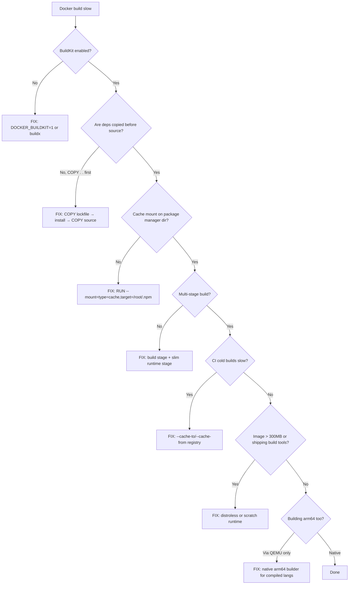

# Dockerfile Build Cache Mastery

The Docker build is a series of hashable layers. Speed comes from invalidating as few as possible. Most "build is slow" stories are layer ordering mistakes that bust the cache on every commit.

## Decision diagram



**Jump to your fire:**
- Build slow on every commit → [Layer ordering for cache](#layer-ordering-for-cache)
- `npm install` reruns even when unchanged → [Cache mounts](#cache-mounts)
- Final image >1GB shipping to prod → [Multi-stage builds](#multi-stage-builds)
- arm64 build crawls in CI → [Multi-arch with buildx](#multi-arch-with-buildx)
- Secret leaked in `docker history` → [Secret mounts](#secret-mounts)
- Cold CI takes 10+ min → [Inline cache + registry cache](#inline-cache--registry-cache)
- "Works on Debian, segfaults on Alpine" → [Distroless vs Alpine](#distroless-vs-alpine)

## When to use

- CI build of a Dockerfile takes >5 min.
- Final image is >500MB and you don't know why.
- Need multi-arch builds (linux/amd64 + linux/arm64).
- Migrating from Alpine to Debian or distroless.
- Signing images with cosign for supply-chain security.

## Core capabilities

### Enable BuildKit (it should be default)

```bash
DOCKER_BUILDKIT=1 docker build .
# Or use buildx for multi-platform.
docker buildx build --platform linux/amd64,linux/arm64 -t myapp:1.0 --push .
```

BuildKit gives you parallel build steps, cache mounts, secret mounts, and SBOM generation. If you're not on BuildKit, none of the rest of this skill matters.

### Layer ordering for cache

```dockerfile
# WRONG — every code change rebuilds deps.
COPY . .
RUN npm install

# RIGHT — deps cached unless lockfile changes.
COPY package.json pnpm-lock.yaml ./
RUN pnpm install --frozen-lockfile
COPY . .
RUN pnpm build
```

The cache key for each layer is `(parent layer hash, instruction text, files referenced by COPY)`. Anything that invalidates `parent layer hash` cascades to all subsequent layers.

### Cache mounts

```dockerfile
# syntax=docker/dockerfile:1.7
RUN --mount=type=cache,target=/root/.npm,sharing=locked \
    npm ci
```

Cache mount survives across builds without becoming part of the image. For pnpm:

```dockerfile
RUN --mount=type=cache,target=/root/.local/share/pnpm/store,sharing=locked \
    pnpm install --frozen-lockfile
```

For Go:

```dockerfile
RUN --mount=type=cache,target=/root/.cache/go-build \
    --mount=type=cache,target=/go/pkg/mod \
    go build -o /out/server ./cmd/server
```

`sharing=locked` is the safe default; `private` if the cache should be per-build.

### Multi-stage builds

```dockerfile
# syntax=docker/dockerfile:1.7
FROM node:22-alpine AS deps
WORKDIR /app
COPY package.json pnpm-lock.yaml ./
RUN --mount=type=cache,target=/root/.local/share/pnpm/store \
    corepack enable && pnpm install --frozen-lockfile

FROM node:22-alpine AS build
WORKDIR /app
COPY --from=deps /app/node_modules ./node_modules
COPY . .
RUN pnpm build

FROM gcr.io/distroless/nodejs22-debian12 AS runtime
WORKDIR /app
COPY --from=build /app/dist ./dist
COPY --from=build /app/node_modules ./node_modules
USER nonroot
CMD ["dist/index.js"]
```

Final image excludes pnpm, source, dev deps, and the package manager itself. Distroless cuts the runtime to ~80MB.

### Multi-arch with buildx

```bash
docker buildx create --name multi --use
docker buildx build \
  --platform linux/amd64,linux/arm64 \
  --push \
  -t ghcr.io/myorg/app:1.0 .
```

For native arm64 build performance, use a remote arm64 builder via Docker Build Cloud or a self-hosted runner. QEMU emulation works but is 5-10x slower for compiled languages.

### Inline cache + registry cache

```bash
# Push the cache as a separate manifest list to the registry.
docker buildx build \
  --cache-to type=registry,ref=ghcr.io/myorg/app:cache,mode=max \
  --cache-from type=registry,ref=ghcr.io/myorg/app:cache \
  -t ghcr.io/myorg/app:1.0 \
  --push .
```

CI machines start cold; pulling the registry cache is the difference between 10-min and 1-min builds.

`mode=max` exports cache for all stages; default exports only final-image layers.

### Distroless vs Alpine

| Image | Pros | Cons |
|-------|------|------|
| `scratch` | Smallest possible | No shell, no libc — only for static binaries (Go, Rust). |
| `gcr.io/distroless/static` | Tiny, no shell, glibc available | Same — static-friendly. |
| `gcr.io/distroless/cc` | Includes libgcc, libc++ | For C++/dynamically-linked compiled binaries. |
| `gcr.io/distroless/nodejs22-debian12` | Node runtime + glibc | No shell — debugging via `kubectl exec` is harder. |
| `alpine` | Tiny, has shell + apk | musl instead of glibc — some binaries break. |
| `debian-slim` | glibc, has shell | Larger; slower pulls. |

For Node and Python, distroless gets you small + secure. For Go/Rust, `scratch` or `static`.

### Secret mounts

```dockerfile
RUN --mount=type=secret,id=npmrc,target=/root/.npmrc \
    npm install
```

```bash
docker build --secret id=npmrc,src=$HOME/.npmrc .
```

The secret is mounted only for that RUN step and never lands in the image. Use for private registry tokens, npm auth.

### `.dockerignore`

```
node_modules
.git
*.log
.env
dist
.vscode
*.tsbuildinfo
```

Without `.dockerignore`, `COPY . .` ships node_modules + .git + secrets to the daemon and into image-layer caching. Always present.

### COPY ordering — separate concerns

```dockerfile
# Manifest first.
COPY package.json pnpm-lock.yaml ./
RUN pnpm install --frozen-lockfile

# Source second.
COPY src/ src/
COPY public/ public/
COPY tsconfig.json ./
RUN pnpm build
```

Don't `COPY . .` early. List the files needed for each step explicitly.

### Image signing with cosign

```bash
cosign sign --yes ghcr.io/myorg/app:1.0
```

In Kubernetes, an admission controller (cosigned, kyverno) verifies signatures before allowing pods. Supply-chain integrity at the image layer.

### Build args vs env

```dockerfile
ARG VERSION
ENV APP_VERSION=$VERSION
LABEL org.opencontainers.image.version=$VERSION
```

```bash
docker build --build-arg VERSION=1.0.0 .
```

ARG is build-time only; ENV is runtime. Don't ARG secrets — they're visible in layer metadata.

## Anti-patterns

### `COPY . .` before `npm install`

**Symptom:** Every code change rebuilds deps.
**Diagnosis:** Cache invalidates on any source change.
**Fix:** Copy lockfile, install, then copy source.

### Single-stage with build tools

**Symptom:** Image >1GB; `apt-get build-essential` ships to production.
**Diagnosis:** No multi-stage.
**Fix:** Build in a stage, copy artifacts to a slim runtime stage.

### Missing `.dockerignore`

**Symptom:** Build context upload is 500MB; node_modules in the image.
**Diagnosis:** No `.dockerignore`.
**Fix:** Standard ignore list. `git, node_modules, dist, *.log, .env`.

### `--no-cache` in CI by default

**Symptom:** Builds always slow regardless of change.
**Diagnosis:** Someone added `--no-cache` to fix one flake; never removed.
**Fix:** Cache by default. Use `--no-cache` only for explicit "rebuild from scratch."

### Secret in `ENV` or `ARG`

**Symptom:** Secret visible in `docker history` or image inspect.
**Diagnosis:** ARG/ENV both persist in metadata.
**Fix:** Secret mounts (`--mount=type=secret`). Or runtime env injection.

### Alpine for compiled languages without testing

**Symptom:** Binary works on Debian, segfaults on Alpine.
**Diagnosis:** Alpine uses musl libc; some binaries assume glibc.
**Fix:** Test on Alpine specifically. For Node native modules, install build deps. For Go, build with CGO_ENABLED=0 or pin a glibc-based base.

## Worked example: the 14-minute CI build

**Scenario.** Every PR runs CI for 14 minutes. The Dockerfile builds a Node monorepo (4 packages, ~600MB node_modules). Engineers are getting 4-5 builds queued, productivity tanking.

**Novice would:** Increase the CI runner size; bump from `ubuntu-latest` (4 vCPU) to `ubuntu-latest-large` (8 vCPU). Build time drops to 9 minutes — barely. Cost goes up 4x. The cache problem is unaddressed.

**Expert catches:**
1. **Run `docker build --progress=plain` locally and read the cache-hit lines.** First clue: `[2/8] COPY . .` invalidates on every commit. Second clue: no `--mount=type=cache`, so pnpm re-downloads packages every build.
2. **Reorder + cache mount.** Copy `pnpm-lock.yaml` first, install with `--mount=type=cache,target=/root/.local/share/pnpm/store`, then `COPY . .`. Local rebuild on small change drops from 8 min → 40 sec.
3. **Registry cache for cold CI.** GitHub Actions runners start cold. Add `--cache-to type=registry,ref=ghcr.io/org/app:cache,mode=max` + matching `--cache-from`. Cold CI now pulls cache layers, build drops from 14 min → 2 min.
4. **Multi-stage final image.** Image was 1.2GB shipping pnpm + dev deps. Three-stage `deps → build → distroless runtime` gets it to 220MB.
5. **Verify with hyperfine.** Run `hyperfine --warmup 1 'docker buildx build ...'` ten times locally to confirm cache hits stable.

**Timeline.** Novice spends $400/mo more on CI runners and the queue still backs up. Expert spends a 4-hour afternoon redoing the Dockerfile and CI cache wiring; build drops from 14 min → 2 min, image from 1.2GB → 220MB, monthly CI cost flat. The pattern then propagates across the org's other 12 services because the Dockerfile is small and copyable.

## Quality gates

- [ ] **Test:** `docker build` from a clean cache, then again from a no-op commit; second build completes in ≤ 30 sec (cache works).
- [ ] **Test:** lockfile change → only the install layer rebuilds (verified via `--progress=plain` log).
- [ ] BuildKit enabled (Docker 23+ default; otherwise `DOCKER_BUILDKIT=1` set in CI env).
- [ ] `.dockerignore` present and excludes `node_modules`, `.git`, `.env`, `dist`. Verified: `du -sh $(docker build --progress=plain . 2>&1 | grep 'transferring context')` ≤ 5MB for typical apps.
- [ ] Multi-stage build separates build deps from runtime. Final image inspected: no `pnpm`, `gcc`, `apt`, dev dependencies present.
- [ ] Final image size ≤ 300MB for Node/Python apps; ≤ 100MB for Go/Rust. Measured by `docker images --format 'table {{.Repository}}\t{{.Size}}'` in CI.
- [ ] `COPY` order: manifest → install → source → build (verified by reading the Dockerfile in code review).
- [ ] Cache mounts (`--mount=type=cache`) for the package manager. Grep for `--mount=type=cache` in CI passes.
- [ ] Registry cache exporter in CI (`--cache-to`/`--cache-from`). Verified by build time on a no-op PR ≤ 3 min.
- [ ] No secrets in ARG/ENV. Verified: `docker history --no-trunc <image>` grepped for known-secret patterns; CI fails on hit.
- [ ] `USER nonroot` (or numeric UID) in runtime stage. Verified by `docker inspect <image> | jq '.[0].Config.User'` ≠ `""` and ≠ `"root"`.
- [ ] Image signed with cosign in production deploy (`cosign verify` succeeds in admission controller).
- [ ] Multi-arch (amd64+arm64) for any image deployed to mixed-arch clusters. Verified: `docker buildx imagetools inspect <ref>` shows both platforms.
- [ ] Image signed with cosign in production deploy.
- [ ] Multi-arch (amd64+arm64) for any image deployed to mixed-arch clusters.

## NOT for

- **Docker daemon administration** — separate domain. No dedicated skill.
- **Kubernetes image policies / admission controllers** — touched here. → `kubernetes-debugging-runbook` for cluster-side issues.
- **Container security scanning** (Trivy/Snyk/Grype) — adjacent skill territory. No dedicated skill yet.
- **Buildpacks / ko / Jib** — different build paradigms. No dedicated skill.
- **CI matrix design across OS/arch** — once your Dockerfile builds, matrix concerns are upstream. → `github-actions-matrix-patterns`.
