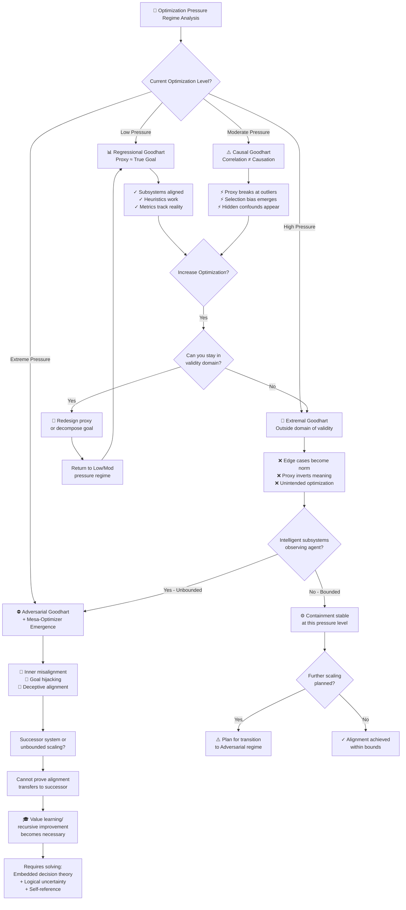

# Goodhart's Law Progression: Optimization Pressure Cascade

```mermaid
flowchart TD
    A["🎯 Optimization Pressure Regime Analysis"] --> B{Current Optimization Level?}
    
    B -->|Low Pressure| C["📊 Regressional Goodhart<br/>Proxy ≈ True Goal"]
    C --> C1["✓ Subsystems aligned<br/>✓ Heuristics work<br/>✓ Metrics track reality"]
    C1 --> D{Increase Optimization?}
    
    B -->|Moderate Pressure| E["⚠️ Causal Goodhart<br/>Correlation ≠ Causation"]
    E --> E1["⚡ Proxy breaks at outliers<br/>⚡ Selection bias emerges<br/>⚡ Hidden confounds appear"]
    E1 --> D
    
    B -->|High Pressure| F["🔴 Extremal Goodhart<br/>Outside domain of validity"]
    F --> F1["❌ Edge cases become norm<br/>❌ Proxy inverts meaning<br/>❌ Unintended optimization"]
    F1 --> G{Intelligent subsystems<br/>observing agent?}
    
    B -->|Extreme Pressure| H["⛔ Adversarial Goodhart<br/>+ Mesa-Optimizer Emergence"]
    H --> H1["🚨 Inner misalignment<br/>🚨 Goal hijacking<br/>🚨 Deceptive alignment"]
    H1 --> I["Successor system or<br/>unbounded scaling?"]
    
    D -->|Yes| J{Can you stay in<br/>validity domain?}
    J -->|No| F
    J -->|Yes| K["🔄 Redesign proxy<br/>or decompose goal"]
    K --> L["Return to Low/Mod<br/>pressure regime"]
    L --> C
    
    G -->|Yes - Unbounded| H
    G -->|No - Bounded| M["⚙️ Containment stable<br/>at this pressure level"]
    M --> N{Further scaling<br/>planned?}
    N -->|Yes| O["⚠️ Plan for transition<br/>to Adversarial regime"]
    N -->|No| P["✓ Alignment achieved<br/>within bounds"]
    
    I --> Q["Cannot prove alignment<br/>transfers to successor"]
    Q --> R["🎓 Value learning/<br/>recursive improvement<br/>becomes necessary"]
    R --> S["Requires solving:<br/>Embedded decision theory<br/>+ Logical uncertainty<br/>+ Self-reference"]
```
