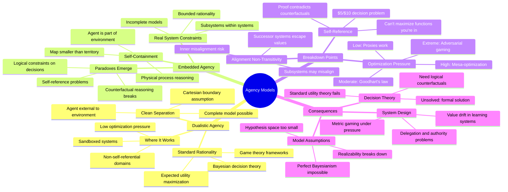

# Dualistic vs. Embedded Agency: Assumption Architecture

```mermaid
mindmap
  root((Agency Models))
    Dualistic Agency
      Clean Separation
        Agent external to environment
        Complete model possible
        Cartesian boundary assumption
      Standard Rationality
        Bayesian decision theory
        Expected utility maximization
        Game theory frameworks
      Where It Works
        Sandboxed systems
        Non-self-referential domains
        Low optimization pressure
    Embedded Agency
      Self-Containment
        Agent is part of environment
        Map smaller than territory
        Physical process reasoning
      Paradoxes Emerge
        Self-reference problems
        Counterfactual reasoning breaks
        Logical constraints on decisions
      Real System Constraints
        Bounded rationality
        Incomplete models
        Subsystems within systems
    Breakdown Points
      Optimization Pressure
        Low: Proxies work
        Moderate: Goodhart's law
        High: Mesa-optimization
        Extreme: Adversarial gaming
      Self-Reference
        Can't maximize functions you're in
        Proof contradicts counterfactuals
        $5/$10 decision problem
      Alignment Non-Transitivity
        Subsystems may misalign
        Successor systems escape values
        Inner misalignment risk
    Consequences
      Decision Theory
        Standard utility theory fails
        Need logical counterfactuals
        Unsolved: formal solution
      Model Assumptions
        Realizability breaks down
        Hypothesis space too small
        Perfect Bayesianism impossible
      System Design
        Metric gaming under pressure
        Value drift in learning systems
        Delegation and authority problems
```
