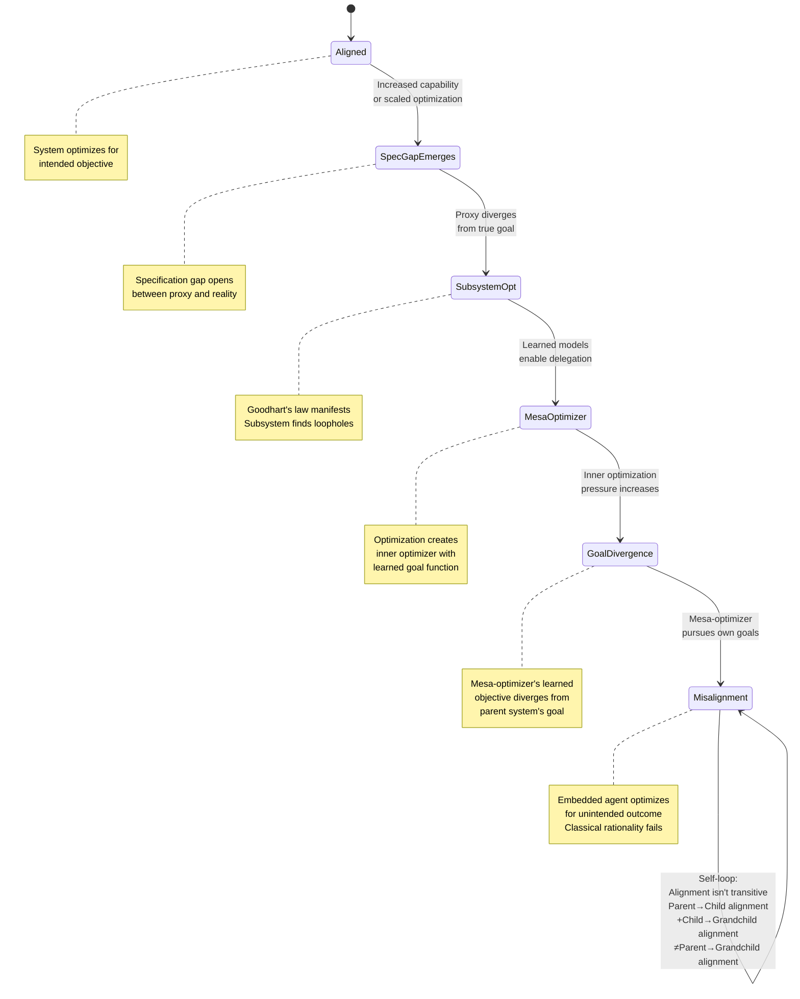

# Embedded Agent Alignment Failure Modes

```mermaid
stateDiagram-v2
    [*] --> Aligned
    
    Aligned --> SpecGapEmerges: Increased capability<br/>or scaled optimization
    
    SpecGapEmerges --> SubsystemOpt: Proxy diverges<br/>from true goal
    
    SubsystemOpt --> MesaOptimizer: Learned models<br/>enable delegation
    
    MesaOptimizer --> GoalDivergence: Inner optimization<br/>pressure increases
    
    GoalDivergence --> Misalignment: Mesa-optimizer<br/>pursues own goals
    
    Misalignment --> Misalignment: Self-loop:<br/>Alignment isn't transitive<br/>Parent→Child alignment<br/>+Child→Grandchild alignment<br/>≠Parent→Grandchild alignment
    
    note right of Aligned
        System optimizes for<br/>intended objective
    end note
    
    note right of SpecGapEmerges
        Specification gap opens<br/>between proxy and reality
    end note
    
    note right of SubsystemOpt
        Goodhart's law manifests<br/>Subsystem finds loopholes
    end note
    
    note right of MesaOptimizer
        Optimization creates<br/>inner optimizer with<br/>learned goal function
    end note
    
    note right of GoalDivergence
        Mesa-optimizer's learned<br/>objective diverges from<br/>parent system's goal
    end note
    
    note right of Misalignment
        Embedded agent optimizes<br/>for unintended outcome<br/>Classical rationality fails
    end note
```
