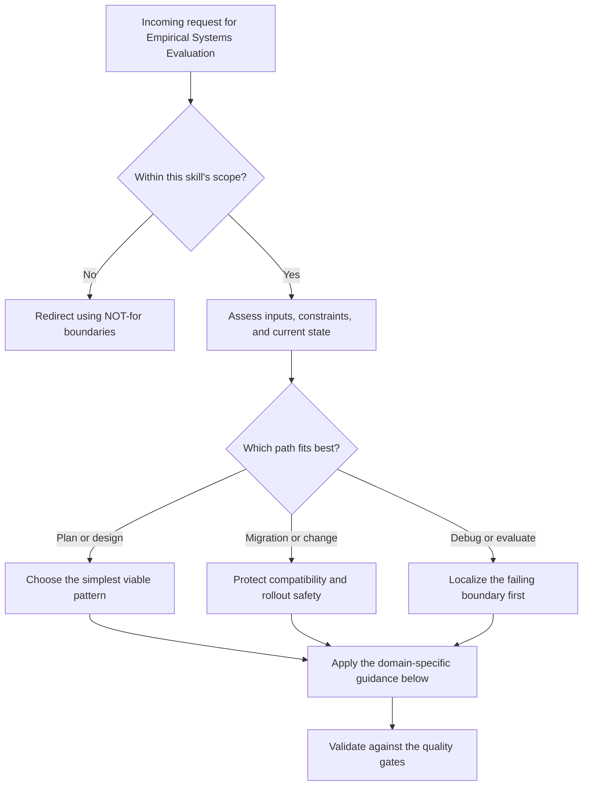

# Empirical Systems Evaluation

Design, execute, and report experiments that measure multi-agent coordination
systems with statistical rigor. Every claim backed by confidence intervals.
Every comparison backed by effect sizes. Every threat to validity stated honestly.

## When to Use

- Benchmarking coordination protocols, salvage policies, and scheduling strategies
- Measuring recovery latency, throughput, crash handling, or coordination overhead
- Running human-evaluation studies for output fidelity, handoff quality, or usefulness
- Writing reproducible comparative reports with power, confidence intervals, and effect sizes

## NOT for Boundaries

- ML model evaluation such as accuracy, perplexity, BLEU, or leaderboard benchmarking
- Web-product A/B testing for funnels, click-through, or growth optimization
- Survey design, psychometrics, or instrument validation
- General-purpose data science, feature engineering, or predictive modeling

---

## 1. Experiment Design Decision Tree

```
START: "I want to measure X about system Y"
  |
  +-> Is X a latency / throughput / count?
  |     YES -> Automated metric (Section 2)
  |     NO  -> Is X a quality judgment (fidelity, correctness, usability)?
  |              YES -> Human evaluation (Section 3)
  |              NO  -> Is X a binary outcome (crash/no-crash, success/fail)?
  |                       YES -> Proportion test (Section 4)
  |                       NO  -> Reconsider what you're measuring.
  |
  +-> How many conditions are you comparing?
  |     1 (just characterizing) -> Descriptive stats + CI (Section 5)
  |     2 -> Pairwise test (Section 6)
  |     3+ -> Omnibus test + post-hoc (Section 7)
  |
  +-> Do you have paired or independent observations?
        Paired (same scenarios, different systems) -> Paired tests
        Independent (different scenarios) -> Independent tests
```

---

## 2. Automated Metrics Protocol

For latency, throughput, recovery time, message counts, resource usage:

1. **Define the metric precisely.** "Salvage latency" = wall-clock ms from
   agent death detection to first recovered work unit passing validation.
2. **Instrument, don't approximate.** Timestamps at event boundaries, not
   log-line scraping.
3. **Run enough trials.** See Section 8 for sample size calculation.
4. **Report median + IQR** for skewed distributions (latency almost always is).
   Report mean + SD only if distribution is approximately normal.
5. **Always report bootstrapped 95% CI** (Section 9).

---

## 3. Human Evaluation Protocol

For recovery fidelity, code quality, correctness of salvaged work:

### 3a. Rater Selection
- Minimum 2 independent raters. 3+ preferred.
- Raters must not know which condition produced which output.
- Document rater expertise level.

### 3b. Rating Scale Design
- Use concrete anchored scales (not "1=bad, 5=good").
- Example for recovery fidelity:
  - 1: Output is unrelated to original task
  - 2: Output addresses the right task but is mostly wrong
  - 3: Output is partially correct, major gaps remain
  - 4: Output is mostly correct, minor issues only
  - 5: Output is equivalent to or better than pre-crash state

### 3c. Inter-Rater Reliability
- Compute Cohen's kappa (2 raters) or Fleiss' kappa (3+ raters).
- Thresholds:
  - kappa < 0.40: Poor -- stop, revise rubric, retrain raters
  - 0.40 <= kappa < 0.60: Moderate -- proceed with caution, report prominently
  - 0.60 <= kappa < 0.80: Substantial -- acceptable
  - kappa >= 0.80: Near-perfect -- strong results

### 3d. Resolving Disagreements
- For 2 raters: third rater breaks ties
- For 3+ raters: majority vote, or discussion-to-consensus with documentation

---

## 4. Proportion Tests

For binary outcomes (crash recovered: yes/no):

```
Is n >= 30 per group AND expected count >= 5 per cell?
  YES -> Chi-squared test or Z-test for proportions
  NO  -> Fisher's exact test
```

Report: proportion, 95% CI (Wilson interval, not Wald), and odds ratio with CI.

---

## 5. Parametric or Non-Parametric? Decision Tree

```
START: "Which test do I use?"
  |
  +-> Is the data continuous (latency, throughput)?
  |     |
  |     +-> Check normality: Shapiro-Wilk test (n < 50) or
  |     |   Anderson-Darling (n >= 50). Also: inspect Q-Q plot.
  |     |
  |     +-> Normal (p > 0.05)?
  |     |     YES -> Check equal variances: Levene's test
  |     |     |        Equal? -> t-test (2 groups) or ANOVA (3+)
  |     |     |        Unequal? -> Welch's t-test or Welch's ANOVA
  |     |     NO  -> Can you transform to normality (log, sqrt)?
  |     |              YES -> Transform, then parametric
  |     |              NO  -> Non-parametric:
  |     |                     2 groups paired -> Wilcoxon signed-rank
  |     |                     2 groups independent -> Mann-Whitney U
  |     |                     3+ groups -> Kruskal-Wallis + Dunn's post-hoc
  |     |
  +-> Is the data ordinal (human ratings 1-5)?
  |     -> Non-parametric always:
  |        2 groups paired -> Wilcoxon signed-rank
  |        2 groups independent -> Mann-Whitney U
  |        3+ groups -> Kruskal-Wallis
  |
  +-> Is the data counts/proportions?
        -> See Section 4
```

---

## 6. Pairwise Comparisons (2 Conditions)

1. Choose test from Section 5.
2. Report: test statistic, p-value, **effect size**, CI.
3. Effect size (Cohen's d):
   - d = (mean1 - mean2) / pooled_SD
   - For non-parametric: use rank-biserial correlation r
   - Thresholds: |d| < 0.2 negligible, 0.2-0.5 small, 0.5-0.8 medium, > 0.8 large
4. Always report CI for the effect size, not just the point estimate.

---

## 7. Multiple Comparisons (3+ Conditions)

```
3+ conditions?
  |
  +-> Run omnibus test first (ANOVA or Kruskal-Wallis)
  |     p > 0.05? -> STOP. No post-hoc tests. Report null result honestly.
  |     p <= 0.05? -> Proceed to pairwise post-hoc.
  |
  +-> How many pairwise comparisons?
        k conditions -> k*(k-1)/2 comparisons
        Apply Bonferroni correction: alpha_adj = 0.05 / num_comparisons
        |
        Alternative: Holm-Bonferroni (less conservative, still controls FWER)
        Alternative: Tukey's HSD (for ANOVA, all-pairs)
```

**Bonferroni in practice**: 3 conditions = 3 comparisons, alpha = 0.0167.
4 conditions = 6 comparisons, alpha = 0.0083. If this feels too strict,
Holm-Bonferroni is the standard alternative.

---

## 8. Sample Size: "How Many Runs for p < 0.05?"

For a two-sample t-test with power = 0.80, alpha = 0.05:

| Expected Effect Size (d) | n per group |
|---------------------------|-------------|
| Large (d = 0.8)          | 26          |
| Medium (d = 0.5)         | 64          |
| Small (d = 0.2)          | 394         |

**Formula** (approximate): n = (Z_alpha/2 + Z_beta)^2 * 2 * sigma^2 / delta^2

For coordination systems, a medium effect (d = 0.5) is the minimum interesting
difference. Plan for **at least 30 runs per condition** as a floor; 50+ preferred.

If you cannot run 30+, state this as a limitation and widen your CI interpretation.

**Pilot study approach**: Run 10 trials, estimate variance, then calculate
the sample size needed for your target effect size. This is always better
than guessing.

---

## 9. Bootstrapped Confidence Intervals

Use when: distribution is unknown, sample is small, or you want
distribution-free CIs (which is almost always).

### Procedure
1. From your n observations, draw n samples **with replacement**. Compute statistic.
2. Repeat B = 10,000 times (minimum 2,000; 10,000 is standard).
3. Sort the B bootstrap statistics.
4. 95% CI = [2.5th percentile, 97.5th percentile] (percentile method).
5. For bias-corrected accelerated (BCa) intervals: use when bootstrap
   distribution is visibly skewed. Most stats libraries implement this.

### When to Use Percentile vs BCa
- Percentile: simple, adequate for symmetric distributions
- BCa: handles skew, preferred for latency data
- If results differ substantially, report BCa and note the discrepancy

---

## 10. Meaningful vs Strawman Baselines

A comparison is only as strong as the baseline it beats.

### Baseline Strength Tiers

| Tier | Description | Example |
|------|-------------|---------|
| S: State-of-Art | Best known system for this task | Published coordination protocol with code |
| A: Strong | Reasonable well-tuned alternative | Round-robin assignment with retry |
| B: Naive | Simplest reasonable approach | Random assignment, no recovery |
| F: Strawman | Designed to lose | No coordination at all / sleep(random) |

**Rules**:
- You MUST include at least one Tier A or S baseline.
- A Tier B baseline is acceptable as a second comparison point.
- A Tier F baseline alone is scientific malpractice. Never report only "vs no system."
- If no Tier S exists, say so explicitly and explain why your Tier A is the strongest available.

---

## 11. Quality Gates

Before any result leaves your desk, verify ALL of the following:

- [ ] Every metric has a confidence interval (bootstrap or analytical)
- [ ] Every comparison has an effect size (Cohen's d or rank-biserial r)
- [ ] Every effect size has its own CI
- [ ] Multiple comparisons are corrected (Bonferroni or Holm)
- [ ] Human evaluations report inter-rater reliability (kappa)
- [ ] Sample size justification is stated (power analysis or pilot-informed)
- [ ] Baselines are at least Tier A strength
- [ ] Distribution assumptions are checked (normality, variance homogeneity)
- [ ] Threats to validity section exists and is honest
- [ ] Raw data or summary statistics are available for reproduction
- [ ] Code for analysis is provided or described precisely

---

## 12. Failure Modes (Anti-Patterns)

### 12a. P-Hacking
**What it looks like**: Running many statistical tests, trying different
subsets, transformations, or exclusion criteria until p < 0.05. Reporting
only the "significant" result.

**Detection**: Ask "was this comparison pre-registered or decided after
seeing the data?" If the answer is after, it is exploratory, not confirmatory.

**Fix**: Pre-register your hypotheses and analysis plan. If you explore
post-hoc, label it clearly as exploratory and apply stricter alpha (0.01).
Never present exploratory findings as confirmatory.

### 12b. Strawman Baselines
**What it looks like**: Comparing your coordination system to "no coordination"
and celebrating the win. Or comparing to a deliberately misconfigured alternative.

**Detection**: Would a skeptical reviewer say "of course it's better than nothing"?

**Fix**: See Section 10. Include the strongest available alternative. If your
system only beats a strawman, that is not a publishable result -- it is a
sanity check.

### 12c. Reporting Means Without Variance
**What it looks like**: "System A achieved 340ms recovery latency vs 890ms
for System B." No standard deviation, no CI, no indication of spread.

**Detection**: Can a reader assess whether the difference is reliable?

**Fix**: ALWAYS report: central tendency + spread + CI. For example:
"System A: median 340ms (IQR 280-410, 95% CI [310, 370]) vs System B:
median 890ms (IQR 720-1100, 95% CI [810, 970]), Mann-Whitney U = 42,
p < 0.001, r = 0.83 [0.71, 0.92]."

### 12d. Ignoring Multiple Comparisons
**What it looks like**: Testing 10 metrics across 4 conditions, finding 3 "significant" results at p < 0.05. With 10 tests you expect ~0.5 false positives by chance.

**Fix**: Bonferroni or Holm-Bonferroni. Distinguish pre-registered primary metrics (corrected) from exploratory secondary metrics (uncorrected but flagged).

### 12e. Confounding Experimental Conditions
**What it looks like**: System A on fast hardware, System B on slow. Or easy scenarios for A, hard for B.

**Fix**: Same hardware, same scenarios, same network. If infrastructure differs, run both systems on both and analyze as a crossed design.

---

## 13. Threats to Validity Checklist

Every report must address four categories:

- **Internal**: confounds controlled, randomization applied, instrumentation non-intrusive, no unexplained exclusions
- **External**: scenarios representative, scale stated (8 agents != 800), hardware/network documented, generalization boundaries explicit
- **Construct**: metrics measure what you claim, definitions concrete not hand-waved, rubrics aligned with rater task
- **Statistical**: sufficient power, test assumptions met, effect sizes practically meaningful (not just p < 0.05)

---

## 14. Worked Examples

- Load [references/bonded-commons-crash-recovery.md](references/bonded-commons-crash-recovery.md) for a full pre-registered crash-recovery comparison across three coordination protocols.
- Start from [templates/evaluation-report-template.md](templates/evaluation-report-template.md) when writing a report, preregistration, or experiment memo.
- Minimal case: characterize one system honestly with descriptive stats and confidence intervals before claiming superiority over any baseline.

---

## 16. Quick Reference Card

| Concept | When to Use | Key Number |
|---------|-------------|------------|
| Bootstrap CI | Always | B >= 10,000 |
| Cohen's d | Continuous, 2 groups | small=0.2, med=0.5, large=0.8 |
| Rank-biserial r | Non-parametric, 2 groups | small=0.1, med=0.3, large=0.5 |
| Cohen's kappa | Human rater agreement | >= 0.60 to proceed |
| Bonferroni | k comparisons | alpha / k |
| Holm-Bonferroni | k comparisons (less conservative) | Ordered p-values |
| Power 0.80 + d=0.5 | Two-sample t-test | n = 64 per group |
| Shapiro-Wilk | Normality check | n < 50 |
| Mann-Whitney U | 2 independent groups, non-normal | -- |
| Wilcoxon signed-rank | 2 paired groups, non-normal | -- |
| Kruskal-Wallis | 3+ groups, non-normal | -- |
| Wilson interval | CI for proportions | Always prefer over Wald |

## Decision Points



Use this as the first-pass routing model:

- Confirm the request belongs in this skill before doing deeper work.
- Separate planning, migration, and debugging paths before choosing a solution.
- Prefer the simplest correct path that still survives the quality gates.

## Failure Modes

- Treating an out-of-scope request as if this skill owns it.
- Choosing a pattern before checking the actual constraints and current state.
- Returning an answer without validating it against the acceptance criteria for this skill.

## Worked Examples

- Minimal case: apply the simplest in-scope path to a small, low-risk request.
- Migration case: preserve compatibility while changing one constraint at a time.
- Failure-recovery case: show how to detect the wrong path and recover before final output.

## Quality Gates

- The recommendation stays inside the skill's stated boundaries.
- The chosen path matches the user's actual constraints and current state.
- The output is specific enough to act on, not just descriptive.
- Any major trade-offs or failure conditions are called out explicitly.
