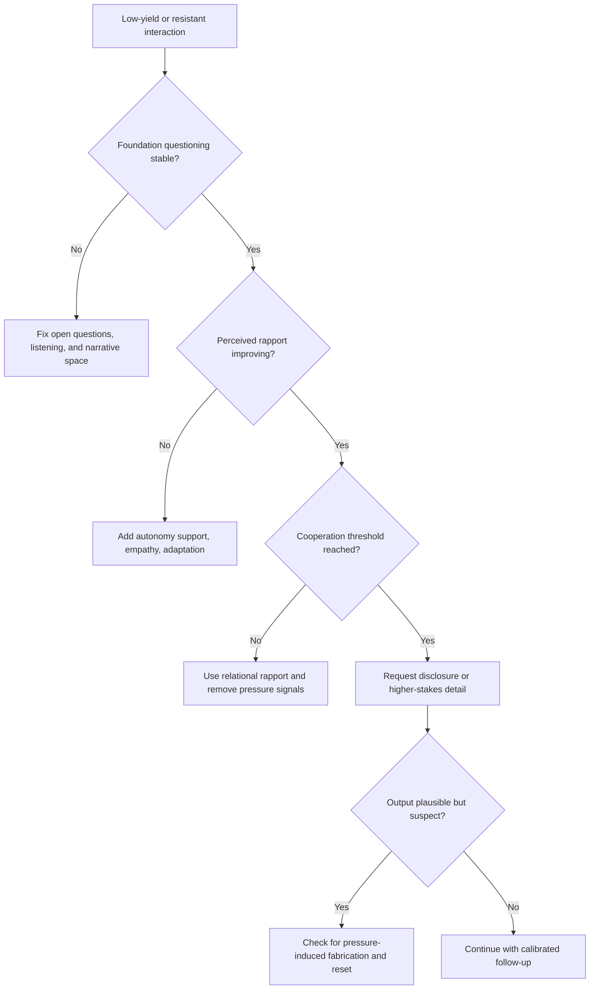

# Evaluating the Benefits of a Rapport-Based Approach

Use this skill when the hidden problem is not lack of instructions but a damaged cooperation pathway. The doctrine here is simple: pressure can force words, but it cannot force truthful, high-yield disclosure.

## When to Use

- A human or sub-agent is giving minimal, evasive, or suspiciously polished responses.
- Adding pressure, constraints, or accusation-like framing keeps making output worse.
- A handoff is failing because the receiver does not feel safe, prepared, or respected enough to cooperate.
- The system is over-trusting confidence signals instead of observed behavioral performance.
- You need to reason about why evidence or better tactics are not being adopted in resistant settings.

## NOT for Boundaries

This skill is not the primary tool for:
- Straightforward cooperative tasks where the other party is already responsive and truthful.
- Pure technical root-cause analysis when the main problem is system state, not resistance or cooperation.
- Compliance regimes where the design requirement is rigid procedure execution rather than disclosure quality.
- Situations where the operator is looking for intimidation or output-forcing tactics instead of trustworthy information.

## Core Mental Models

### Coercion Corrupts the Channel

Pressure-based tactics often produce the worst kind of success: output that looks usable but is structurally contaminated by compliance pressure, guesswork, or fabrication.

### Rapport Is a Mediated Causal Chain

The chain is tactic -> perceived rapport -> willingness to cooperate -> disclosure. If the cooperation step never forms, "more extraction pressure" is a category mistake.

### The Layers Must Stack in Order

Foundation questioning comes first, conversational rapport second, relational rapport third. Skipping the lower layers and jumping to high-trust asks is a design failure, not a shortcut.

### Self-Reported Capability Is Not Behavioral Capability

Practitioners and agents often say they understand the tactic while behaving as though they do not. Evaluate the behavior under pressure, not the self-description.

## Decision Points

### 1. Decide Whether the Problem Is Resistance or Difficulty

- If the counterpart is confused but willing, simplify the task.
- If the counterpart is resistant, treat cooperation-building as the main work.

### 2. Decide Which Layer Is Missing

- Weak questions or no listening means the foundation is missing.
- Good questions with poor willingness signals means conversational rapport is missing.
- Basic cooperation with continued guardedness means relational rapport is the next lever.

### 3. Decide Whether to Trust the Output

- If output arrived only after stronger pressure, distrust it.
- If confidence rose without observable behavioral improvement, distrust the self-report and watch the behavior.

## Failure Modes

### Pressure-Induced Fabrication

**Symptoms:** answers become fluent, fast, and wrong immediately after pressure increases.  
**Recovery:** back out the pressure signal, restore narrative space, and re-check the mediation chain.

### Layer Skipping

**Symptoms:** operators ask for high-stakes disclosure before basic rapport is established.  
**Recovery:** step back to foundation questioning and rebuild in order.

### Resistance Misread as Defiance

**Symptoms:** hesitation is interpreted as obstinacy instead of a cue about trust, fear, or poor framing.  
**Recovery:** treat resistance as diagnostic information about the current interaction design.

### Competence Theater

**Symptoms:** training or prompting sounds correct, but real behavior under stress does not change.  
**Recovery:** evaluate coded behavior and actual disclosure quality, not familiarity or confidence ratings.

### Evidence-With-No-Adoption

**Symptoms:** strong evidence exists for better tactics, yet practitioners keep using the dominant coercive style.  
**Recovery:** provide situated demonstrations in hard cases, not abstract evidence alone.

## Worked Examples

### Example 1: Investigative Interview

An interviewer responds to guarded answers by stacking accusations and constraints. Disclosure quality drops. Switching to open narrative prompts, active listening, and autonomy-supportive framing improves perceived rapport first, then cooperation, then factual yield.

### Example 2: Orchestrator to Sub-Agent Handoff

A coordinator keeps saying "just answer exactly in this format now" to a sub-agent facing an ambiguous synthesis task. The sub-agent returns polished nonsense. Reframing the task with scope, missing-context acknowledgment, and safe partial-output permission restores cooperation and improves truthfulness.

## Quality Gates

- [ ] The current layer failure is identified before adding more pressure.
- [ ] The tactic -> rapport -> cooperation -> disclosure chain is being monitored explicitly.
- [ ] Output obtained under stronger pressure is treated as suspect until corroborated.
- [ ] Behavioral coding or observable performance is preferred over self-assessed competence.
- [ ] Adoption plans include demonstrations in hard, resistant cases rather than evidence in the abstract.

## Reference Files

| File | Load when |
| --- | --- |
| `references/rapport-as-causal-mechanism-not-social-lubricant.md` | You need the mediation logic behind rapport-driven disclosure. |
| `references/coercive-vs-rapport-the-failure-mode-of-forcing-output.md` | A system is drifting toward pressure tactics that produce false-confidence output. |
| `references/three-layers-of-rapport-architecture.md` | You need the ordered stack of foundation, conversational, and relational rapport. |
| `references/resistance-as-information-not-obstacle.md` | Resistance needs to be interpreted diagnostically rather than punished. |
| `references/gap-between-knowing-and-doing.md` | Training, prompting, or self-report seems stronger than actual behavior. |
| `references/evidence-based-practice-adoption-barriers.md` | Better tactics are known but not being adopted in practice. |

## Anti-Patterns

- Treating more pressure as the universal fix for poor yield.
- Asking for high-trust disclosure before creating a cooperative substrate.
- Using self-reported competence as a routing signal for high-stakes work.
- Confusing well-formed output with trustworthy output after a coercive interaction.
