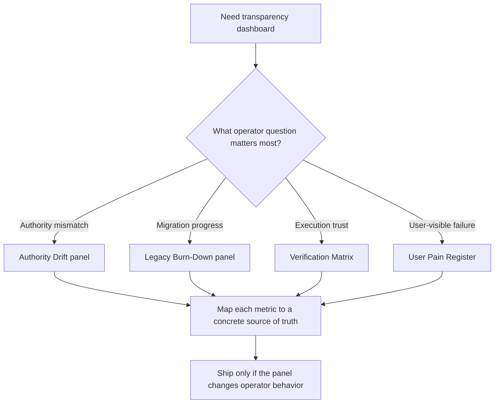

# Execution Transparency Dashboard

Build dashboards that answer operator questions, reveal drift between intended and actual execution, and shorten the time from anomaly to corrective action.

## When to Use

- Building internal dashboards for workflow runtimes, migrations, multi-agent systems, or refactors.
- Exposing authority drift, verifier status, backlog burn-down, runtime health, or user-visible failure patterns.
- Replacing ad hoc status spreadsheets with a source-of-truth operator surface.
- Designing a panel set where every chart must map to a specific operator decision.

## NOT for

- Marketing, growth, or executive KPI dashboards whose value is narrative rather than intervention.
- One-off exploratory charts with no owner, threshold, or follow-up action.
- Duplicate reporting for product analytics that already has a stable home.
- Full UI implementation details for internal tooling chrome. Use `admin-dashboard` when the shell and controls are the hard part.

## Decision Points

- Start with operator questions, not available metrics. If nobody can act on the panel, cut it.
- Separate live runtime truth from planned work. Mixing them produces false confidence.
- Prefer status panels that expose blocked edges, drift, or unverified states over vanity totals.
- Add drill-down only when operators need to localize a failure boundary, not just admire the aggregate.
- Make freshness explicit whenever a panel can lag behind the underlying runtime.

## Failure Modes

- Dashboard theater. Symptom: attractive panels with no linked operator action. Recovery: attach an owner and decision threshold to each panel or delete it.
- Drifted truth. Symptom: the dashboard summarizes a shadow data source instead of the runtime contract. Recovery: trace every metric to one authoritative source.
- Mixed horizons. Symptom: planned work and live state appear identical. Recovery: visually distinguish forecast, backlog, and verified runtime facts.
- Hidden staleness. Symptom: operators act on outdated data because freshness is invisible. Recovery: display timestamps and refresh mechanics directly in the panel.
- Metric sprawl. Symptom: dozens of weak charts dilute attention. Recovery: keep only the panels tied to intervention, escalation, or rollout confidence.

## Worked Example

Need: build a migration dashboard for moving a workflow engine from frontend-simulated execution to backend authority.

1. Create an `Authority Drift` panel showing how many flows still depend on frontend-only transitions.
2. Add a `Legacy Burn-Down` panel for compatibility shims, dual-path adapters, and remaining migration blockers.
3. Add a `Verification Matrix` panel that distinguishes tested, untested, and failing subsystems.
4. Track a `User Pain Register` for incidents the migration is meant to eliminate, not just internal technical milestones.
5. Expose freshness timestamps and drill-down links so operators can move from red panel to exact failing boundary.

The expert move is treating the dashboard as an operational contract, not a decorative readout.

## Quality Gates

- [ ] Every panel is framed as an operator question.
- [ ] Every metric resolves to an authoritative source of truth.
- [ ] Planned, inferred, and verified states are visually distinct.
- [ ] Freshness and sampling cadence are visible.
- [ ] A red state implies a concrete next action or escalation path.
- [ ] Drill-down paths localize the failure boundary without requiring raw-log spelunking for common cases.

## Anti-Patterns and Shibboleths

- "If the data exists, it deserves a chart." Wrong. Operators need intervention surfaces, not metric hoarding.
- "A migration dashboard should mostly show percent complete." Weak. Experts track drift, blocked edges, and unverified seams because those predict rollout risk.

## Reference Map

- `references/INDEX.md`
- `references/dashboard-panels.md`
