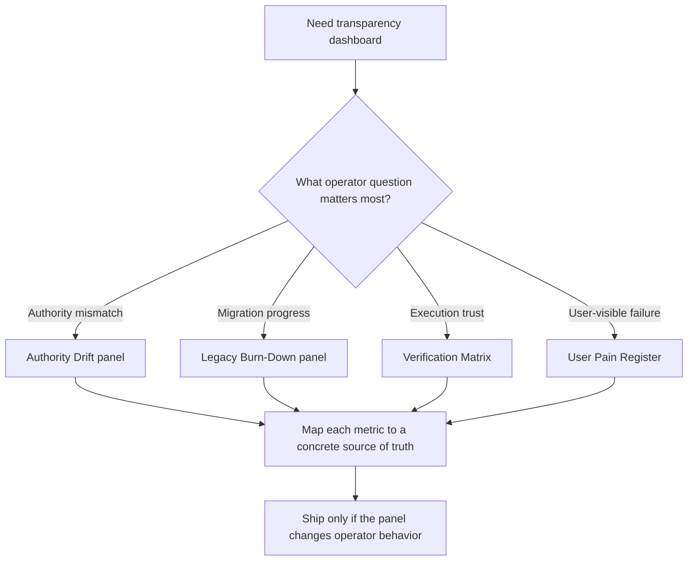

# Diagram 1: flowchart

```mermaid
flowchart TD
  A[Need transparency dashboard] --> B{What operator question matters most?}
  B -->|Authority mismatch| C[Authority Drift panel]
  B -->|Migration progress| D[Legacy Burn-Down panel]
  B -->|Execution trust| E[Verification Matrix]
  B -->|User-visible failure| F[User Pain Register]
  C --> G[Map each metric to a concrete source of truth]
  D --> G
  E --> G
  F --> G
  G --> H[Ship only if the panel changes operator behavior]
```
