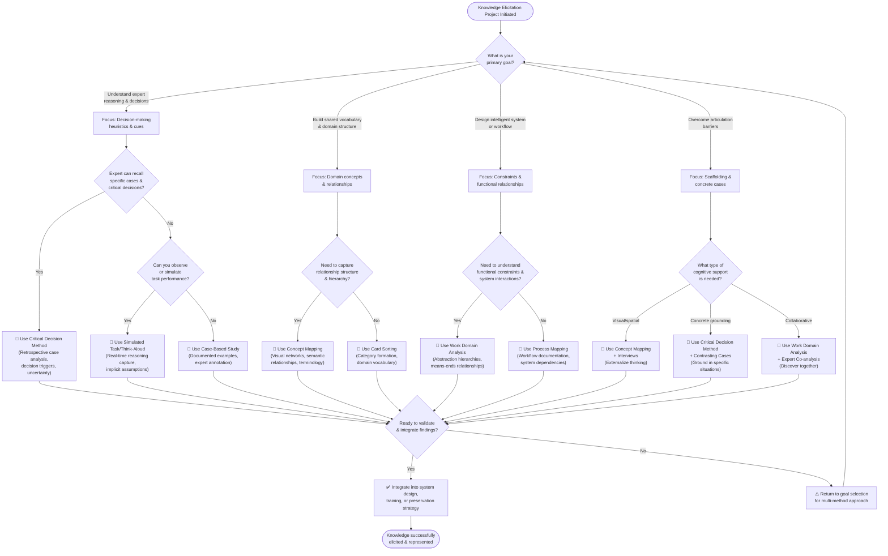

# Knowledge Elicitation Method Selection Decision Tree

```mermaid
flowchart TD
    Start([Knowledge Elicitation Project Initiated]) --> Goal{What is your<br/>primary goal?}
    
    Goal -->|Understand expert<br/>reasoning & decisions| ReasoningPath[Focus: Decision-making<br/>heuristics & cues]
    Goal -->|Build shared vocabulary<br/>& domain structure| ConceptPath[Focus: Domain concepts<br/>& relationships]
    Goal -->|Design intelligent system<br/>or workflow| SystemPath[Focus: Constraints &<br/>functional relationships]
    Goal -->|Overcome articulation<br/>barriers| BarrierPath[Focus: Scaffolding &<br/>concrete cases]
    
    ReasoningPath --> CDMDecision{Expert can recall<br/>specific cases &<br/>critical decisions?}
    CDMDecision -->|Yes| CDM["🎯 Use Critical Decision Method<br/>(Retrospective case analysis,<br/>decision triggers, uncertainty)"]
    CDMDecision -->|No| SimDecision{Can you observe<br/>or simulate<br/>task performance?}
    
    SimDecision -->|Yes| SimTask["🎯 Use Simulated Task/Think-Aloud<br/>(Real-time reasoning capture,<br/>implicit assumptions)"]
    SimDecision -->|No| CaseStudy["🎯 Use Case-Based Study<br/>(Documented examples,<br/>expert annotation)"]
    
    ConceptPath --> VocabDecision{Need to capture<br/>relationship structure<br/>& hierarchy?}
    VocabDecision -->|Yes| ConceptMap["🎯 Use Concept Mapping<br/>(Visual networks, semantic<br/>relationships, terminology)"]
    VocabDecision -->|No| CardSort["🎯 Use Card Sorting<br/>(Category formation,<br/>domain vocabulary)"]
    
    SystemPath --> ConstraintDecision{Need to understand<br/>functional constraints &<br/>system interactions?}
    ConstraintDecision -->|Yes| WDA["🎯 Use Work Domain Analysis<br/>(Abstraction hierarchies,<br/>means-ends relationships)"]
    ConstraintDecision -->|No| ProcessMap["🎯 Use Process Mapping<br/>(Workflow documentation,<br/>system dependencies)"]
    
    BarrierPath --> ScaffoldDecision{What type of<br/>cognitive support<br/>is needed?}
    ScaffoldDecision -->|Visual/spatial| ConcurrentMap["🎯 Use Concept Mapping<br/>+ Interviews<br/>(Externalize thinking)"]
    ScaffoldDecision -->|Concrete grounding| ConcreteCase["🎯 Use Critical Decision Method<br/>+ Contrasting Cases<br/>(Ground in specific situations)"]
    ScaffoldDecision -->|Collaborative| CollabWDA["🎯 Use Work Domain Analysis<br/>+ Expert Co-analysis<br/>(Discover together)"]
    
    CDM --> Validation{Ready to validate<br/>& integrate findings?}
    SimTask --> Validation
    CaseStudy --> Validation
    ConceptMap --> Validation
    CardSort --> Validation
    WDA --> Validation
    ProcessMap --> Validation
    ConcurrentMap --> Validation
    ConcreteCase --> Validation
    CollabWDA --> Validation
    
    Validation -->|Yes| Integrate["✅ Integrate into system design,<br/>training, or preservation strategy"]
    Validation -->|No| Iterate["⚠️ Return to goal selection<br/>for multi-method approach"]
    
    Iterate --> Goal
    Integrate --> End([Knowledge successfully<br/>elicited & represented])
```
