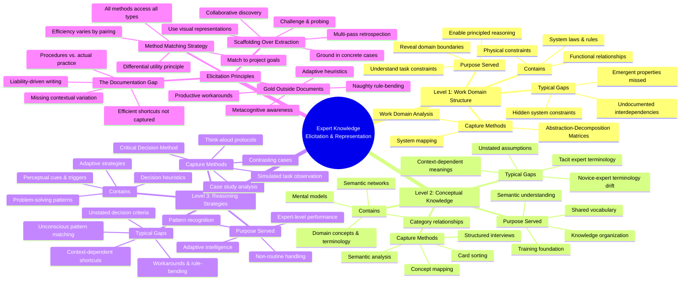

# Three-Level Knowledge Architecture and Elicitation Mapping

```mermaid
mindmap
  root((Expert Knowledge<br/>Elicitation & Representation))
    Level 1: Work Domain Structure
      Contains
        Functional relationships
        Physical constraints
        System laws & rules
      Capture Methods
        Work Domain Analysis
        Abstraction-Decomposition Matrices
        System mapping
      Purpose Served
        Understand task constraints
        Enable principled reasoning
        Reveal domain boundaries
      Typical Gaps
        Undocumented interdependencies
        Hidden system constraints
        Emergent properties missed
    Level 2: Conceptual Knowledge
      Contains
        Domain concepts & terminology
        Category relationships
        Mental models
        Semantic networks
      Capture Methods
        Concept mapping
        Card sorting
        Structured interviews
        Semantic analysis
      Purpose Served
        Shared vocabulary
        Knowledge organization
        Semantic understanding
        Training foundation
      Typical Gaps
        Tacit expert terminology
        Unstated assumptions
        Context-dependent meanings
        Novice-expert terminology drift
    Level 3: Reasoning Strategies
      Contains
        Decision heuristics
        Perceptual cues & triggers
        Problem-solving patterns
        Adaptive strategies
      Capture Methods
        Critical Decision Method
        Think-aloud protocols
        Case study analysis
        Simulated task observation
        Contrasting cases
      Purpose Served
        Adaptive intelligence
        Non-routine handling
        Expert-level performance
        Pattern recognition
      Typical Gaps
        Unstated decision criteria
        Unconscious pattern matching
        Workarounds & rule-bending
        Context-dependent shortcuts
    Elicitation Principles
      Scaffolding Over Extraction
        Ground in concrete cases
        Use visual representations
        Multi-pass retrospection
        Collaborative discovery
        Challenge & probing
      The Documentation Gap
        Procedures vs. actual practice
        Liability-driven writing
        Missing contextual variation
        Efficient shortcuts not captured
      Method Matching Strategy
        Match to project goals
        Differential utility principle
        All methods access all types
        Efficiency varies by pairing
      Gold Outside Documents
        Adaptive heuristics
        Productive workarounds
        Naughty rule-bending
        Metacognitive awareness
```
