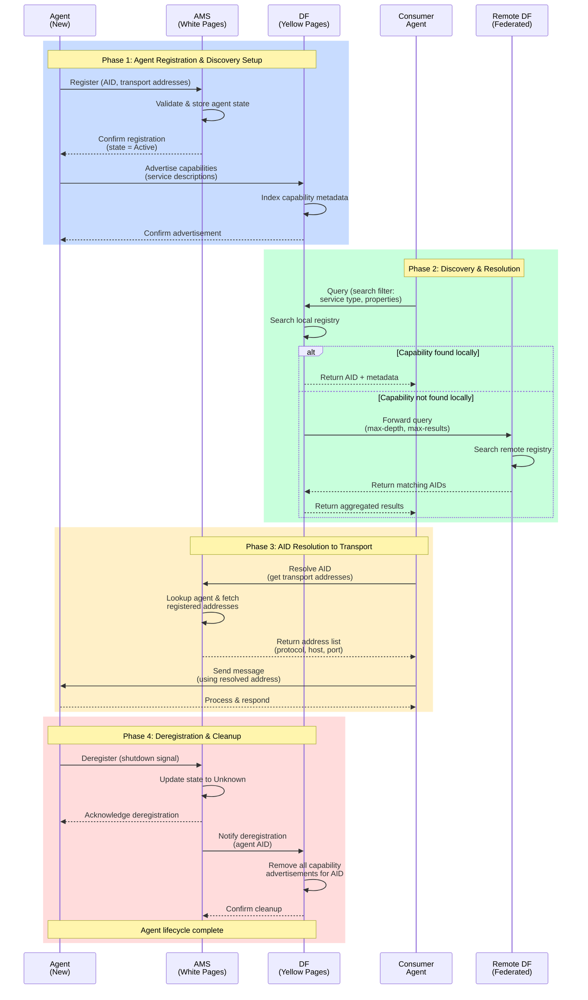

# Agent Discovery & Registration Protocol (White Pages + Yellow Pages)

```mermaid
sequenceDiagram
    participant Agent as Agent<br/>(New)
    participant AMS as AMS<br/>(White Pages)
    participant DF as DF<br/>(Yellow Pages)
    participant Consumer as Consumer<br/>Agent
    participant RemoteDF as Remote DF<br/>(Federated)

    rect rgb(200, 220, 255)
    Note over Agent,DF: Phase 1: Agent Registration & Discovery Setup
    Agent->>AMS: Register (AID, transport addresses)
    AMS->>AMS: Validate & store agent state
    AMS-->>Agent: Confirm registration<br/>(state = Active)
    Agent->>DF: Advertise capabilities<br/>(service descriptions)
    DF->>DF: Index capability metadata
    DF-->>Agent: Confirm advertisement
    end

    rect rgb(200, 255, 220)
    Note over Consumer,RemoteDF: Phase 2: Discovery & Resolution
    Consumer->>DF: Query (search filter:<br/>service type, properties)
    DF->>DF: Search local registry
    alt Capability found locally
        DF-->>Consumer: Return AID + metadata
    else Capability not found locally
        DF->>RemoteDF: Forward query<br/>(max-depth, max-results)
        RemoteDF->>RemoteDF: Search remote registry
        RemoteDF-->>DF: Return matching AIDs
        DF-->>Consumer: Return aggregated results
    end
    end

    rect rgb(255, 240, 200)
    Note over Consumer,AMS: Phase 3: AID Resolution to Transport
    Consumer->>AMS: Resolve AID<br/>(get transport addresses)
    AMS->>AMS: Lookup agent & fetch<br/>registered addresses
    AMS-->>Consumer: Return address list<br/>(protocol, host, port)
    Consumer->>Agent: Send message<br/>(using resolved address)
    Agent-->>Consumer: Process & respond
    end

    rect rgb(255, 220, 220)
    Note over Agent,DF: Phase 4: Deregistration & Cleanup
    Agent->>AMS: Deregister (shutdown signal)
    AMS->>AMS: Update state to Unknown
    AMS-->>Agent: Acknowledge deregistration
    AMS->>DF: Notify deregistration<br/>(agent AID)
    DF->>DF: Remove all capability<br/>advertisements for AID
    DF-->>AMS: Confirm cleanup
    Note over Agent,DF: Agent lifecycle complete
    end
```
