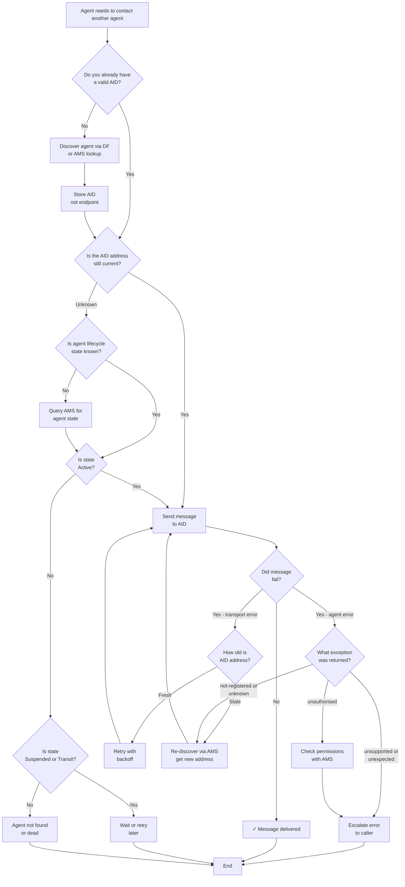

# Decision Tree: Agent Addressing & Registry Lookup

```mermaid
flowchart TD
    START["Agent needs to contact another agent"] --> Q1{Do you already have<br/>a valid AID?}
    
    Q1 -->|No| Q2["Discover agent via DF<br/>or AMS lookup"]
    Q1 -->|Yes| Q3{Is the AID address<br/>still current?}
    
    Q2 --> STORE1["Store AID<br/>not endpoint"]
    STORE1 --> Q3
    
    Q3 -->|Unknown| Q4{Is agent lifecycle<br/>state known?}
    Q3 -->|Yes| SEND["Send message<br/>to AID"]
    
    Q4 -->|No| CHECKAMS["Query AMS for<br/>agent state"]
    Q4 -->|Yes| Q5{Is state<br/>Active?}
    
    CHECKAMS --> Q5
    
    Q5 -->|No| Q6{Is state<br/>Suspended or Transit?}
    Q5 -->|Yes| SEND
    
    Q6 -->|Yes| WAIT["Wait or retry<br/>later"]
    Q6 -->|No| NOTFOUND["Agent not found<br/>or dead"]
    
    SEND --> Q7{Did message<br/>fail?}
    
    Q7 -->|No| SUCCESS["✓ Message delivered"]
    Q7 -->|Yes - transport error| Q8{How old is<br/>AID address?}
    Q7 -->|Yes - agent error| Q9{What exception<br/>was returned?}
    
    Q8 -->|Fresh| RETRY["Retry with<br/>backoff"]
    Q8 -->|Stale| REDISCOVER["Re-discover via AMS<br/>get new address"]
    
    REDISCOVER --> SEND
    RETRY --> SEND
    
    Q9 -->|not-registered or<br/>unknown| REDISCOVER
    Q9 -->|unsupported or<br/>unexpected| ESCALATE["Escalate error<br/>to caller"]
    Q9 -->|unauthorised| NOTAUTH["Check permissions<br/>with AMS"]
    
    NOTAUTH --> ESCALATE
    ESCALATE --> END1["End"]
    SUCCESS --> END1
    WAIT --> END1
    NOTFOUND --> END1
```
