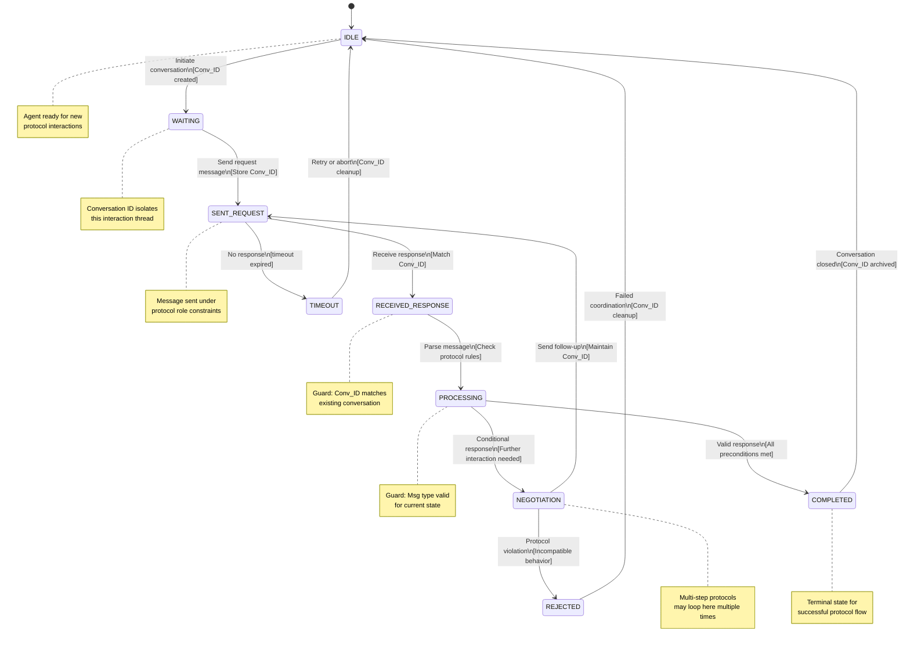

# Protocol State Machines and Agent Conversation States

```mermaid
stateDiagram-v2
    [*] --> IDLE
    
    IDLE --> WAITING: Initiate conversation\n[Conv_ID created]
    
    WAITING --> SENT_REQUEST: Send request message\n[Store Conv_ID]
    
    SENT_REQUEST --> RECEIVED_RESPONSE: Receive response\n[Match Conv_ID]
    SENT_REQUEST --> TIMEOUT: No response\n[timeout expired]
    
    RECEIVED_RESPONSE --> PROCESSING: Parse message\n[Check protocol rules]
    
    PROCESSING --> COMPLETED: Valid response\n[All preconditions met]
    PROCESSING --> NEGOTIATION: Conditional response\n[Further interaction needed]
    
    NEGOTIATION --> SENT_REQUEST: Send follow-up\n[Maintain Conv_ID]
    NEGOTIATION --> REJECTED: Protocol violation\n[Incompatible behavior]
    
    TIMEOUT --> IDLE: Retry or abort\n[Conv_ID cleanup]
    REJECTED --> IDLE: Failed coordination\n[Conv_ID cleanup]
    COMPLETED --> IDLE: Conversation closed\n[Conv_ID archived]
    
    note right of IDLE
        Agent ready for new
        protocol interactions
    end note
    
    note right of WAITING
        Conversation ID isolates
        this interaction thread
    end note
    
    note right of SENT_REQUEST
        Message sent under
        protocol role constraints
    end note
    
    note right of RECEIVED_RESPONSE
        Guard: Conv_ID matches
        existing conversation
    end note
    
    note right of PROCESSING
        Guard: Msg type valid
        for current state
    end note
    
    note right of NEGOTIATION
        Multi-step protocols
        may loop here multiple times
    end note
    
    note right of COMPLETED
        Terminal state for
        successful protocol flow
    end note
```
