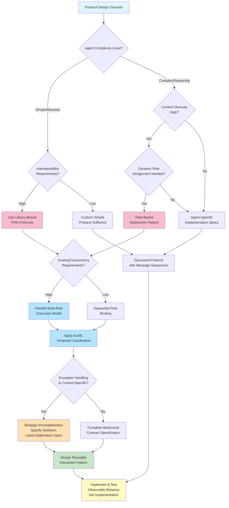

# Decision Framework for Protocol Selection and Design

```mermaid
graph TD
    A["Protocol Design Decision"] --> B{Agent Complexity Level?}
    
    B -->|Simple/Reactive| C{Interoperability<br/>Requirements?}
    B -->|Complex/Reasoning| D{Context Diversity<br/>High?}
    
    C -->|High| E["Use Library-Based<br/>FIPA Protocols"]
    C -->|Low| F["Custom Simple<br/>Protocol Sufficient"]
    
    D -->|Yes| G{Dynamic Role<br/>Assignment Needed?}
    D -->|No| H["Agent-Specific<br/>Implementation Specs"]
    
    G -->|Yes| I["Role-Based<br/>Abstraction Pattern"]
    G -->|No| H
    
    E --> J{Scaling/Concurrency<br/>Requirements?}
    I --> J
    
    J -->|High| K["Parallel Multi-Role<br/>Execution Model"]
    J -->|Low| L["Sequential Role<br/>Binding"]
    
    K --> M["Apply AUML<br/>Temporal Coordination"]
    L --> M
    
    M --> N{Exception Handling<br/>& Context-Specific?}
    
    N -->|Yes| O["Strategic Incompleteness:<br/>Specify Skeleton,<br/>Leave Elaboration Open"]
    N -->|No| P["Complete Behavioral<br/>Contract Specification"]
    
    O --> Q["Design Reusable<br/>Interaction Pattern"]
    P --> Q
    
    F --> R["Document Protocol<br/>with Message Sequences"]
    H --> R
    
    Q --> S["Implement & Test<br/>Observable Behavior<br/>Not Implementation"]
    R --> S

    style A fill:#e1f5ff
    style Q fill:#c8e6c9
    style S fill:#fff9c4
    style E fill:#f8bbd0
    style I fill:#f8bbd0
    style K fill:#b3e5fc
    style M fill:#b3e5fc
    style O fill:#ffe0b2
```
