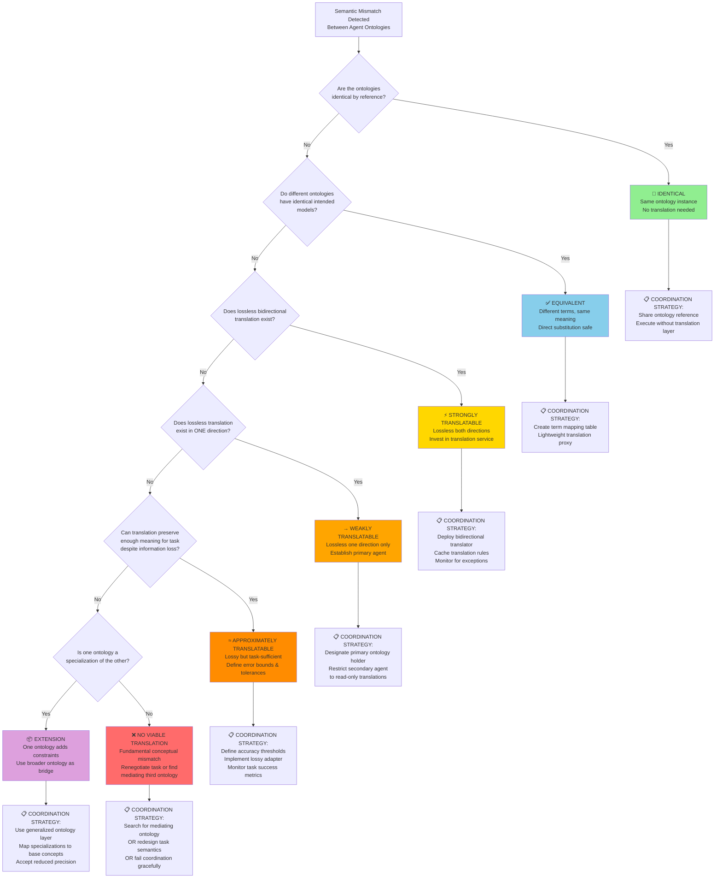

# Ontology Relationship Decision Tree

```mermaid
flowchart TD
    Start["Semantic Mismatch Detected<br/>Between Agent Ontologies"] --> Q1{Are the ontologies<br/>identical by reference?}
    
    Q1 -->|Yes| Identical["🎯 IDENTICAL<br/>Same ontology instance<br/>No translation needed"]
    
    Q1 -->|No| Q2{Do different ontologies<br/>have identical intended<br/>models?}
    
    Q2 -->|Yes| Equivalent["✅ EQUIVALENT<br/>Different terms, same meaning<br/>Direct substitution safe"]
    
    Q2 -->|No| Q3{Does lossless bidirectional<br/>translation exist?}
    
    Q3 -->|Yes| StronglyTranslatable["⚡ STRONGLY TRANSLATABLE<br/>Lossless both directions<br/>Invest in translation service"]
    
    Q3 -->|No| Q4{Does lossless translation<br/>exist in ONE direction?}
    
    Q4 -->|Yes| WeaklyTranslatable["→ WEAKLY TRANSLATABLE<br/>Lossless one direction only<br/>Establish primary agent"]
    
    Q4 -->|No| Q5{Can translation preserve<br/>enough meaning for task<br/>despite information loss?}
    
    Q5 -->|Yes| ApproximatelyTranslatable["≈ APPROXIMATELY TRANSLATABLE<br/>Lossy but task-sufficient<br/>Define error bounds & tolerances"]
    
    Q5 -->|No| Q6{Is one ontology a<br/>specialization of the other?}
    
    Q6 -->|Yes| Extension["📦 EXTENSION<br/>One ontology adds constraints<br/>Use broader ontology as bridge"]
    
    Q6 -->|No| NoTranslation["❌ NO VIABLE TRANSLATION<br/>Fundamental conceptual mismatch<br/>Renegotiate task or find<br/>mediating third ontology"]
    
    Identical --> Strategy1["📋 COORDINATION STRATEGY:<br/>Share ontology reference<br/>Execute without translation layer"]
    
    Equivalent --> Strategy2["📋 COORDINATION STRATEGY:<br/>Create term mapping table<br/>Lightweight translation proxy"]
    
    StronglyTranslatable --> Strategy3["📋 COORDINATION STRATEGY:<br/>Deploy bidirectional translator<br/>Cache translation rules<br/>Monitor for exceptions"]
    
    WeaklyTranslatable --> Strategy4["📋 COORDINATION STRATEGY:<br/>Designate primary ontology holder<br/>Restrict secondary agent<br/>to read-only translations"]
    
    ApproximatelyTranslatable --> Strategy5["📋 COORDINATION STRATEGY:<br/>Define accuracy thresholds<br/>Implement lossy adapter<br/>Monitor task success metrics"]
    
    Extension --> Strategy6["📋 COORDINATION STRATEGY:<br/>Use generalized ontology layer<br/>Map specializations to base concepts<br/>Accept reduced precision"]
    
    NoTranslation --> Strategy7["📋 COORDINATION STRATEGY:<br/>Search for mediating ontology<br/>OR redesign task semantics<br/>OR fail coordination gracefully"]
    
    style Identical fill:#90EE90
    style Equivalent fill:#87CEEB
    style StronglyTranslatable fill:#FFD700
    style WeaklyTranslatable fill:#FFA500
    style ApproximatelyTranslatable fill:#FF8C00
    style Extension fill:#DDA0DD
    style NoTranslation fill:#FF6B6B
```
