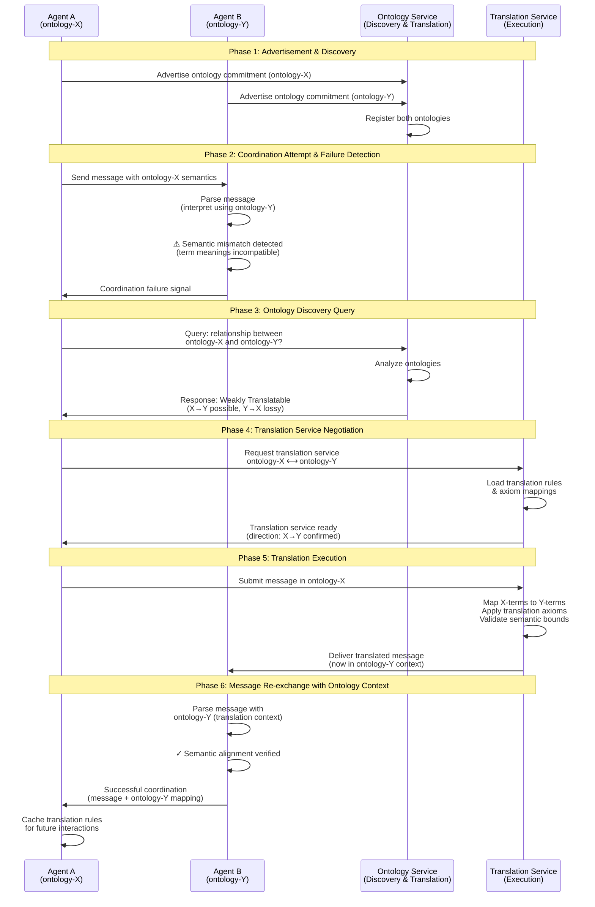

# FIPA Ontology Service Coordination Protocol

```mermaid
sequenceDiagram
    participant AgentA as Agent A<br/>(ontology-X)
    participant AgentB as Agent B<br/>(ontology-Y)
    participant OntSvc as Ontology Service<br/>(Discovery & Translation)
    participant TransSvc as Translation Service<br/>(Execution)

    Note over AgentA,TransSvc: Phase 1: Advertisement & Discovery
    AgentA->>OntSvc: Advertise ontology commitment (ontology-X)
    AgentB->>OntSvc: Advertise ontology commitment (ontology-Y)
    OntSvc->>OntSvc: Register both ontologies

    Note over AgentA,TransSvc: Phase 2: Coordination Attempt & Failure Detection
    AgentA->>AgentB: Send message with ontology-X semantics
    AgentB->>AgentB: Parse message<br/>(interpret using ontology-Y)
    AgentB->>AgentB: ⚠ Semantic mismatch detected<br/>(term meanings incompatible)
    AgentB->>AgentA: Coordination failure signal

    Note over AgentA,TransSvc: Phase 3: Ontology Discovery Query
    AgentA->>OntSvc: Query: relationship between<br/>ontology-X and ontology-Y?
    OntSvc->>OntSvc: Analyze ontologies
    OntSvc->>AgentA: Response: Weakly Translatable<br/>(X→Y possible, Y→X lossy)

    Note over AgentA,TransSvc: Phase 4: Translation Service Negotiation
    AgentA->>TransSvc: Request translation service<br/>ontology-X ⟷ ontology-Y
    TransSvc->>TransSvc: Load translation rules<br/>& axiom mappings
    TransSvc->>AgentA: Translation service ready<br/>(direction: X→Y confirmed)

    Note over AgentA,TransSvc: Phase 5: Translation Execution
    AgentA->>TransSvc: Submit message in ontology-X
    TransSvc->>TransSvc: Map X-terms to Y-terms<br/>Apply translation axioms<br/>Validate semantic bounds
    TransSvc->>AgentB: Deliver translated message<br/>(now in ontology-Y context)

    Note over AgentA,TransSvc: Phase 6: Message Re-exchange with Ontology Context
    AgentB->>AgentB: Parse message with<br/>ontology-Y (translation context)
    AgentB->>AgentB: ✓ Semantic alignment verified
    AgentB->>AgentA: Successful coordination<br/>(message + ontology-Y mapping)
    AgentA->>AgentA: Cache translation rules<br/>for future interactions
```
