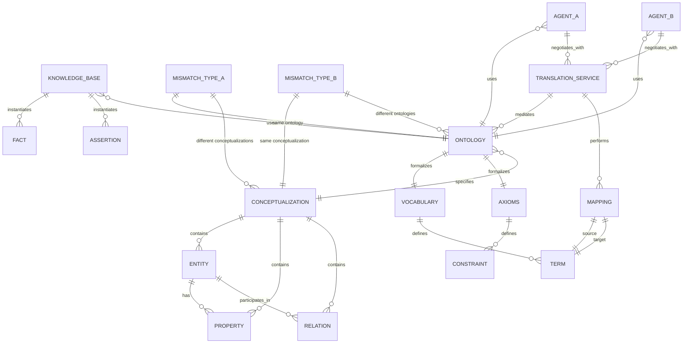

# Three-Layer Ontological Model (Conceptualization → Ontology → Knowledge Base)

```mermaid
erDiagram
    CONCEPTUALIZATION ||--o{ ENTITY : contains
    CONCEPTUALIZATION ||--o{ PROPERTY : contains
    CONCEPTUALIZATION ||--o{ RELATION : contains
    
    ONTOLOGY ||--|| VOCABULARY : formalizes
    ONTOLOGY ||--|| AXIOMS : formalizes
    ONTOLOGY }o--|| CONCEPTUALIZATION : specifies
    
    VOCABULARY ||--o{ TERM : defines
    AXIOMS ||--o{ CONSTRAINT : defines
    
    KNOWLEDGE_BASE ||--o{ FACT : instantiates
    KNOWLEDGE_BASE ||--o{ ASSERTION : instantiates
    KNOWLEDGE_BASE }o--|| ONTOLOGY : uses
    
    ENTITY ||--o{ PROPERTY : has
    ENTITY ||--o{ RELATION : participates_in
    
    MISMATCH_TYPE_A ||--|| ONTOLOGY : "same ontology"
    MISMATCH_TYPE_A ||--o{ CONCEPTUALIZATION : "different conceptualizations"
    
    MISMATCH_TYPE_B ||--|| CONCEPTUALIZATION : "same conceptualization"
    MISMATCH_TYPE_B ||--o{ ONTOLOGY : "different ontologies"
    
    TRANSLATION_SERVICE ||--o{ ONTOLOGY : mediates
    TRANSLATION_SERVICE ||--o{ MAPPING : performs
    
    MAPPING ||--|| TERM : source
    MAPPING ||--|| TERM : target
    
    AGENT_A }o--|| ONTOLOGY : uses
    AGENT_B }o--|| ONTOLOGY : uses
    AGENT_A ||--o{ TRANSLATION_SERVICE : negotiates_with
    AGENT_B ||--o{ TRANSLATION_SERVICE : negotiates_with
```
