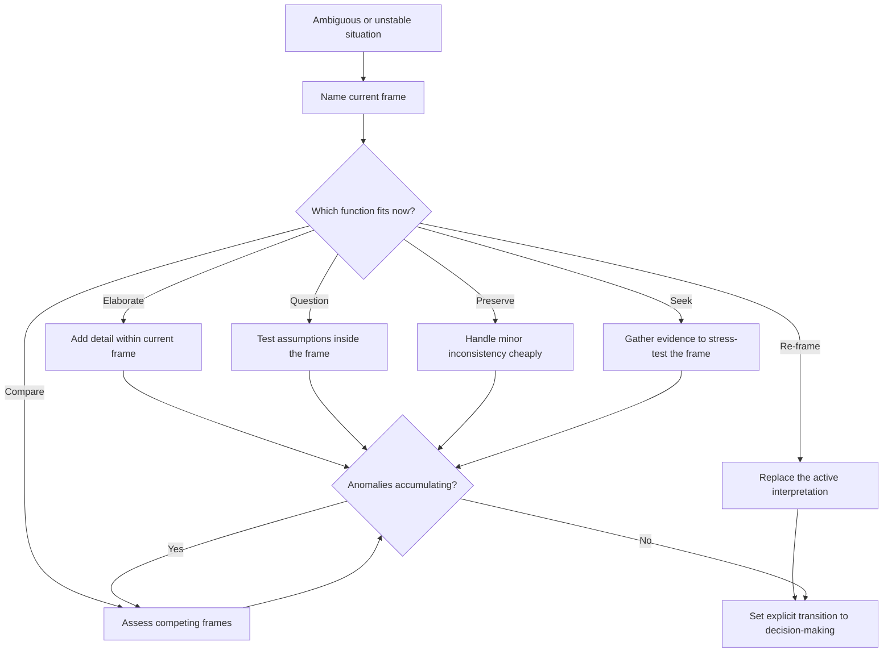

# FOCUS: A Model of Sensemaking

Source basis: the Data/Frame model from Klein Associates on how people build, test, preserve, and replace interpretive frames under ambiguity.

## When to Use

- An agent or analyst has conflicting cues and is at risk of committing too early.
- You need to separate situation understanding from downstream decision-making.
- A system keeps explaining away anomalies instead of updating its interpretation.
- You are designing question-generation behavior for ambiguous, evolving situations.
- You need to decide whether to store comprehensive models or fragmentary domain patterns.

## NOT for

- Simple classification, retrieval, or pattern matching where the situation is already clear.
- Pure decision optimization problems where the frame is settled and only action choice remains.
- "Ask more questions" advice that ignores the current interpretive frame and its assumptions.

## Decision Points

1. Name the current frame. If you cannot state the working interpretation, you are not ready to reason about anomalies.
2. Decide which of the six functions is appropriate: elaborate, question, preserve, compare, seek, or re-frame.
3. Check whether anomaly handling is still healthy or has turned into preservation-driven fixation.
4. Set an explicit gate for moving from sensemaking to decision-making.

## Decision Flow

## Working Model

- Data and frame are reciprocal. The frame tells you what matters, and the data can confirm, strain, or break that frame.
- Experts do not rely on one giant world model. They use fragmentary mental models: local patterns, causal snippets, and heuristics assembled when needed.
- Expertise shows up more in better knowledge structures and better discipline between sensemaking and deciding than in a totally different reasoning algorithm.
- Preserving is necessary but dangerous. It handles small inconsistencies cheaply, but it is also where fixation usually hides.
- Good questions target the assumptions inside the current frame, not just missing facts on the surface.

## Failure Modes

- Treating the first plausible frame as settled truth and explaining away every later anomaly.
- Moving into action planning before the situation model is coherent enough to trust.
- Demanding a complete model of the environment instead of using fragmentary patterns that can be assembled just in time.
- Asking only data-seeking questions and never assumption-challenging questions.
- Treating each anomaly independently instead of tracking whether anomalies are accumulating into a reframing signal.

## Anti-Patterns and Shibboleths

- Anti-pattern: jumping from ambiguity straight into action planning with no named frame.
- Anti-pattern: calling every extra data request "sensemaking" even when no frame assumptions are being tested.
- Shibboleth: if the agent cannot say whether it is preserving, comparing, or reframing, it is probably improvising without a sensemaking method.

## Worked Examples

- An incident-response agent sees three weak signs that the current diagnosis is wrong but keeps preserving the original explanation. The fix is to force comparison against a competing frame once anomaly count crosses a threshold.
- A research assistant keeps asking "what happened next?" but never "why would that actor do this?" The fix is to generate questions from frame assumptions, not from missing fields alone.

## Fork Guidance

- Stay in-process when you are refining one dominant frame and only need a few targeted questions.
- Fork one subagent per competing frame when ambiguity is real and you want independent frame comparisons before deciding.

## Quality Gates

- The active frame is stated explicitly.
- The chosen sensemaking function is named rather than implied.
- Anomaly handling includes a threshold for when comparison or reframing becomes mandatory.
- Decision-making starts only after an explicit transition gate.
- Questions test assumptions inside the frame, not just facts outside it.

## Reference Routing

- `references/data-frame-reciprocity-in-agent-systems.md`: load when designing the loop between current interpretation and next evidence sought.
- `references/fragmentary-mental-models-for-agents.md`: load when choosing what kind of knowledge structures to give the system.
- `references/sensemaking-decision-making-separation.md`: load when action bias is collapsing understanding and decision into one phase.
- `references/expert-questioning-strategies.md`: load when question quality, not question quantity, is the real bottleneck.
- `references/frame-elaboration-vs-frame-comparison.md`: load when the system is stuck preserving one frame for too long.
- `references/sensemaking-triggers-and-anomaly-detection.md`: load when you need criteria for when deliberate sensemaking should start.
