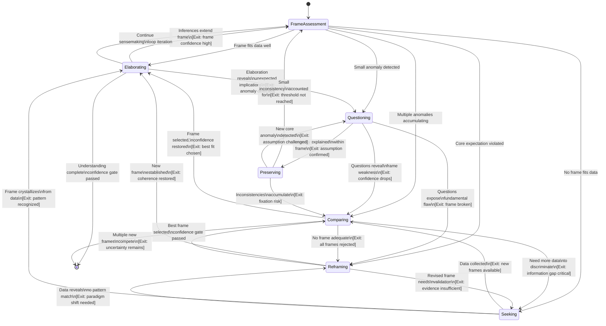

# Sensemaking State Machine: Frame-Data Loop & Function Transitions

```mermaid
stateDiagram-v2
    [*] --> FrameAssessment
    
    FrameAssessment --> Elaborating: Frame fits data well
    FrameAssessment --> Questioning: Small anomaly detected
    FrameAssessment --> Comparing: Multiple anomalies accumulating
    FrameAssessment --> Seeking: No frame fits data
    FrameAssessment --> Reframing: Core expectation violated
    
    Elaborating --> FrameAssessment: Inferences extend frame\n[Exit: frame confidence high]
    Elaborating --> Questioning: Elaboration reveals\nunexpected implications\n[Exit: anomaly detected]
    
    Questioning --> Preserving: Anomaly explained\nwithin frame\n[Exit: assumption confirmed]
    Questioning --> Comparing: Questions reveal\nframe weakness\n[Exit: confidence drops]
    Questioning --> Reframing: Questions expose\nfundamental flaw\n[Exit: frame broken]
    
    Preserving --> FrameAssessment: Small inconsistency\naccounted for\n[Exit: threshold not reached]
    Preserving --> Comparing: Inconsistencies\naccumulate\n[Exit: fixation risk]
    Preserving --> Questioning: New core anomaly\ndetected\n[Exit: assumption challenged]
    
    Comparing --> Elaborating: Frame selected,\nconfidence restored\n[Exit: best fit chosen]
    Comparing --> Reframing: No frame adequate\n[Exit: all frames rejected]
    Comparing --> Seeking: Need more data\nto discriminate\n[Exit: information gap critical]
    
    Seeking --> Comparing: Data collected\n[Exit: new frames available]
    Seeking --> Elaborating: Frame crystallizes\nfrom data\n[Exit: pattern recognized]
    Seeking --> Reframing: Data reveals\nno pattern match\n[Exit: paradigm shift needed]
    
    Reframing --> Elaborating: New frame\nestablished\n[Exit: coherence restored]
    Reframing --> Seeking: Revised frame needs\nvalidation\n[Exit: evidence insufficient]
    Reframing --> Comparing: Multiple new frames\ncompete\n[Exit: uncertainty remains]
    
    Elaborating --> [*]: Understanding complete\nconfidence gate passed
    Comparing --> [*]: Best frame selected\nconfidence gate passed
    Elaborating --> FrameAssessment: Continue sensemaking\nloop iteration
```
