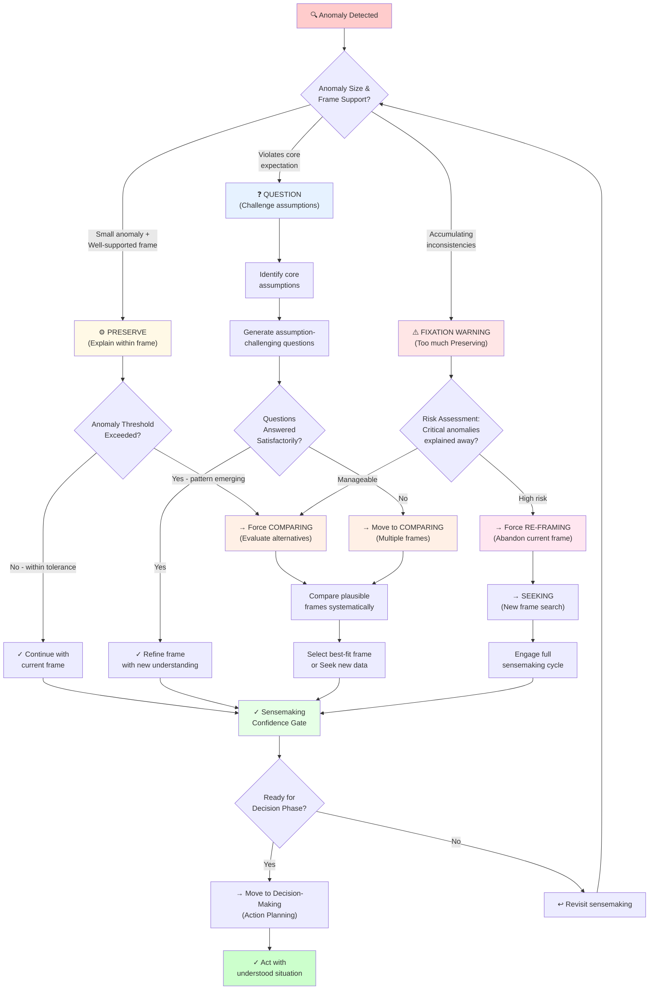

# Decision Framework: Anomaly Detection → Function Selection

```mermaid
flowchart TD
    START["🔍 Anomaly Detected"] --> CHECK1{Anomaly Size &<br/>Frame Support?}
    
    CHECK1 -->|Small anomaly +<br/>Well-supported frame| PRESERVE["⚙️ PRESERVE<br/>(Explain within frame)"]
    CHECK1 -->|Violates core<br/>expectation| QUESTION["❓ QUESTION<br/>(Challenge assumptions)"]
    CHECK1 -->|Accumulating<br/>inconsistencies| FIXATION["⚠️ FIXATION WARNING<br/>(Too much Preserving)"]
    
    PRESERVE --> THRESHOLD{"Anomaly Threshold<br/>Exceeded?"}
    THRESHOLD -->|No - within tolerance| CONTINUE["✓ Continue with<br/>current frame"]
    THRESHOLD -->|Yes - pattern emerging| COMPARE1["→ Force COMPARING<br/>(Evaluate alternatives)"]
    
    QUESTION --> ASSUME["Identify core<br/>assumptions"]
    ASSUME --> QGENERATE["Generate assumption-<br/>challenging questions"]
    QGENERATE --> ANSWERED{Questions<br/>Answered<br/>Satisfactorily?}
    
    ANSWERED -->|Yes| REFINE["✓ Refine frame<br/>with new understanding"]
    ANSWERED -->|No| COMPARE2["→ Move to COMPARING<br/>(Multiple frames)"]
    
    FIXATION --> RISK{"Risk Assessment:<br/>Critical anomalies<br/>explained away?"}
    RISK -->|High risk| REFRAME["→ Force RE-FRAMING<br/>(Abandon current frame)"]
    RISK -->|Manageable| COMPARE1
    
    COMPARE1 --> COMPACTION["Compare plausible<br/>frames systematically"]
    COMPARE2 --> COMPACTION
    COMPACTION --> BEST["Select best-fit frame<br/>or Seek new data"]
    
    REFRAME --> SEEK["→ SEEKING<br/>(New frame search)"]
    SEEK --> NEWSENSE["Engage full<br/>sensemaking cycle"]
    
    CONTINUE --> GATE["✓ Sensemaking<br/>Confidence Gate"]
    REFINE --> GATE
    BEST --> GATE
    NEWSENSE --> GATE
    
    GATE --> READY{Ready for<br/>Decision Phase?}
    READY -->|Yes| DECIDE["→ Move to Decision-Making<br/>(Action Planning)"]
    READY -->|No| RESTART["↩️ Revisit sensemaking"]
    RESTART --> CHECK1
    DECIDE --> END["✓ Act with<br/>understood situation"]
    
    style START fill:#ffcccc
    style PRESERVE fill:#fff9e6
    style QUESTION fill:#e6f2ff
    style FIXATION fill:#ffe6e6
    style COMPARE1 fill:#fff0e6
    style COMPARE2 fill:#fff0e6
    style REFRAME fill:#ffe6f0
    style GATE fill:#e6ffe6
    style END fill:#ccffcc
```
