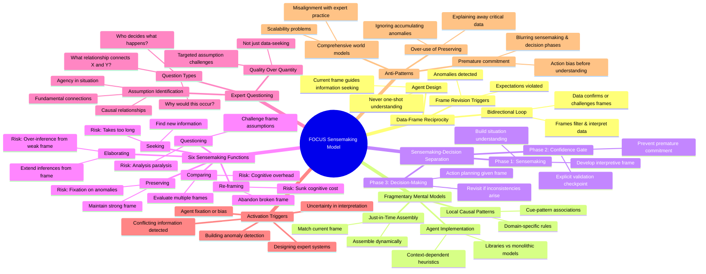

# FOCUS Sensemaking Model: Knowledge Architecture & Mental Models

```mermaid
mindmap
  root((FOCUS Sensemaking Model))
    Data-Frame Reciprocity
      Bidirectional Loop
        Frames filter & interpret data
        Data confirms or challenges frames
      Frame Revision Triggers
        Anomalies detected
        Expectations violated
      Agent Design
        Never one-shot understanding
        Current frame guides information seeking
    Fragmentary Mental Models
      Local Causal Patterns
        Domain-specific rules
        Cue-pattern associations
      Just-in-Time Assembly
        Assemble dynamically
        Match current frame
      Agent Implementation
        Libraries vs monolithic models
        Context-dependent heuristics
    Sensemaking-Decision Separation
      Phase 1: Sensemaking
        Build situation understanding
        Develop interpretive frame
      Phase 2: Confidence Gate
        Explicit validation checkpoint
        Prevent premature commitment
      Phase 3: Decision-Making
        Action planning given frame
        Revisit if inconsistencies arise
    Six Sensemaking Functions
      Elaborating
        Extend inferences from frame
        Risk: Over-inference from weak frame
      Questioning
        Challenge frame assumptions
        Risk: Analysis paralysis
      Preserving
        Maintain strong frame
        Risk: Fixation on anomalies
      Comparing
        Evaluate multiple frames
        Risk: Cognitive overhead
      Seeking
        Find new information
        Risk: Takes too long
      Re-framing
        Abandon broken frame
        Risk: Sunk cognitive cost
    Expert Questioning
      Assumption Identification
        Agency in situation
        Causal relationships
        Fundamental connections
      Question Types
        Who decides what happens?
        Why would this occur?
        What relationship connects X and Y?
      Quality Over Quantity
        Targeted assumption challenges
        Not just data-seeking
    Activation Triggers
      Conflicting information detected
      Agent fixation or bias
      Uncertainty in interpretation
      Designing expert systems
      Building anomaly detection
    Anti-Patterns
      Over-use of Preserving
        Explaining away critical data
        Ignoring accumulating anomalies
      Premature commitment
        Blurring sensemaking & decision phases
        Action bias before understanding
      Comprehensive world models
        Scalability problems
        Misalignment with expert practice
```
