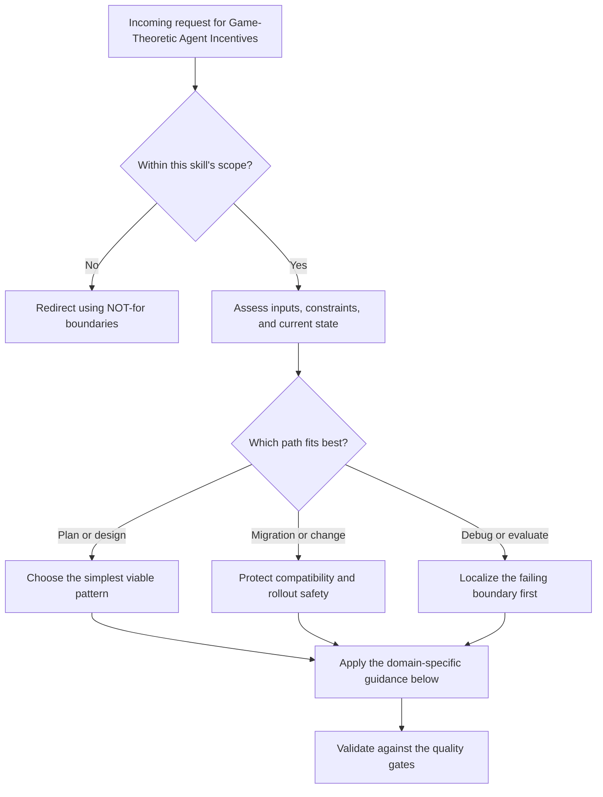

# Game-Theoretic Agent Incentives

Advisory claims only work when deviation is more expensive than compliance. This skill gives you the formal machinery to prove it, detect when it breaks, and fix the protocol.

## Decision Points



Use this as the first-pass routing model:

- Confirm the request belongs in this skill before doing deeper work.
- Separate planning, migration, and debugging paths before choosing a solution.
- Prefer the simplest correct path that still survives the quality gates.


## When to Use

- Proving that truthful file claim signaling is incentive-compatible
- Analyzing whether cooperation survives in repeated agent interactions
- Designing daemon-mediated coordination as a correlated equilibrium
- Bounding efficiency loss when claims are advisory (not enforced)
- Auditing whether a protocol's punishment mechanism actually deters deviation
- Determining if an agent population will converge to truthful reporting

## NOT for

- Evolutionary game theory in biology or population dynamics.
- Poker strategy, card-game exploitation, or sports analytics.
- General microeconomics, marketplace pricing, or equilibrium analysis outside agent coordination protocols.

## Primary Decision Tree: Classifying the Game

```
START: You have agents making strategic decisions about claims/coordination
|
+-- Is this a ONE-SHOT interaction or REPEATED?
|   |
|   +-- ONE-SHOT (agents meet once, no history)
|   |   |
|   |   +-- Is there a binding enforcement mechanism?
|   |   |   +-- YES -> Standard mechanism design (not this skill)
|   |   |   +-- NO  -> Advisory claims are CHEAP TALK in one-shot games
|   |   |         |
|   |   |         +-- Can the daemon add a correlation signal?
|   |   |             +-- YES -> Go to CORRELATED EQUILIBRIUM tree
|   |   |             +-- NO  -> Advisory claims have NO credibility
|   |   |                        WARN: One-shot + no enforcement + no
|   |   |                        correlation = claims are meaningless
|   |   |
|   +-- REPEATED (agents interact over multiple rounds)
|       |
|       +-- Is the history OBSERVABLE?
|       |   +-- YES (immutable note trail, audit log)
|       |   |   +-- Is the shadow of the future LONG?
|       |   |   |   +-- YES -> Go to FOLK THEOREM tree
|       |   |   |   +-- NO  -> Cooperation unravels via backward induction
|       |   |   |             WARN: Short horizon = agents defect on last round,
|       |   |   |             then second-to-last, etc.
|       |   |   |
|       |   +-- NO (history private or forgettable)
|       |       +-- Reputation cannot form
|       |       +-- Treat as repeated one-shot
|       |       +-- WARN: Without observable history, repeated game
|       |               collapses to one-shot incentives
|       |
+-- Who benefits from deviation?
    |
    +-- AGENT deviates (lies about file claim to avoid conflict)
    |   +-- Go to CLAIM SIGNALING EQUILIBRIUM analysis
    |
    +-- PRINCIPAL deviates (misreports to monopolize resources)
    |   +-- Go to PRINCIPAL DEVIATION analysis
    |
    +-- COALITION deviates (multiple agents collude)
        +-- Go to COLLUSION RESISTANCE analysis
```

## Decision Tree: Folk Theorem Application

The folk theorem says: in infinitely repeated games with observable actions and sufficiently patient players, ANY individually rational payoff vector can be sustained as a Nash equilibrium.

```
START: You want to sustain cooperation in a repeated claim game
|
+-- Step 1: Define the STAGE GAME
|   +-- Players: Set of agents {A1, A2, ..., An}
|   +-- Actions: {Claim truthfully, Claim falsely, No claim}
|   +-- Payoffs: Cooperation payoff (c), Deviation payoff (d), Punishment payoff (p)
|   +-- Requirement: d > c > p (deviation tempting, punishment painful)
|
+-- Step 2: Check FOLK THEOREM CONDITIONS
|   |
|   +-- Observable actions?
|   |   +-- Immutable note trail? -> YES, actions are observable
|   |   +-- Agent heartbeats logged? -> YES, presence is observable
|   |   +-- File claims recorded with timestamps? -> YES
|   |   +-- No audit trail? -> FAIL: Folk theorem requires observability
|   |
|   +-- Discount factor delta close to 1? (agents value future interactions)
|   |   +-- Agent expected to run many sessions? -> delta ~ 0.9+, GOOD
|   |   +-- Agent is ephemeral (one task, gone)? -> delta ~ 0, BAD
|   |   +-- Agent's identity persists across projects? -> delta HIGH
|   |   +-- Agent identity is disposable (can re-register)? -> delta ~ 0, BAD
|   |       WARN: Sybil attacks destroy the shadow of the future
|   |
|   +-- Punishment credible?
|       +-- Other agents can detect deviation? -> Check note trail
|       +-- Other agents will actually punish? -> Need trigger strategy
|       +-- Punishment hurts punisher too? -> Check mutual punishment cost
|
+-- Step 3: Construct TRIGGER STRATEGY
|   +-- Grim trigger: Defect once, punished forever
|   |   +-- Pro: Maximum deterrence
|   |   +-- Con: No forgiveness, single error cascades
|   |   +-- Con: Punisher bears cost too (mutual destruction)
|   |
|   +-- Tit-for-tat: Mirror last observed action
|   |   +-- Pro: Forgiving, recovers from single defections
|   |   +-- Con: Can enter defection cycles from observation errors
|   |
|   +-- Graduated punishment: Escalate on repeated defection
|       +-- Pro: Proportional, robust to noise
|       +-- Con: Complex to implement, harder to reason about
|       +-- RECOMMENDED for advisory claim systems
|
+-- Step 4: Verify EQUILIBRIUM CONDITION
    +-- Deviation payoff NOW < Discounted future cooperation payoff
    +-- Formula: d - c < delta / (1 - delta) * (c - p)
    +-- If inequality holds: Cooperation is a Nash equilibrium
    +-- If not: Either increase punishment (lower p) or increase delta
```

## Decision Tree: Correlated Equilibrium (Daemon as Correlating Device)

A correlated equilibrium uses a trusted third party (the daemon) to send private recommendations to agents. Each agent's best response is to follow the recommendation, given that others follow theirs.

```
START: You want the daemon to coordinate agent behavior
|
+-- Step 1: Can the daemon OBSERVE the full game state?
|   +-- Active claims, agent identities, file conflict graph? -> YES
|   +-- Only partial state visible? -> Correlated equilibrium is approximate
|
+-- Step 2: Can the daemon send PRIVATE signals to agents?
|   +-- Per-agent recommendations via pub/sub? -> YES
|   +-- Only broadcast signals? -> Reduces to public correlation
|   |   (still useful but weaker)
|
+-- Step 3: Design the CORRELATION SCHEME
|   +-- Daemon computes: who should claim what, when
|   +-- Daemon sends recommendation to each agent privately
|   +-- Key property: No agent benefits from deviating from recommendation
|   |   given that all others follow theirs
|   |
|   +-- Example: Two agents want the same file
|       +-- Daemon flips weighted coin based on priority/history
|       +-- Sends "claim" to winner, "wait" to loser
|       +-- Both follow because: winner gets file; loser knows
|       |   fighting yields conflict penalty worse than waiting
|       +-- This is STRICTLY BETTER than Nash equilibrium
|           (avoids the inefficient "both claim" or "both wait" outcomes)
|
+-- Step 4: Verify OBEDIENCE CONSTRAINTS
    +-- For each agent, for each recommendation they might receive:
    +-- Expected payoff from following >= Expected payoff from any deviation
    +-- If violated: Adjust the correlation distribution or payoffs
```

## Decision Tree: Price of Anarchy Analysis

The price of anarchy (PoA) measures how much efficiency is lost because claims are advisory (agents choose freely) rather than enforced (daemon assigns optimally).

```
START: Measure efficiency loss from advisory claims
|
+-- Step 1: Compute OPTIMAL SOCIAL WELFARE
|   +-- If daemon could enforce assignments, what's the best total payoff?
|   +-- This is the centralized optimum (OPT)
|   +-- Usually: maximum parallel work, minimum conflict, minimum idle time
|
+-- Step 2: Compute WORST-CASE EQUILIBRIUM WELFARE
|   +-- Among all Nash equilibria of the advisory claim game,
|       which one has the LOWEST total payoff?
|   +-- This is the equilibrium floor (EQ_worst)
|   +-- Common bad equilibria:
|       +-- All agents claim the same popular file
|       +-- No agent claims risky files (bystander effect)
|       +-- Agents hoard claims defensively
|
+-- Step 3: PoA = OPT / EQ_worst
|   +-- PoA = 1.0 -> Advisory claims lose NOTHING vs enforcement
|   +-- PoA = 2.0 -> Advisory claims lose HALF the efficiency
|   +-- PoA = N   -> Advisory claims lose almost everything
|       (N agents all competing for same resource)
|
+-- Step 4: REDUCE the Price of Anarchy
    +-- Add information (publish who claimed what) -> Reduces PoA
    +-- Add correlation (daemon recommends) -> Can achieve PoA ~ 1
    +-- Add mild penalties (reputation cost for conflict) -> Reduces PoA
    +-- Add commitment (time-limited claim locks) -> Reduces PoA
    +-- NEVER go straight to full enforcement
        (it kills agent autonomy and creates brittle single points of failure)
```

## Worked Example: Truthful File Claim Signaling as Nash Equilibrium

### Setup

Port Daddy uses advisory file claims. When agent A claims `src/auth.ts`, other agents see the claim but nothing stops them from editing the file anyway. We want to prove that truthful claiming is a Nash equilibrium in the repeated game.

### Step 1: Define the Stage Game

**Players:** Two agents, A and B, working on the same project.

**Actions for each agent on each file:**
- T (Truthful): Claim files you intend to edit, do not claim files you will not edit
- F (False): Claim files you do not intend to edit (to block others) or fail to claim files you do edit (to avoid scrutiny)

**Stage game payoff matrix (per round):**

```
                    Agent B
                 T           F
Agent A   T    (3, 3)      (1, 4)
          F    (4, 1)      (0, 0)
```

- (T, T) = 3 each: Both claim truthfully, no conflicts, efficient parallel work
- (T, F) = (1, 4): Truthful agent suffers (wasted coordination, surprise conflicts); deviator gains (monopolized files, avoided scrutiny)
- (F, F) = 0 each: Both lie, claims are meaningless noise, constant merge conflicts

This is a Prisoner's Dilemma. In the one-shot game, F strictly dominates T. Truthful signaling is NOT a one-shot Nash equilibrium.

### Step 2: Move to the Repeated Game

Agents interact over many sessions. Port Daddy provides:
- **Immutable note trail**: Every claim, every edit, every heartbeat is logged
- **Observable history**: Any agent can query `pd notes` to see full audit trail
- **Persistent identity**: Agent IDs survive across sessions (no free re-registration)

The discount factor delta represents how much agents value future interactions. For long-lived agents: delta = 0.9.

### Step 3: Construct the Strategy Profile

**Strategy (Graduated Trigger):**
1. Start by playing T (truthful claims)
2. If opponent played T last round, play T
3. If opponent played F last round, play F for the next 3 rounds (punishment phase), then return to T
4. If opponent deviates during punishment phase, restart the 3-round punishment

### Step 4: Deviation Analysis

**Can Agent A profit by deviating (playing F when the strategy says T)?**

Immediate gain from deviation: 4 - 3 = 1 (one extra unit this round)

Cost of punishment: 3 rounds of (F, F) = 0 payoff each, versus (T, T) = 3 each.
Lost payoff during punishment: 3 rounds * 3 per round = 9

Discounted cost: 9 * delta^1 (starts next round) = 9 * 0.9 = 8.1

**Net payoff from deviation: 1 - 8.1 = -7.1**

Deviation is strictly unprofitable. Truthful signaling is sustained as a Nash equilibrium.

### Step 5: Why Observable History Is Critical

Remove the immutable note trail. Now deviation is undetectable. Agent A can play F, and B cannot observe it to trigger punishment. The game collapses to repeated one-shot: both play F every round.

**This is why Port Daddy's immutable notes are load-bearing for incentive compatibility.** They are not a convenience feature. They are the observability infrastructure that makes the folk theorem applicable.

### Step 6: Why Persistent Identity Is Critical

Allow agents to re-register with new IDs (Sybil attack). Now an agent can deviate, abandon its identity before punishment, and re-enter as a "new" agent with a clean slate. The discount factor effectively becomes 0 because the future reputation cost is zero.

**Countermeasure:** Make identity creation costly (registration bond, human approval, rate limiting) or tie identity to something hard to forge (worktree path, SSH key).

### Equilibrium Proof Summary

| Component | Value |
|-----------|-------|
| Strategy profile | Graduated trigger: cooperate, punish for 3 rounds on observed defection |
| Deviation analysis | Gain = 1, Cost = 8.1 (discounted), Net = -7.1 |
| Conditions | Observable history (immutable notes), persistent identity (no Sybil), delta >= 0.53 |
| Result | Truthful claim signaling is a Nash equilibrium for delta >= 0.53 |

The critical delta threshold: d - c < (delta / (1 - delta)) * (c - p), which gives 1 < (delta / (1 - delta)) * 3, so delta > 1/4 = 0.25 under grim trigger, or delta > 0.53 under 3-round graduated punishment. Any agent expecting more than ~2 future interactions will cooperate.

## Failure Modes

### Failure Mode 1: Identity Sybil Attack

**What happens:** An agent deviates (false claims, file conflicts), then re-registers under a new identity before punishment can take effect. Reputation cost is zero. The folk theorem breaks because the shadow of the future is destroyed.

**Detection:**
- Spike in new agent registrations correlated with salvage events
- Short-lived agent IDs that never accumulate history
- Same worktree path appearing under multiple agent IDs

**Fix:**
- Registration cost: require a bond or approval for new identities
- Identity anchoring: tie agent ID to something persistent (worktree path, SSH key, hardware token)
- Cool-down periods: new agents get lower priority in claim conflicts
- History migration: allow re-registration but carry forward reputation score

### Failure Mode 2: Punishment Cascade (Grim Trigger Doom Loop)

**What happens:** Agent A experiences a transient failure (network issue, OOM kill) that looks like defection. Agent B triggers grim punishment. Agent A, now being punished for something it did not do, has no incentive to cooperate. Both agents defect forever. One accidental defection destroys all cooperation.

**Detection:**
- Sudden transition from mutual cooperation to mutual defection
- Agent A's "defection" correlates with infrastructure events (heartbeat timeout, daemon restart)
- No recovery to cooperation even after extended time

**Fix:**
- Use graduated punishment, not grim trigger (forgive after N rounds)
- Distinguish crash from defection: crashed agents enter salvage queue (involuntary), defectors have active sessions with conflicting claims (voluntary)
- Allow "cheap talk" apology: agent can post a note explaining the deviation. While cheap talk is not credible in one-shot games, in repeated games with reputation, false apologies are detectable over time
- Build noise tolerance into trigger strategy: require K defections in N rounds before punishing

### Failure Mode 3: Collusion (Coalition Deviation)

**What happens:** Two or more agents coordinate to monopolize files. Agent A claims files it will not use, blocking others. Agent B (A's collaborator) gets exclusive access to remaining files. They split the benefit. Individual deviation analysis misses this because no single agent is deviating.

**Detection:**
- Agent pairs that always claim complementary (non-overlapping) file sets
- One agent consistently claims files it never modifies
- Correlated timing: claims from colluding agents arrive in suspiciously tight windows

**Fix:**
- Monitor claim-to-edit ratio: agents that claim but do not edit are flagged
- Implement claim expiration: unused claims auto-release after a timeout
- Cross-reference claim patterns: statistical anomaly detection on claim co-occurrence
- Daemon as correlating device: if the daemon assigns claim priority randomly, collusion cannot guarantee monopolization

### Failure Mode 4: Race to the Bottom (Price of Anarchy Blow-Up)

**What happens:** When many agents compete for few high-value files, the equilibrium degrades. All agents rush to claim popular files. Nobody claims unglamorous but necessary files (tests, docs, configs). The social welfare of the advisory claim system approaches zero even though each agent is individually rational.

**Detection:**
- High claim collision rate on a small subset of files
- Large number of unclaimed files that need work
- Increasing merge conflict rate despite claim system being in place

**Fix:**
- Daemon recommendation: use correlated equilibrium to distribute agents across files
- Priority scoring: agents with domain expertise on a file get higher claim priority
- Bundling: claim a "task" (set of related files) rather than individual files, making cherry-picking harder
- Publish efficiency metrics: show agents the global claim distribution so they self-correct

## Worked Examples

- Minimal case: apply the simplest in-scope path to a small, low-risk request.
- Migration case: preserve compatibility while changing one constraint at a time.
- Failure-recovery case: show how to detect the wrong path and recover before final output.


## Quality Gates

### Gate: Equilibrium Proof

An equilibrium proof is complete ONLY when it specifies ALL of:

1. **Strategy profile**: The exact strategy for every player (not just "cooperate"). Must specify: initial action, response to each observable history, punishment duration, forgiveness conditions.

2. **Deviation analysis**: For EACH player, show that NO unilateral deviation is profitable. This means checking every alternative strategy, not just "what if they defect once." At minimum, check: one-shot deviation, permanent deviation, delayed deviation.

3. **Conditions**: The exact parameter ranges under which the equilibrium holds. At minimum: discount factor threshold, observability requirements, identity persistence requirements. State what breaks when each condition is violated.

If any of these three components is missing, the proof is incomplete. Do not present it as a result.

### Gate: Price of Anarchy Bound

A PoA analysis is complete ONLY when it includes:

1. **Optimal welfare computation**: What is the best possible total payoff under centralized assignment?
2. **Equilibrium identification**: Which equilibria exist? Which is worst?
3. **Bound**: The ratio OPT / EQ_worst, with the exact game parameters that determine it.
4. **Tightness**: Is the bound tight (achieved by some game instance) or loose?

### Gate: Correlated Equilibrium Design

A correlated equilibrium is valid ONLY when:

1. **Correlation device specified**: What signal does the daemon send, to whom, drawn from what distribution?
2. **Obedience constraints verified**: For each agent and each possible signal, following the signal is at least as good as any deviation.
3. **Welfare improvement shown**: The correlated equilibrium Pareto-dominates or welfare-dominates at least one Nash equilibrium.

## Anti-Patterns

### Anti-Pattern: "Just Add Enforcement"

**Symptom:** When advisory claims fail, the instinct is to make them mandatory (lock files, block edits, reject conflicting claims).

**Why it is wrong:** Full enforcement eliminates agent autonomy, creates deadlocks when an agent crashes while holding a lock, and makes the system brittle. The price of anarchy may be 1.0 but the price of fragility is unbounded. A crashed agent holding an enforced lock blocks the entire team. An advisory claim from a crashed agent is simply ignored.

**Instead:** Use reputation, graduated punishment, and correlated equilibria to make advisory claims credible without making them mandatory. Accept a small PoA in exchange for resilience.

### Anti-Pattern: "One-Shot Reasoning for Repeated Games"

**Symptom:** Analyzing a repeated interaction as if it were one-shot. Concluding "agents will always defect" because defection dominates in the stage game.

**Why it is wrong:** The folk theorem guarantees that cooperation can be sustained in repeated games with observable history and patient agents. One-shot analysis is correct only when delta is near 0 (agents are ephemeral) or history is unobservable.

**Instead:** Always check: is this repeated? Is history observable? Is delta high? If all three are yes, cooperation is achievable. Design the trigger strategy.

### Anti-Pattern: "Trusting Cheap Talk"

**Symptom:** Treating agent claims as credible without any verification mechanism. "Agent A said it would only edit `README.md`, so we planned around that."

**Why it is wrong:** In a one-shot game, claims are cheap talk: costless to make, costless to break. They carry zero information about true intent. Even in repeated games, claims are only credible if false claims are detectable and punished.

**Instead:** Claims become credible ONLY when backed by: observable history (deviation is detectable), reputation (deviation has future cost), or correlation (the daemon verifies compliance). Design the backing mechanism before trusting the claim.

### Anti-Pattern: "Symmetric Analysis of Asymmetric Games"

**Symptom:** Analyzing all agents as identical when they have different roles, capabilities, or stakes. Using a single payoff matrix for a game where principals and agents face fundamentally different incentives.

**Why it is wrong:** A principal who delegates work has different deviation incentives than the agent doing the work. The principal might overstate urgency to get priority; the agent might understate difficulty to win the assignment. Symmetric analysis misses both.

**Instead:** Model each role's payoff function separately. Check deviation incentives for each role independently. The equilibrium must be robust to deviation by any player type, not just a generic "player."

### Anti-Pattern: "Infinite Punishment for Finite Deviation"

**Symptom:** Using grim trigger (permanent punishment) for minor infractions. A single false claim results in permanent exclusion from the coordination system.

**Why it is wrong:** Disproportionate punishment makes the system fragile to noise (false positives), discourages participation (risk of accidental exclusion is too high), and wastes resources (permanently excluding a productive agent over one mistake).

**Instead:** Use graduated punishment proportional to the deviation severity. Reserve permanent exclusion for repeated, deliberate sabotage. Allow agents to rebuild reputation after serving a punishment period.

## Reference: Key Theorems (Informal Statements)

**Nash Existence Theorem:** Every finite game has at least one Nash equilibrium (possibly in mixed strategies). You never need to worry about whether an equilibrium exists; the question is which one, and whether it is efficient.

**Folk Theorem (Repeated Games):** In an infinitely repeated game with observable actions and discount factor delta sufficiently close to 1, any feasible payoff vector that gives each player more than their minimax value can be sustained as a Nash equilibrium. Translation: if agents are patient and can see what others do, almost any reasonable outcome can be made stable.

**Correlated Equilibrium Existence:** For any Nash equilibrium, there exists a correlated equilibrium that is at least as good for all players. The daemon-as-correlator can never make things worse and usually makes them better.

**Price of Anarchy Bound (Routing Games):** In congestion games (which model file claim competition), the price of anarchy is at most 5/2 for linear latency functions. This gives a concrete upper bound on how bad advisory claims can get in common settings.
