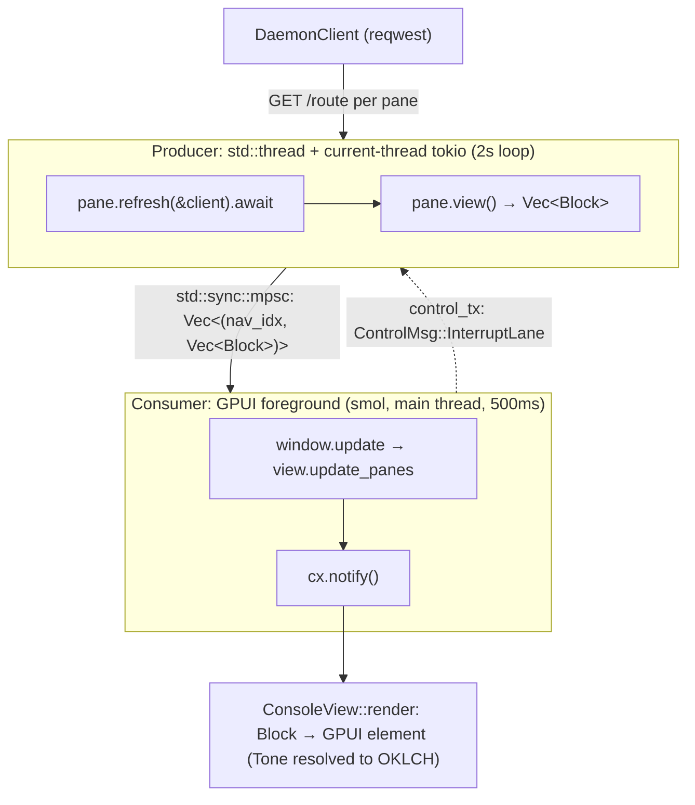

# gpui-rust-console

Authoritative skill for `core/pd-console` (crate `pd-console` v0.2.0, ADR-0046): a
GPU-native standalone macOS operator console built on GPUI 0.2.2, plus a headless ratatui
REPL that renders the *same* panes. The defining idea: **a pane emits render-agnostic
`Block`s; two renderers paint them.** One pane, two faces — which is why every pane is
unit-tested on cheap Linux runners while the Metal window builds only on macOS.

## When to Use

✅ **Use for**:
- Adding or extending a pane/surface in `core/pd-console/`
- GPUI layout (Taffy flexbox), scroll (`uniform_list`/`list`), focus, keyboard nav
- The OKLCH theme (`theme.rs`) and ICS maritime flag badges (`maritime.rs`)
- Debugging the reqwest↔smol two-thread refresh pipeline or `cx.notify()` storms
- Designing text input where GPUI ships no widget (the `pd tube` cockpit)
- Getting the feature-gated `cargo`/CI gate right

❌ **NOT for**:
- The TypeScript daemon, routes, or `agent.rs` HTTP wiring beyond consuming it
- Generic Rust (borrow checker, async, FFI, testing idioms) → `rust-with-claude-code`
- A non-pd GPUI app — the theme, the 17-pane model, and the daemon contract are specific
- Generic macOS app packaging / notarization → `rust-app-distribution`

## The Model in One Diagram



reqwest needs tokio; GPUI runs smol; they **cannot** share an executor. The producer owns
the daemon + all 17 panes and `mpsc`s `Block`s to the consumer; control flows back on a
second channel. Use channels, never `Arc<Mutex<State>>` (it blocks the renderer — the #1
GPUI perf bug). Full detail: `references/console-architecture.md`.

## Task Branches

| Branch | Do | Load |
|--------|----|------|
| `add-pane` | New surface end to end | `examples/add-a-pane.md`, `templates/new_pane.rs.tmpl`, `templates/pane_tests.rs.tmpl` |
| `layout` | Taffy flexbox, three-panel skeleton | `references/render-and-layout.md` |
| `scroll` | `uniform_list` vs `list`, bounded parents | `references/render-and-layout.md` |
| `theme` | Add/preview an OKLCH tone | `references/maritime-flags.md`, `examples/preview-theme.md`, `scripts/oklch_to_srgb.py` |
| `maritime` | ICS flag mapping / badge | `references/maritime-flags.md`, `scripts/flag_resolve.py` |
| `text-input` | Cockpit chat / command entry | `references/text-input.md` |
| `verify` | Run the real CI gate locally | `references/build-and-ci.md`, `scripts/verify_console.py` |

## The Contracts You Must Not Break

- **Panes are render-agnostic.** Emit `Block`s with a `Tone` (meaning), never a color. The
  renderer resolves `Tone → theme OKLCH → rgb(u32)` in one place (`pane.rs::Tone::color`).
- **`trait Pane` is object-safe** (`Box<dyn Pane>` registry). `refresh` is a hand-rolled
  boxed future (no `#[async_trait]`); `mutate`/`subscription`/`on_stream` have defaults so
  read-only panes need zero changes. `SurfaceAction` is an enum, never a generic.
- **`view()` is sync and IO-free.** All fetching is in `refresh()` on the producer thread.
  A failed fetch is recorded in `last_error` and rendered as an error state — never
  propagated (one bad route must not blank the console).
- **`cx.notify()` only on real state change.** Never mutate `self` inside `render`.

## Anti-Patterns

### Sharing state with `Arc<Mutex<T>>` across the two threads
**Novice**: "Wrap the pane state in `Arc<Mutex>` so both threads can touch it."
**Expert**: The producer *owns* the panes; it `mpsc`s `Vec<Block>` snapshots to the
consumer. A mutex under refresh contention stalls the GPUI render loop — visible jank.
**Detection**: any `Mutex` / `RwLock` reachable from a pane; reqwest called off the
producer thread.

### Hardcoding a hex in a pane
**Novice**: `div().bg(rgb(0xe3b56d))` inside a pane's view.
**Expert**: Emit `Block::Chip { tone: Tone::Accent }`. The amber lives once in
`theme.rs` (`DARK.accent`, which `oklch_to_srgb.py` confirms is `e3b56d`). Color resolves
at paint time so retheme/light-mode is free; an inline hex also trips the brand-color guard.
**Detection**: `rgb(0x…)` literals in `*_pane.rs`.

### `RUST_MIN_STACK` for the "gpui stack overflow"
**Novice**: "GPUI macros overflow the stack — set `RUST_MIN_STACK=16777216`."
**Expert**: The error is a **compile-time recursion limit**, fixed by
`#![recursion_limit = "512"]` at the top of `main.rs`. `RUST_MIN_STACK` resizes a *runtime*
thread stack and does nothing for a compile error. CI sets neither — it runs plain
`cargo check` + `cargo test` with gpui feature-gated off on Linux.
**Timeline**: this corrected an earlier draft of this very skill; see `references/build-and-ci.md`.

### Expecting a built-in text input
**Novice**: "Use GPUI's text field for the cockpit."
**Expert**: GPUI 0.2.x ships **no** text-input widget. Use the full-screen entry overlay
pattern (state on the view, not the busy stream pane) or build an `Element` (~300 LOC).
**Detection**: searching the API for `text_input()`; cursor state bolted onto the Lane pane.

## Quality Gates

```
□ Pane emits Block+Tone only — zero rgb(0x…) in the pane
□ view() is sync and IO-free; refresh() records errors, never propagates
□ trait stays object-safe (boxed future; enum actions; no generics on dyn methods)
□ New pane proves 3 states (empty/error/populated) — templates/pane_tests.rs.tmpl
□ NAV index (app.rs) == producer slot index (main.rs)
□ Theme change is OKLCH in theme.rs, never inline hex; previewed via oklch_to_srgb.py
□ Maritime change keeps flag_resolve.py --selftest green (HITL→Foxtrot, mayday→Juliett)
□ python3 scripts/verify_console.py run --crate core/pd-console  → cargo check + test ok
□ python3 scripts/validate_skill.py  → 0 errors
□ No retired cinnabar hex / no daemon-URL literal outside agent.rs
```

## Reference Files

| File | Consult When |
|------|--------------|
| `references/console-architecture.md` | Two-thread pipeline, Block/Pane(Surface) contract, registry, FsAssets, window bootstrap |
| `references/render-and-layout.md` | Render vs RenderOnce, Taffy flexbox, `uniform_list`/`list`, focus, keyboard, notify discipline, perf anti-patterns |
| `references/maritime-flags.md` | ICS flag mapping + badge colors, the OKLCH theme and `to_srgb8()`, Tone→color resolution |
| `references/build-and-ci.md` | The feature-gate, the real `cargo`/CI jobs, `recursion_limit` vs `RUST_MIN_STACK`, brand/URL guards |
| `references/text-input.md` | GPUI has no input widget — defer / overlay / build-an-Element decision tree |

## Scripts

| Script | Purpose |
|--------|---------|
| `scripts/_envelope.py` | Shared stdin/stdout script-io envelope (imported by the others) |
| `scripts/oklch_to_srgb.py` | Faithful port of `theme.rs::to_srgb8`; preview an OKLCH token's hex (`oklch.to_srgb`) |
| `scripts/flag_resolve.py` | Faithful port of `maritime.rs`; resolve agent-state → ICS flag + meanings (`flag.resolve`) |
| `scripts/verify_console.py` | Run the real CI gate locally: `cargo check`+`test` (+`--features gpui` on macOS) |
| `scripts/validate_skill.py` | Skill self-check: frontmatter, refs, schema, no phantom citations, script selftests |

## Schemas

| File | Used By |
|------|---------|
| `schemas/script-io.schema.json` | The Request/Response envelope every script wraps stdin/stdout against |

## Templates

| Template | Output |
|----------|--------|
| `templates/new_pane.rs.tmpl` | A read-only `Pane` skeleton (error/empty/populated states, boxed-future refresh) |
| `templates/pane_tests.rs.tmpl` | The three-state pane test suite (sync, no tokio, Linux-CI-safe) |

## Examples

| Example | Walks Through |
|---------|---------------|
| `examples/add-a-pane.md` | Adding a "Voyages" pane end to end with real `main.rs`/`app.rs` cites |
| `examples/preview-theme.md` | Designing a new OKLCH status tone and seeing its hex before touching Rust |

<!-- BEGIN BUNDLE INDEX (auto: index_references.py) -->

## Skill Bundle Index

*Every file in this skill, and when to open it. Auto-generated; run `scripts/index_references.py --fix`.*

**root**
- [`.gitignore`](.gitignore)

**`examples/`**
- [`examples/add-a-pane.md`](examples/add-a-pane.md) — Example: Add a new pane to pd-console end to end — Goal: add a "Voyages" pane that lists active voyages from `GET /voyages`, slotted after Lane, fully unit-tested, no gpui needed for the test
- [`examples/preview-theme.md`](examples/preview-theme.md) — Example: Preview a new OKLCH status tone without compiling Rust — Goal: you want to add a `Stalled` status tone (a desaturated amber, distinct from the warning amber) and see its hex before wiring it into `

**`references/`**
- [`references/build-and-ci.md`](references/build-and-ci.md) — Building pd-console & the Real CI Gate — > Source of truth: `core/pd-console/Cargo.toml` and the `rust-console` / > `rust-console-gpui` jobs in `.github/workflows/ci.yml`.
- [`references/console-architecture.md`](references/console-architecture.md) — pd-console Architecture — The Unified Model — > Source of truth: `core/pd-console/src/` (crate `pd-console` v0.2.0, ADR-0046).
- [`references/maritime-flags.md`](references/maritime-flags.md) — ICS Maritime Flags & the OKLCH Theme — > Source: `core/pd-console/src/maritime.rs` and `core/pd-console/src/theme.rs`.
- [`references/render-and-layout.md`](references/render-and-layout.md) — GPUI 0.2.x Rendering & Layout — the idioms that compile — > GPUI 0.2.2 (`Cargo.toml`: `gpui = { version = "0.2.2", optional = true }`).
- [`references/text-input.md`](references/text-input.md) — Text Input in GPUI 0.2.x — There Is No Widget — > The single most surprising gap for anyone coming from web/Qt/SwiftUI: **GPUI 0.2.x ships > no text-input widget.** Zed builds its own.

**`schemas/`**
- [`schemas/script-io.schema.json`](schemas/script-io.schema.json) — script io.schema (data/schema)

**`scripts/`**
- [`scripts/_envelope.py`](scripts/_envelope.py) — Shared script-io envelope helpers for the gpui-rust-console skill.
- [`scripts/flag_resolve.py`](scripts/flag_resolve.py) — Resolve a canonical agent-state string to its ICS maritime flag, meanings, and
- [`scripts/oklch_to_srgb.py`](scripts/oklch_to_srgb.py) — Convert OKLCH theme tokens to packed 0xRRGGBB sRGB — a faithful Python port of
- [`scripts/validate_skill.py`](scripts/validate_skill.py) — Self-check the gpui-rust-console skill: frontmatter, required references,
- [`scripts/verify_console.py`](scripts/verify_console.py) — Run the real pd-console CI gate locally and report it as a script-io envelope.

**`templates/`**
- [`templates/new_pane.rs.tmpl`](templates/new_pane.rs.tmpl)
- [`templates/pane_tests.rs.tmpl`](templates/pane_tests.rs.tmpl)

<!-- END BUNDLE INDEX -->
