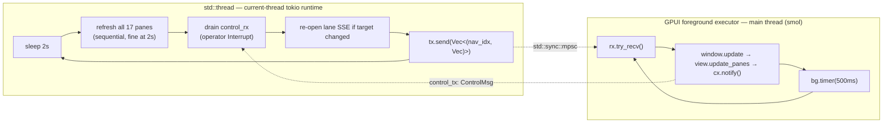

# pd-console Architecture — The Unified Model

> Source of truth: `core/pd-console/src/` (crate `pd-console` v0.2.0, ADR-0046). Cite
> these files when reasoning; do not invent shapes.

## The one idea: a pane emits render-agnostic `Block`s; two renderers paint them

The console is **render-agnostic by contract**. A pane never touches GPUI. It emits a
`Vec<Block>`; the GPUI shell (`pd-console`) and the ratatui REPL (`pd-console-repl`)
each paint the same blocks in the locked theme. "One pane, two faces." This is why
the CI Linux gate can unit-test every pane without ever compiling Metal/gpui — the
gpui dependency is feature-gated (see `build-and-ci.md`).

`core/pd-console/src/pane.rs`:

```rust
pub enum Block {
    Header(String),
    KeyVal(String, String),
    Row(Vec<String>),
    Chip { label: String, tone: Tone },
    Spark(Vec<f32>),
    Gap,
}
```

`Tone` is **meaning, not color** (`pane.rs::Tone`: `Default | Accent | Engaged | Gated
| Resting | Landed | Conflicted`). The renderer resolves a tone to an OKLCH value via
`Tone::color(&Theme)`. A pane that hardcodes a hex has committed the cardinal sin —
color is resolved at paint time, in one place, so light/dark and theme swaps are free.

## The Pane trait is a *Surface* (object-safe, additive evolution)

`pane.rs` defines `trait Pane: Send` and re-exports it as `Surface`. It is **object-safe**
on purpose — the registry holds `Vec<Box<dyn Pane>>`. That single constraint dictates
every signature:

- `refresh<'a>(&'a mut self, daemon: &'a DaemonClient) -> Pin<Box<dyn Future<...> + Send + 'a>>`
  — a hand-rolled boxed future, **not** `#[async_trait]`. async-trait would still work,
  but the boxed-future form keeps the trait object-safe with zero proc-macro and zero
  extra crate. This is the load-bearing idiom; see `rust-with-claude-code/references/ffi-and-async.md`.
- `mutate(...)` and `subscription()` and `on_stream(...)` all have **no-op / `None`
  defaults**, so the 14 read-only panes needed zero changes when the contract grew the
  "grab the wheel" axis (operator mutations) and the live-subscription axis. Evolving a
  trait additively via defaulted methods is how you avoid a 16-file churn.

`SurfaceAction` is an **enum**, not a generic `mutate<T>`, precisely to preserve object
safety. A generic method cannot live on a `dyn` trait. When you add an operator action,
add a variant — never a type parameter.

```rust
pub enum SurfaceAction { Interrupt { reason: Option<String> } }
pub enum Subscription  { Agent { agent_id: String } }
```

## The two-thread refresh pipeline (the reason this app doesn't deadlock)

`core/pd-console/src/main.rs`. reqwest needs tokio; GPUI runs on smol. **They cannot
share an executor.** The fix is a strict producer/consumer split across an `mpsc`:



Key invariants, each visible in `main.rs`:

1. **Producer owns the daemon client and all 17 pane structs.** Slots are numbered 0–16
   (Fleet…Lane), and the `Vec<(usize, Vec<Block>)>` carries the nav index so the consumer
   updates the right slot. Never move a pane to the foreground thread.
2. **`tx.send(...).is_err()` is the shutdown signal** — when the window closes, the
   receiver drops, send fails, the producer `break`s its loop and the runtime winds down.
   No explicit join, no shutdown channel.
3. **Control flows the other way** via a *second* `mpsc` (`control_tx`/`control_rx`). The
   UI's Interrupt button sends `ControlMsg::InterruptLane`; the producer drains it and
   calls `lane.mutate(&client, SurfaceAction::Interrupt {..})`. The daemon echoes the
   control message back on the agent's SSE stream — the loop is *closed*, the operator
   sees their own stop land.
4. **The Lane is the only live (SSE) surface.** It declares `subscription()`; `main.rs`
   owns opening `client.subscribe_agent(id)` and re-opens it only when the watched agent
   changes (`reopen = cur != agent_id`). Envelopes are drained each loop into `on_stream`.

A novice reaches for `Arc<Mutex<State>>` shared between threads. That **blocks the
renderer** under contention and is the #1 GPUI performance bug. The channel pattern is
not a style preference — it is the supported concurrency model.

## Window + focus bootstrap (so keyboard nav works without a click)

`main.rs` opens the window with `FsAssets` as the `AssetSource`, a transparent titlebar
with macOS traffic-light positioning, then **focuses the view's `FocusHandle` immediately**
so the 1–9 / s/m/p/h/c/d nav keys work before any click grabs focus. The `--pane <id>`
CLI arg opens directly on a pane so screenshot tooling can capture each surface without
synthesizing keystrokes (which would need Accessibility permission). These are real
operational decisions, not decoration — preserve them.

## FsAssets: how SVGs load

`AssetSource` is resolved relative to `assets/` next to the crate root, located via
`env!("CARGO_MANIFEST_DIR")` at compile time. `load()` returns `Ok(None)` for
`NotFound` (a *missing* asset is not an error — GPUI treats `None` as "no asset") and
`Err` only for real IO faults. Get this wrong and a missing icon panics the window.

## Map of the crate

| File | Role |
|------|------|
| `main.rs` | Entry; `FsAssets`; window; the two-thread pipeline; control channel |
| `app.rs` | `ConsoleView` (`Render`); NAV table; palette constants; block→element painter |
| `pane.rs` | `Block`, `Tone`, `SurfaceAction`, `Subscription`, `trait Pane`/`Surface`, `PaneRegistry` |
| `agent.rs` | `DaemonClient` (reqwest); `discover()`; `subscribe_agent()` SSE; `StreamEnvelope` |
| `theme.rs` | `Oklch`, `Theme`, `DARK`; `to_srgb8()` (see `maritime-flags.md` + `preview-theme.md`) |
| `maritime.rs` | ICS `Flag` enum, `flag_for_state`, `FlagBadge` (see `maritime-flags.md`) |
| `*_pane.rs` (17) | One surface each: fleet, cockpit, sorties, claims, peek, roadmap, adrs, activity, sessions, inbox, suggest, notes(memory), prs, health, coast-guard, dispatch, lane |
| `bin/repl.rs` | The headless ratatui renderer — the Linux CI gate |
