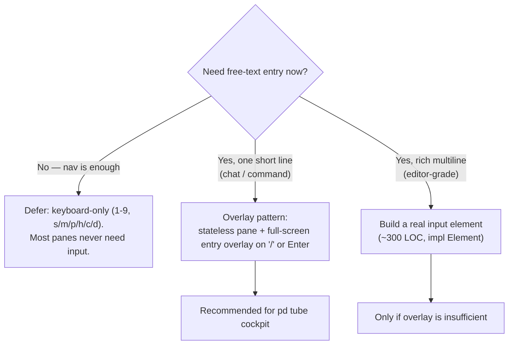

# Text Input in GPUI 0.2.x — There Is No Widget

> The single most surprising gap for anyone coming from web/Qt/SwiftUI: **GPUI 0.2.x ships
> no text-input widget.** Zed builds its own. You must too. This page is the decision tree
> and the cheapest correct path for pd-console (the `pd tube` cockpit chat input).

## Why there's no `text_input()`

GPUI gives you `div()`, text *rendering*, `KeyDownEvent`, `MouseDownEvent`, and
`TextLayout` for glyph measurement — the *primitives*. A text field is cursor state +
selection model + IME + clipboard + hit-testing, which Zed implements as a bespoke element.
There is no batteries-included field to drop in. Accept this before you design the cockpit.

## Decision tree



## Option 1 — Defer (most panes)

The 17 console panes are read-only surfaces or operator-action surfaces driven by single
keys. None of them needs typed text. For v1, **keyboard-only nav with no text input is a
legitimate, shipped design** — don't build an input you won't use.

## Option 2 — The overlay pattern (the cockpit answer)

For the `pd tube` cockpit chat (operator types a message to an agent), the recommended
shape is: the pane stays a stateless display of the message stream; pressing Enter (or
`/`) opens a **full-screen text-entry overlay**; the operator types, Enter sends, Escape
cancels. The overlay owns the (small) input state; the pane stays pure. This avoids
threading cursor/selection state through every render of a busy stream pane.

Wiring sketch:

```rust
// State lives on the view, not the pane:
struct ConsoleView { entry_open: bool, entry_buf: String, /* ... */ }

// '/' opens, Escape closes, Enter sends:
.on_key_down(cx.listener(|this, ev: &KeyDownEvent, _, cx| {
    match ev.keystroke.key.as_str() {
        "/" if !this.entry_open => { this.entry_open = true; this.entry_buf.clear(); }
        "Escape" if this.entry_open => this.entry_open = false,
        "Enter" if this.entry_open => { this.send_entry(); this.entry_open = false; }
        // While open, append printable keys to entry_buf (minimal — no selection):
        k if this.entry_open && k.chars().count() == 1 => this.entry_buf.push_str(k),
        "Backspace" if this.entry_open => { this.entry_buf.pop(); }
        _ => return,
    }
    cx.notify();
}))
```

The send path is an operator mutation: it goes through the control channel
(`ControlMsg`) to the producer thread, which calls `client.tube_send(...)` — never call
reqwest from the foreground/handler (see `console-architecture.md`).

## Option 3 — A real input element (~300 LOC)

If you genuinely need editor-grade input (multiline, selection, IME), implement the
`Element` trait:

- Track cursor and selection as **byte indices** into the `String` (not char indices — Rust
  strings are UTF-8; slicing on a non-boundary panics). Use `str::char_indices()` to move.
- Use `TextLayout` to measure glyph runs for hit-testing (mouse click → byte offset) and to
  position the caret.
- Handle `KeyDownEvent` (insert/delete/arrow/home/end), `MouseDownEvent` (place caret),
  and drag for selection.
- Repaint via `cx.notify()` on every edit.

This is real work. Prefer Option 2 unless the overlay is demonstrably insufficient — for an
operator console it almost never is.

## Anti-pattern: threading cursor state through a stream pane

Novice instinct is to make the busy Lane pane *also* own a text cursor so the user can
"type in place." That couples a high-churn display surface to fiddly edit state and makes
every stream frame re-render the input. Keep input in an overlay (Option 2) or a dedicated
input element (Option 3); never bolt it onto a streaming display pane.
