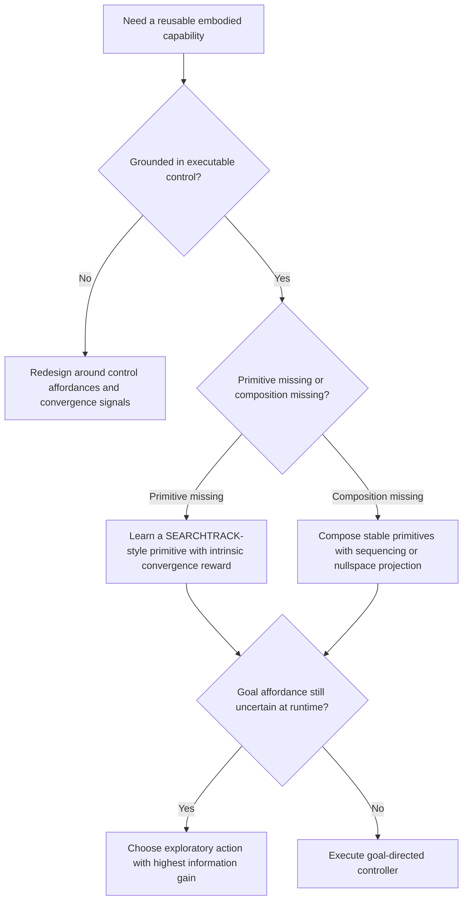

# Hierarchical Skills and Skill-based Representation

Use this skill when an embodied agent needs reusable control primitives that can serve as both executable skills and grounded knowledge.

## When to Use

- The agent must bridge continuous control with discrete reasoning instead of keeping perception, planning, and action as isolated layers.
- The system should learn reusable capabilities through convergence and interaction, not only through externally labeled tasks or fixed reward shaping.
- Object knowledge should support action selection, uncertainty reduction, or manipulation rather than passive classification alone.
- Multiple controllers must run together without stomping on each other, especially when redundancy and nullspace structure matter.
- Exploration decisions should be driven by information gain about affordances before committing to expensive or irreversible actions.

## NOT for Boundaries

- Pure symbolic planning, theorem proving, or text-only orchestration where there is no sensorimotor grounding.
- Generic RL hyperparameter tuning, benchmark chasing, or leaderboard comparisons detached from representational design.
- Classical computer-vision pipelines that only need discriminative labels and never need executable affordance models.
- Systems where action selection is already fixed and the open question is only implementation throughput or inference latency.

## Core Mental Models

### Control affordances are the knowledge primitive

Objects are represented by the control programs that reliably converge on them. A useful representation answers "what controller can stabilize here?" before it answers "what category is this?"

### Skill learning is a curriculum of convergence

Reward the transition from transient to converged control on external signals. That gives the agent a domain-general way to discover what it can reliably do before task-specific semantics are introduced.

### Composition should preserve superior objectives

When two controllers must coexist, project the subordinate one into the nullspace of the superior controller instead of mixing objectives with ad hoc weights. This preserves priority while still exploiting spare degrees of freedom.

### Recognition and action selection share one model

The same affordance model that helps infer object identity should also predict which exploratory action will reduce uncertainty about the next useful affordance.

## Decision Points

1. Is the proposed representation grounded in executable control relations, or is it merely a feature vocabulary with no action semantics?
2. Is the next capability best learned as a new primitive schema, or as a composition of already stable schemas?
3. Should the agent commit to a goal action now, or spend one cheap action gathering information about the relevant affordance?

## Failure Modes

| Failure mode | What it looks like | Recovery move |
| --- | --- | --- |
| Feature-only object models | Recognition works in the lab but does not help select actions under pose variation | Rebuild the representation around convergent controllers and spatial affordance distributions |
| Monolithic policy learning | The agent solves one configuration but cannot reuse the behavior or explain why it works | Factor the behavior into primitives and compositions with explicit prerequisites |
| Weighted-controller soup | Simultaneous objectives interfere and produce unstable or oscillatory behavior | Introduce explicit priority structure and project subordinate controllers into the superior nullspace |
| Premature action commitment | The system grasps, pushes, or cuts before locating the actual affordance geometry | Insert an information-seeking step and act only after uncertainty drops below a task threshold |

## Worked Examples

### Example: Grasping a mug in arbitrary poses

- Novice move: Train a classifier for "mug" and a separate policy for "grasp mug," then hope the policy generalizes across poses.
- Expert move: Represent the mug as a distribution of controllable affordances such as rim tracking, handle-oriented grasp points, and force closure regions. Use a cheap exploratory visual action to localize the likely grasp affordance before attempting the grasp.

### Example: Adding a polishing action after stable reach

- Novice move: Train a new end-to-end policy for reach-and-polish from scratch.
- Expert move: Keep the reach controller as the superior objective, then add the polishing controller as a subordinate behavior that only uses residual degrees of freedom once reach remains stable.

## Quality Gates

- Every symbolic predicate in the design can be traced back to an executable controller or convergence state.
- At least one example demonstrates generalization across pose, viewpoint, or other environmental variation.
- Composed controllers state their priority structure explicitly instead of relying on unprincipled weighted sums.
- Exploration policy is justified in information terms when uncertainty matters.
- The wrapper stays lean and sends deeper mathematical detail to the reference set.

## References

Read [references/INDEX.md](references/INDEX.md) first, then load only the files needed for the current design question.

- Use `control-affordances-as-knowledge-representation.md` when the core question is what should count as an object representation.
- Use `intrinsic-motivation-for-skill-acquisition.md` when the challenge is how to bootstrap a curriculum without hand-shaped rewards.
- Use `hierarchical-composition-and-nullspace-projection.md` when multiple control objectives compete.
- Use `information-theoretic-action-selection-under-uncertainty.md` when deciding whether to explore or commit.

## Shibboleths

- Someone who has internalized this framework talks about convergence, affordances, and nullspace structure, not just perception modules and downstream planners.
- They can explain why an exploratory action is valuable even when it does not advance the final task directly.
- They treat object identity as something inferred from controllable relationships, not just static features.
