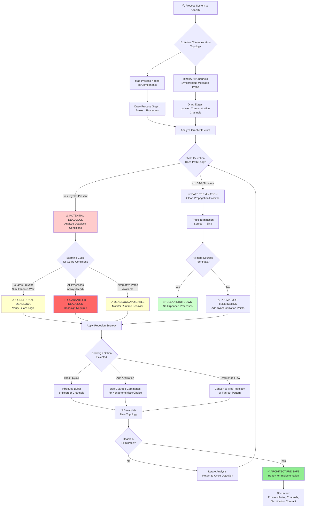

# Process Communication Topology & Deadlock Analysis

```mermaid
graph TD
    A["🔍 Process System to Analyze"] --> B{Examine Communication<br/>Topology}
    
    B --> C["Map Process Nodes<br/>as Components"]
    B --> D["Identify All Channels<br/>Synchronous Message Paths"]
    
    C --> E["Draw Process Graph:<br/>Boxes = Processes"]
    D --> F["Draw Edges:<br/>Labeled Communication Channels"]
    
    E --> G["Analyze Graph Structure"]
    F --> G
    
    G --> H{Cycle Detection:<br/>Does Path Loop?}
    
    H -->|Yes: Cycles Present| I["⚠️ POTENTIAL DEADLOCK<br/>Analyze Deadlock Conditions"]
    H -->|No: DAG Structure| J["✅ SAFE TERMINATION<br/>Clean Propagation Possible"]
    
    I --> K{Examine Cycle<br/>for Guard Conditions}
    K -->|All Processes<br/>Always Ready| L["🔴 GUARANTEED DEADLOCK<br/>Redesign Required"]
    K -->|Guards Prevent<br/>Simultaneous Wait| M["⚠️ CONDITIONAL DEADLOCK<br/>Verify Guard Logic"]
    K -->|Alternative Paths<br/>Available| N["✓ DEADLOCK AVOIDABLE<br/>Monitor Runtime Behavior"]
    
    J --> O["Trace Termination<br/>Source → Sink"]
    O --> P{All Input Sources<br/>Terminate?}
    P -->|Yes| Q["✅ CLEAN SHUTDOWN<br/>No Orphaned Processes"]
    P -->|No| R["⚠️ PREMATURE TERMINATION<br/>Add Synchronization Points"]
    
    M --> S["Apply Redesign Strategy"]
    L --> S
    N --> S
    R --> S
    
    S --> T{Redesign Option<br/>Selected}
    T -->|Break Cycle| U["Introduce Buffer<br/>or Reorder Channels"]
    T -->|Add Arbitration| V["Use Guarded Commands<br/>for Nondeterministic Choice"]
    T -->|Restructure Flow| W["Convert to Tree Topology<br/>or Fan-out Pattern"]
    
    U --> X["🔄 Revalidate<br/>New Topology"]
    V --> X
    W --> X
    
    X --> Y{Deadlock<br/>Eliminated?}
    Y -->|No| Z["Iterate Analysis:<br/>Return to Cycle Detection"]
    Y -->|Yes| AA["✅ ARCHITECTURE SAFE<br/>Ready for Implementation"]
    
    Z --> H
    AA --> AB["Document:<br/>Process Roles, Channels,<br/>Termination Contract"]
    
    style I fill:#ffcccc
    style L fill:#ff6666
    style Q fill:#ccffcc
    style AA fill:#90EE90
    style M fill:#ffffcc
    style N fill:#ffffcc
```
