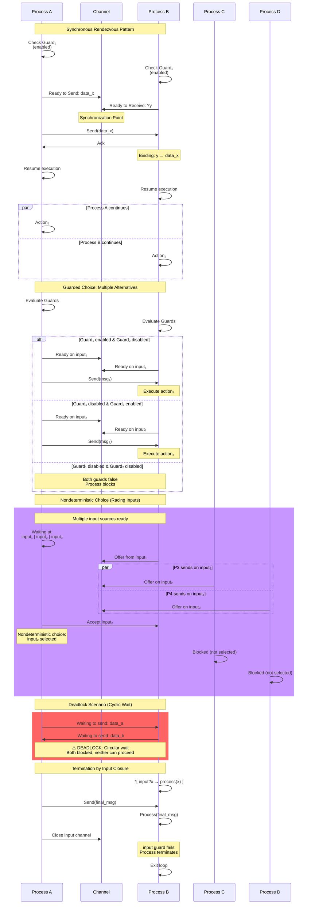

# Synchronous Rendezvous & Protocol Handshakes

```mermaid
sequenceDiagram
    participant P1 as Process A
    participant Chan as Channel
    participant P2 as Process B
    
    Note over P1,P2: Synchronous Rendezvous Pattern
    
    P1->>P1: Check Guard₁<br/>(enabled)
    P2->>P2: Check Guard₁<br/>(enabled)
    
    P1->>Chan: Ready to Send: data_x
    P2->>Chan: Ready to Receive: ?y
    
    Note over Chan: Synchronization Point
    
    P1->>P2: Send(data_x)
    P2->>P1: Ack
    
    Note over P2: Binding: y ← data_x
    
    P1->>P1: Resume execution
    P2->>P2: Resume execution
    
    par Process A continues
        P1->>P1: Action₁
    and Process B continues
        P2->>P2: Action₁
    end
    
    Note over P1,P2: Guarded Choice: Multiple Alternatives
    
    P1->>P1: Evaluate Guards
    P2->>P2: Evaluate Guards
    
    alt Guard₁ enabled & Guard₂ disabled
        P1->>Chan: Ready on input₁
        P2->>Chan: Ready on input₁
        P1->>P2: Send(msg₁)
        Note over P2: Execute action₁
    else Guard₁ disabled & Guard₂ enabled
        P1->>Chan: Ready on input₂
        P2->>Chan: Ready on input₂
        P1->>P2: Send(msg₂)
        Note over P2: Execute action₂
    else Guard₁ disabled & Guard₂ disabled
        Note over P1,P2: Both guards false<br/>Process blocks
    end
    
    Note over P1,P2: Nondeterministic Choice (Racing Inputs)
    
    rect rgb(200, 150, 255)
    Note over P1,P2: Multiple input sources ready
    P1->>P1: Waiting at:<br/>input₁ | input₂ | input₃
    P2->>Chan: Offer from input₁
    par P3 sends on input₂
        participant P3 as Process C
        P3->>Chan: Offer on input₂
    and P4 sends on input₃
        participant P4 as Process D
        P4->>Chan: Offer on input₃
    end
    
    P1->>P2: Accept input₂
    Note over P1: Nondeterministic choice:<br/>input₂ selected
    P3->>P3: Blocked (not selected)
    P4->>P4: Blocked (not selected)
    end
    
    Note over P1,P2: Deadlock Scenario (Cyclic Wait)
    
    rect rgb(255, 100, 100)
    P1->>P2: Waiting to send: data_a
    P2->>P1: Waiting to send: data_b
    Note over P1,P2: ⚠ DEADLOCK: Circular wait<br/>Both blocked, neither can proceed
    end
    
    Note over P1,P2: Termination by Input Closure
    
    P2->>P2: *[ input?x → process(x) ]
    P1->>P2: Send(final_msg)
    P2->>P2: Process(final_msg)
    P1->>Chan: Close input channel
    Note over P2: input guard fails<br/>Process terminates
    P2->>P2: Exit loop
```
