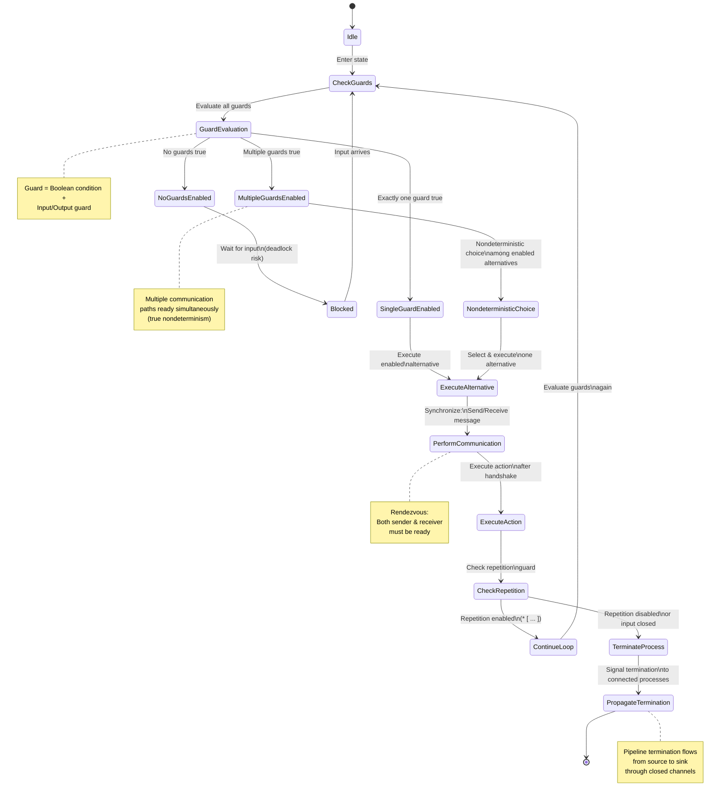

# Guarded Command State Machine & Enabled Alternatives

```mermaid
stateDiagram-v2
    [*] --> Idle
    
    Idle --> CheckGuards: Enter state
    
    CheckGuards --> GuardEvaluation: Evaluate all guards
    
    GuardEvaluation --> NoGuardsEnabled: No guards true
    GuardEvaluation --> SingleGuardEnabled: Exactly one guard true
    GuardEvaluation --> MultipleGuardsEnabled: Multiple guards true
    
    NoGuardsEnabled --> Blocked: Wait for input\n(deadlock risk)
    Blocked --> CheckGuards: Input arrives
    
    SingleGuardEnabled --> ExecuteAlternative: Execute enabled\nalternative
    
    MultipleGuardsEnabled --> NondeterministicChoice: Nondeterministic choice\namong enabled alternatives
    NondeterministicChoice --> ExecuteAlternative: Select & execute\none alternative
    
    ExecuteAlternative --> PerformCommunication: Synchronize:\nSend/Receive message
    
    PerformCommunication --> ExecuteAction: Execute action\nafter handshake
    
    ExecuteAction --> CheckRepetition: Check repetition\nguard
    
    CheckRepetition --> ContinueLoop: Repetition enabled\n(* [ ... ])
    CheckRepetition --> TerminateProcess: Repetition disabled\nor input closed
    
    ContinueLoop --> CheckGuards: Evaluate guards\nagain
    
    TerminateProcess --> PropagateTermination: Signal termination\nto connected processes
    
    PropagateTermination --> [*]
    
    note right of GuardEvaluation
        Guard = Boolean condition +
        Input/Output guard
    end note
    
    note right of MultipleGuardsEnabled
        Multiple communication
        paths ready simultaneously
        (true nondeterminism)
    end note
    
    note right of PerformCommunication
        Rendezvous:
        Both sender & receiver
        must be ready
    end note
    
    note right of PropagateTermination
        Pipeline termination flows
        from source to sink
        through closed channels
    end note
```
