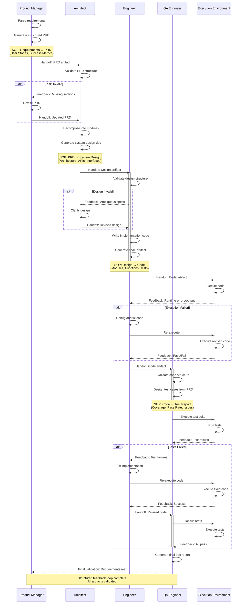

# Agent Coordination with Structured Artifacts

```mermaid
sequenceDiagram
    participant PM as Product Manager
    participant Arch as Architect
    participant Eng as Engineer
    participant QA as QA Engineer
    participant Exec as Execution Environment

    PM->>PM: Parse requirements
    PM->>PM: Generate structured PRD
    Note over PM: SOP: Requirements → PRD<br/>(User Stories, Success Metrics)
    
    PM->>Arch: Handoff: PRD artifact
    activate Arch
    Arch->>Arch: Validate PRD structure
    alt PRD Invalid
        Arch-->>PM: Feedback: Missing sections
        PM->>PM: Revise PRD
        PM->>Arch: Handoff: Updated PRD
    end
    
    Arch->>Arch: Decompose into modules
    Arch->>Arch: Generate system design doc
    Note over Arch: SOP: PRD → System Design<br/>(Architecture, APIs, Interfaces)
    deactivate Arch
    
    Arch->>Eng: Handoff: Design artifact
    activate Eng
    Eng->>Eng: Validate design structure
    alt Design Invalid
        Eng-->>Arch: Feedback: Ambiguous specs
        Arch->>Arch: Clarify design
        Arch->>Eng: Handoff: Revised design
    end
    
    Eng->>Eng: Write implementation code
    Eng->>Eng: Generate code artifact
    Note over Eng: SOP: Design → Code<br/>(Modules, Functions, Tests)
    deactivate Eng
    
    Eng->>Exec: Handoff: Code artifact
    activate Exec
    Exec->>Exec: Execute code
    Exec-->>Eng: Feedback: Runtime errors/output
    deactivate Exec
    
    alt Execution Failed
        Eng->>Eng: Debug and fix code
        Eng->>Exec: Re-execute
        activate Exec
        Exec->>Exec: Execute revised code
        Exec-->>Eng: Feedback: Pass/Fail
        deactivate Exec
    end
    
    Eng->>QA: Handoff: Code artifact
    activate QA
    QA->>QA: Validate code structure
    QA->>QA: Design test cases from PRD
    Note over QA: SOP: Code → Test Report<br/>(Coverage, Pass Rate, Issues)
    deactivate QA
    
    QA->>Exec: Execute test suite
    activate Exec
    Exec->>Exec: Run tests
    Exec-->>QA: Feedback: Test results
    deactivate Exec
    
    alt Tests Failed
        QA-->>Eng: Feedback: Test failures
        Eng->>Eng: Fix implementation
        Eng->>Exec: Re-execute code
        activate Exec
        Exec->>Exec: Execute fixed code
        Exec-->>Eng: Feedback: Success
        deactivate Exec
        Eng->>QA: Handoff: Revised code
        activate QA
        QA->>Exec: Re-run tests
        activate Exec
        Exec->>Exec: Execute tests
        Exec-->>QA: Feedback: All pass
        deactivate Exec
        deactivate QA
    end
    
    QA->>QA: Generate final test report
    QA-->>PM: Final validation: Requirements met
    Note over PM,QA: Structured feedback loop complete<br/>All artifacts validated
```
